# Go语言笔记

* [0.为什么需要Go语言](#0为什么需要go语言)
* [1.第一个Go程序](#1第一个go程序)
* [2.变量操作](#2变量操作)
  * [2.1.什么是变量](#21什么是变量)
  * [2.2.声明变量](#22声明变量)
  * [2.3.变量初始化](#23变量初始化)
  * [2.4.变量赋值](#24变量赋值)
  * [2.5.自动推导类型](#25自动推导类型)
    * [2.5.1.多重赋值匿名变量](#251多重赋值匿名变量)
    * [2.5.2.匿名变量](#252匿名变量)
  * [2.7.输出格式](#27输出格式)
  * [2.6.输入格式](#26输入格式)
  * [2.8.变量命名规范](#28变量命名规范)
* [3.数据类型](#3数据类型)
  * [3.1.整型](#31整型)
  * [3.2.浮点型](#32浮点型)
  * [3.3.bool型](#33bool型)
  * [3.4.字符型](#34字符型)
  * [3.5.字符串型](#35字符串型)
  * [3.6.强制类型转换](#36强制类型转换)
  * [3.7.数据类型综合案例](#37数据类型综合案例)
  * [3.8.fmt输入输出格式](#38fmt输入输出格式)
  * [3.9.各种类型的大小](#39各种类型的大小)
* [4.常量](#4常量)
* [5.运算符](#5运算符)
  * [5.1.算术运算符](#51算术运算符)
  * [5.2.赋值运算符](#52赋值运算符)
  * [5.3.关系运算符](#53关系运算符)
  * [5.4.逻辑运算符](#54逻辑运算符)
* [6.流程控制](#6流程控制)
  * [6.1.分支结构](#61分支结构)
    * [6.1.1.if](#611if)
    * [6.1.2.if...else...](#612ifelse)
    * [6.1.3.if...else if...](#613ifelse-if)
    * [6.1.4.switch](#614switch)
  * [6.2.循环结构](#62循环结构)
* [7.函数](#7函数)
  * [7.1.基础函数](#71基础函数)
  * [7.2.延迟调用](#72延迟调用)
  * [7.3.递归函数](#73递归函数)
  * [7.4.匿名函数](#74匿名函数)
* [8.数组](#8数组)
  * [8.1.一维数组](#81一维数组)
  * [8.2.二维数组](#82二维数组)
* [9.切片](#9切片)
  * [9.1.切片创建](#91切片创建)
  * [9.2.切片初始化](#92切片初始化)
  * [9.3.切片的遍历](#93切片的遍历)
  * [9.4.切片的截取](#94切片的截取)
  * [9.5.append函数扩容机制](#95append函数扩容机制)
  * [9.6.copy拷贝函数](#96copy拷贝函数)
  * [9.7.切片作为函数参数](#97切片作为函数参数)
  * [9.8.切片案例](#98切片案例)
  * [9.9.排序](#99排序)
    * [9.9.1.冒泡排序](#991冒泡排序)
    * [9.9.2.选择排序](#992选择排序)
* [10.map](#10map)
  * [10.1.map概念](#101map概念)
  * [10.2.map创建与初始化](#102map创建与初始化)
  * [10.3.键值操作](#103键值操作)
  * [10.4.map作为函数参数](#104map作为函数参数)
* [11.结构体](#11结构体)
  * [11.1.结构体简介](#111结构体简介)
  * [11.2.结构体的创建和初始化](#112结构体的创建和初始化)
    * [11.2.1.结构体创建](#1121结构体创建)
    * [11.2.2.初始化](#1122初始化)
  * [11.3.结构体和数组](#113结构体和数组)
  * [11.4.结构体和切片](#114结构体和切片)
  * [11.5.结构体和map](#115结构体和map)
  * [11.6.结构体作为函数参数](#116结构体作为函数参数)
* [12.指针](#12指针)
  * [12.1.指针简介](#121指针简介)
  * [12.2.指针使用](#122指针使用)
  * [12.3.将指针作为函数参数](#123将指针作为函数参数)
  * [12.4.数组指针](#124数组指针)
  * [12.5.指针数组](#125指针数组)
  * [12.6.指针与切片](#126指针与切片)
  * [12.7.指针与结构体](#127指针与结构体)
  * [12.8.多级指针](#128多级指针)
* [13.基础进阶](#13基础进阶)
  * [13.1.深浅拷贝](#131深浅拷贝)
    * [区别](#区别)
    * [示例](#示例)
  * [13.2.传参分析](#132传参分析)
  * [13.3.for……range分析](#133forrange分析)
* [14.通讯录案例介绍](#14通讯录案例介绍)
* [15.面向对象](#15面向对象)
  * [15.1.对象的创建](#151对象的创建)
  * [15.2.继承](#152继承)
  * [15.3.成员操作](#153成员操作)
  * [15.4.指针类型匿名字段](#154指针类型匿名字段)
  * [15.5.多重继承](#155多重继承)
  * [15.6.为结构体添加方法](#156为结构体添加方法)
  * [15.7.使用方法的注意事项](#157使用方法的注意事项)
  * [15.8.面向对象方法案例](#158面向对象方法案例)
  * [15.9.方法继承](#159方法继承)
  * [15.10.方法重写](#1510方法重写)
  * [15.11.方法值和方法表达式](#1511方法值和方法表达式)
  * [15.12.包装类](#1512包装类)
  * [15.13.面向对象案例（类）](#1513面向对象案例类)
  * [15.14.接口](#1514接口)
  * [15.15.多态](#1515多态)
  * [15.16.面向对象案例（多态）](#1516面向对象案例多态)
  * [15.17.接口继承和转换](#1517接口继承和转换)
  * [15.18.空接口定义与使用](#1518空接口定义与使用)
  * [15.19.空接口与断言综合应用](#1519空接口与断言综合应用)
* [16.异常](#16异常)
  * [16.1.panic函数（出现异常）](#161panic函数出现异常)
  * [16.2.error接口（抛异常和抓异常）](#162error接口抛异常和抓异常)
  * [16.3.recover错误拦截（冷处理异常）](#163recover错误拦截冷处理异常)
* [17.文本文件处理](#17文本文件处理)
  * [17.1.创建文件](#171创建文件)
  * [17.2.打开文件](#172打开文件)
  * [17.3.写入数据](#173写入数据)
  * [17.4.读取数据](#174读取数据)
* [18.字符串](#18字符串)
  * [18.1.常用方法](#181常用方法)
  * [18.2.相关案例](#182相关案例)
  * [18.3.字符串和自他类型的转换](#183字符串和自他类型的转换)
* [19.工程管理](#19工程管理)
* [20.基础巩固加强](#20基础巩固加强)
  * [20.1.指针强化](#201指针强化)
    * [计算机中内存分布](#计算机中内存分布)
    * [指针介绍](#指针介绍)
    * [野指针和空指针](#野指针和空指针)
    * [new()方法](#new方法)
    * [左值和右值](#左值和右值)
    * [指针的函数传参](#指针的函数传参)
  * [20.2.切片强化](#202切片强化)
    * [数组的缺点](#数组的缺点)
    * [切片的本质](#切片的本质)
    * [增删查改](#增删查改)
    * [强化案例](#强化案例)
  * [20.3.map强化](#203map强化)
    * [map的创建](#map的创建)
    * [map的赋值](#map的赋值)
    * [增删查改](#增删查改-1)
    * [强化案例](#强化案例-1)
  * [20.4.结构体强化](#204结构体强化)
    * [结构体传参](#结构体传参)
    * [结构体案例](#结构体案例)
  * [20.5.文件操作强化](#205文件操作强化)
    * [文件指针](#文件指针)
    * [打开文件](#打开文件)
    * [写文件操作](#写文件操作)
      * [按字符串写](#按字符串写)
      * [按字节写](#按字节写)
      * [按位置写](#按位置写)
    * [读文件操作](#读文件操作)
      * [按行读](#按行读)
      * [按字节读](#按字节读)
    * [目录操作](#目录操作)
      * [打开目录](#打开目录)
      * [读目录内容](#读目录内容)
      * [目录操作案例](#目录操作案例)
* [21.Go语言并发编程](#21go语言并发编程)
  * [21.1.并发和并行的区别](#211并发和并行的区别)
  * [21.2.进程并发（了解）](#212进程并发了解)
    * [程序和进程](#程序和进程)
    * [进程状态](#进程状态)
    * [进程并发相关问题](#进程并发相关问题)
  * [21.3.线程并发（了解）](#213线程并发了解)
    * [线程（LWP）简介](#线程lwp简介)
    * [线程同步](#线程同步)
    * [锁的应用](#锁的应用)
      * [互斥量mutex](#互斥量mutex)
      * [读写锁](#读写锁)
  * [21.4.协程并发（了解）](#214协程并发了解)
  * [21.5.Go并发](#215go并发)
  * [21.6.Goroutine协程](#216goroutine协程)
    * [代码示例](#代码示例)
    * [runtime包常用方法](#runtime包常用方法)
      * [runtime.Gosched()](#runtimegosched)
      * [runtime.Goexit()](#runtimegoexit)
      * [runtime.GOMAXPROCS()](#runtimegomaxprocs)
  * [21.7.channel通道](#217channel通道)
    * [初试channel](#初试channel)
    * [数据通信](#数据通信)
    * [无缓冲channel](#无缓冲channel)
    * [有缓冲channel](#有缓冲channel)
    * [关闭channel](#关闭channel)
    * [单向channel](#单向channel)
    * [生产者消费者模型](#生产者消费者模型)
      * [生产者消费者分析](#生产者消费者分析)
      * [生产者消费者实现](#生产者消费者实现)
    * [定时](#定时)
      * [定时器](#定时器)
        * [time.Timer](#timetimer)
        * [time.Ticker](#timeticker)
      * [定时方法](#定时方法)
        * [time.Sleep()](#timesleep)
        * [time.After()](#timeafter)
  * [21.8.select监听](#218select监听)
    * [select设置超时](#select设置超时)
  * [21.9.锁和条件变量](#219锁和条件变量)
    * [死锁](#死锁)
    * [互斥锁](#互斥锁)
    * [读写锁](#读写锁-1)
    * [条件变量](#条件变量)
* [22.Go语言网络编程](#22go语言网络编程)
  * [22.1.网络概述](#221网络概述)
    * [网络协议](#网络协议)
    * [典型的协议](#典型的协议)
    * [分层模型](#分层模型)
      * [网络分层架构](#网络分层架构)
      * [层与协议](#层与协议)
      * [各层功能](#各层功能)
        * [链路层](#链路层)
        * [网络层](#网络层)
        * [传输层](#传输层)
        * [应用层](#应用层)
    * [通信过程](#通信过程)
  * [22.2.Socket编程](#222socket编程)
    * [什么是Socket](#什么是socket)

# 0.为什么需要Go语言

学习Go语言有一个官方途径：https://studygolang.com/pkgdoc

-------------

**笔记作者对Go语言的评价是：**

<center style="font-weight:bold"><i>像 Java 的 C++ <br>像 python 的 C语言 </i></center>

------------------------

在编程语言发展进程中，C语言在2000年前的单机时代是编程语言之王，但是随着机器硬件性能逐步的提升，Java逐渐取代了C的位置，看起来Java已经深得人心，但是Java的编程体验还是有所欠缺；

从市场占有率来看，Java的占比下降的速度还是比较快的，是否侧面反映了Java后劲不足还需要反复考虑，可能是因为我的主要方向是Java语言编程，心中有不甘？但是要承认事实；

Go语言官方自称，之所以开发Go 语言，是因为“近10年来开发程序之难让我们有点沮丧”。**Go希望成为互联网时代的C语言**，多数系统级语言（Java，C#）的根本编程哲学来源于C++，将面向对象编程进一步发扬光大，但是Go语言的设计者们却认为C++没有什么好学的，这点我也认为，因为如果只是在C语言基础上添加上了面向对象的新特性的话，为什么不能直接精通C语言呢？

C语言能够经久不衰的根本原因是它足够简单，这个简单我认为应该是编程的思想，它足够接近底层，又能够被人理解；因此Go的设计者们也想着要Go语言在互联网时代变得足够简单；

**互联网时代有哪些关键的问题呢？**

- 首先是并行和分布式的支持，多核化和集群化是整个互联网时代的特征，作为互联网时代的C语言，必须要让这门语言能够操作多核计算机与计算机集群如同操作单机一样容易；
- 其次是软件工程的支持，工程规模不断扩大是产业发展的必然趋势，单机时代语言可以只关心语言本身，互联网时代语言还需要关注软件品质和团队协作等；
- 最后是编程思想的重塑，我从Python开始学习到前端页面的静态化设计，再到C语言的系统性学习，最后到钻研Java生态，一路走来一直对于编程的思想有所感悟，面向对象一定是好的么？面向过程是否过时？什么才是最佳的编程实践呢？弱类型是否是新时代的版本答案？有没有一门语言可以对这些进行整合，集所有优点于一身呢？

**并发与分布式**

- 并发执行的”执行体“：执行体是一个抽象的概念，比如操作系统的进程（process），进程中的线程（thread）以及进程内的协程（coroutine，也叫轻量级线程）。Go语言在语言级别支持协程，叫goroutine，使用协程的时候会用到一个标志性的关键字：**go**，这大概是献给这个时代最好的礼物；

- ”执行体间的通信“：

  - 执行体之间的互斥与同步；

    当执行体之间存在共享资源（一般是共享内存）时，为了保证内存访问逻辑的确定性，需要对访问该共享资源的相关执行体进行互斥；当多个执行体之间的逻辑存在时序上的依赖时，也往往需要在执行体之间进行同步，互斥与同步是执行体之间对基本的交互方式；

    多数语言提供了线程之间的互斥与同步的支持，但是协程方面，多数语言在标准库中都是看不到的；

  - 执行体之间的消息传毒；

    在并发编程模型的选择上有两个流派。一个是共享内存的模型，一个是消息传递的模型。多数传统语言都选择的前者，少数语言选择后者，后者的典型代表就是Erlang语言，这也组成”Erlang风格的并发模型“。其主体思想就是”轻量级的进程“和消息乃进程间通信的唯一方式”，Go语言推荐采用“Erlang风格的并发模型”，并且内置了消息队列的支持，只不过它叫通道“channel”，两个goroutine之间通过channel来进行交互；

**软件工程**

单机时代的语言可以只关心问题本身的解决，但是随着工程规模的不断扩大，软件复杂度的不断增加，软件工程也成为语言设计层面要考虑的重要课题。多数软件需要一个团队共同去完成，在团队协作的过程中，人们需要建立统一的交互语言来降低沟通的成本；

Go语言很可能是第一个将代码风格强制统一的语言，例如Go语言要求public的变量必须以大写字母开头，private变量则以小写字母开头，这种做法不仅免除了public、private关键字，更重要的是统一了命名风格。

**编程哲学**

C语言是纯面向过程式，Java语言则是激进的面向对象主义者，而Go语言没有去否认任何一方。而是用批判吸收的眼光，融合众家之长，但时刻警惕特性复杂化，极力维持语言特性的简洁，小而精；

一些小例子：

- Go语言反对函数和操作符重载，是因为这些特性给语言带来了很大的负担；
- Go语言支持类，类成员方法，类的组合，但是反对继承，但对虚函数和虚函数重载；
- Go语言放弃了构造函数和析构函数；
- Go语言的接口是非入侵的，也就是说实现一个接口时无需从接口派生，降低了耦合度，也不需要为了实现一个接口而专门去导入一个包，这也是Go语言非常不推荐的一种做法；
- Go语言接受了函数式编程的一些想法，支持匿名函数和闭包，接受了面向消息编程的思想，支持goroutine和通道；

# 1.第一个Go程序

```go
package main
import "fmt"
func main(){
	fmt.Print("Hello Go")
}
```

**第一行：每个Go源代码文件的开头都是一个package声明，表示该Go代码所属的包。**

GO语言中是通过包来对代码进行管理的。那么什么是包呢？我通过一个例子来解释一下包的概念。例如：有一家公司叫“京东“”，该公司有一个项目叫“京东网上商城”，该项目下面有管理“客户信息”的代码，另外一家公司叫“淘宝”，该公司也有一个项目叫“淘宝网上商城”，该项目下面也有管理的“客户信息”的代码，我开发的“客户管理软件”，既要用到“京东”的客户信息管理代码，也要用到“淘宝”的客户信息管理代码，为了能够很好的区分，我们在使用时必须写清楚，客户的信息管理代码到底是来自哪个商城，所以我可以这样写“import京东”，表示所使用的“客户信息代码”是来自“京东”的，那么“京东”就是一个标识，也就是包。所以说，包就是一个标识，标志着着你写的GO代码来自哪.这样代码管理非常清晰，使用也非常方便。

那么后面随着我们学习的深入，学习的代码也越来越多，我们给大家去讲解怎样自己创建包，来管理代码。创建包用到的就是package.

但是，不管你创建多少个包，要想让程序运行，必须包含一个main包。如果缺少该包，程序是无法运行的。

**第二行代码：import表示导入，“fmt”是包名.**

不管是使用我们自己定义的包还是GO自带都是通过import导入的，“fmt”是GO自带的包，该包 包含了怎样将信息打印在电脑屏幕上。注意包名要用“”表示。

**第三行代码：表示程序的入口；**

程序就是从该位置开始执行的，就像是教室的门口一样，注意该行代码是固定的写法，func 与main之间必须有空格，同时main后面必须带小括号,后面的一对大括号表示要完成的具体工作，也就是完成具体任务的代码必须写在一对大括号内。

func表示后面跟着的main是一个函数，函数必须有一对小括号。什么是函数呢？现在大家可以先理解与我们在数学中学到的函数是一样的，都是实现某个具体的功能，例如我们学习的三角函数等。Main函数实现的就是入口功能。再次强调一下，GO语言中的函数前面必须加上func这个单词，而且函数名称后面必须跟一对小括号。

**第六行代码：就是使用了fmt包（注意具体使用的时候不需要加上双引号）中的Print函数；**

将要“hello go” 打印在屏幕上。这行代码要注意的是，fmt包与Print函数之间是用.(点连接的)，该点是在半角输入法状态下输入，同时Print函数第一个字母P是大写的，不能写成小写，也就是说GO语言是区分大小写的，有很多同学在这里容易出错。将要输出的信息写在Print函数的括号内（注意括号也是在半角状态下输入的），并且用双引号包裹起来（双引号也是半角状态下输入的）

**写好后需要编译这个文件，只需要在控制台对他进行如下操作：**

```shell
go build .\Test.go
```

编译结果如下：

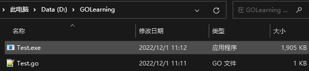

**然后运行该可执行程序：（直接在控制台输入如下语句）**

```shell
.\Test.exe
```

运行效果如下：

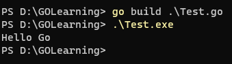

**上面两个指令，其实可以合成一个，且不会生成可执行文件，如下：**

```shell
go run Test.go
```

运行效果如下：

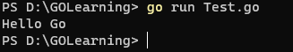

至此，命令行的卑微生活就结束了，以下的笔记均以GoLang为准；

**总结注意事项：**

- 程序中必须包含main包；
- func表示后面跟的是一个函数；
- main函数是整个程序的入口，所在的包为main包；
- 注意大括号的书写位置；
- 所有代码都写到大括号中；
- 符号为半角符；
- 每行代码结尾没有分号；
- Print() 函数首字母大写；

# 2.变量操作

## 2.1.什么是变量

所谓的变量简单的理解就是计算机用来存储数据的。我们可以理解变量就像我们去超市买商品时用到的购物车，我们先将商品从货架上拿下来，放到购物车中，结账时在从购物车中取出商品。计算机通过变量来保存数据实际上将数据存储到计算机的内存中，这里我们可以画一个图给大家理解一下。

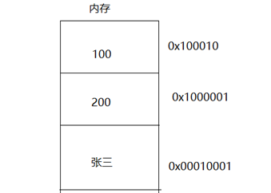

计算机将内存划分成不同的区域，数据就是存储在这些区域中，那么怎样从这些区域中将数据取出来呢？计算机将每块区域都加上了一串数字，作为编号。通过该编号就可以将数据取出来了，但是问题是，这一串数字对我们程序员来说是非常难记忆的，

为了解决这个问题，我们可以通过变量的方式来表示存储的数据，如下图：

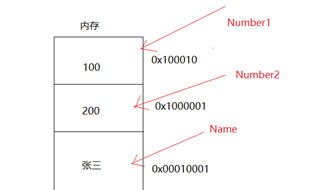

我们给每个存储区域加上了Number1,Number2,Name等符号，这样通过这些符号来存储数据，然后通过这些符号取出数据就非常容易，方便了。这些符号就是变量。

## 2.2.声明变量

所谓声明变量就是创建一个变量，并且指定该变量存储什么类型的数据。

**基本格式：**

```go
//基本格式
var 变量名 数据类型

//同时声明多个同类型变量
var 变量名,变量名,…… 数据类型
```

Go语言引入了关键字var，而类型信息放在变量名之后；

**示例如下：**


## 2.3.变量初始化

现在我们虽然已经完成变量的定义了，但是该变量中存储的值，并不是我们想要的，我们希望变量中存储的是我们想要的值，应该怎么办？

**基本格式：**

```go
var 变量名 数据类型 = 初始值
```

我们可以在定义变量时，就给变量赋值，这种方式就是变量的初始化。

**示例如下：**

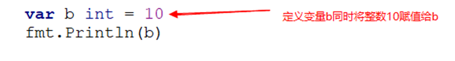

## 2.4.变量赋值

除了在定义变量时，完成初始化以外，我们也可以在变量定义完后，再给变量赋值，也就是先声明后赋值；

**基本格式：**

```
var 变量名 数据类型
变量名 = 被赋值内容
```

**示例如下：**

示例一：

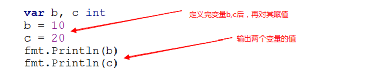

示例二：

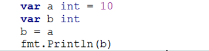

示例三：

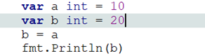

## 2.5.自动推导类型

在给变量赋值时，我们感觉非常麻烦，有没有更简单的给变量赋值的方式，我们可以使用自动推导类型；

**基本格式：**

```go
变量名 := 初始化值
```

具体示例如下：

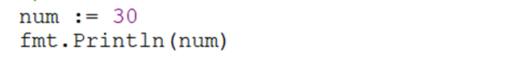

所谓自动推导类型，就是不用通过var 声明变量，不用指定类型，直接在变量名后面跟”:”号，同时完成赋值。那么GO会根据所赋的值自动推导出变量的类型。如果给num变量赋值为小数，那么该变量的类型为小数类型（浮点）。

通过比较，我们发现这种方式比前面的赋值方式要简单方便。这种方式，也是我们以后开发过程中最常用的方式。

### 2.5.1.多重赋值匿名变量

我们给变量num赋值，采用了自动推导的方式，如果想一次使用自动推导的方式，给多个变量赋值，应该怎样实现呢？具体如下：

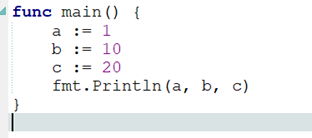

但是这种方式写起来非常的复杂，可以用如下的方式进行简化：

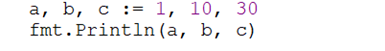

### 2.5.2.匿名变量

匿名变量，丢弃数据不进行处理, _匿名变量配合函数返回值使用才有价值，目前大家只需要知道其语法，后面学到函数时，我们在强调匿名变量的使用场景。

现在我们看一下匿名变量的语法：

```go
_,i,_,j := 1,2,3,4
```

## 2.7.输出格式

输出格式一般使用以下三种函数：

**在Go语言中，输出语句的字符串连接使用 `,` ；赋值情况的字符串连接使用 `+`；**

```go
//普通输出
fmt.Print(a ...any)

//格式化输出
fmt.Printf(format string, a ...any)
//常见的格式符
//%d 整型
//%f 浮点型
//%c 字符型
//%s 字符串型
//%t bool型
//%T 数据类型
//%q Go语言类型字符串，即内容用“”括起来
//%v 显示对应数据详细信息

//换行输出
fmt.Println(a ...any)
```

示例如下：

```go
package main

import "fmt"

func main() {
   num1 := 10
   num2 := 20
   num3 := 30
   fmt.Println("num1 =", num1, ",num2 =", num2, ",num3 =", num3)
   fmt.Print("num1 = ", num1, ",num2 = ", num2, ",num3 = ", num3, "\n")
   fmt.Printf("num1 = %d,num2 = %d,num3 = %d\n", num1, num2, num3)
}
```

打印效果如下：

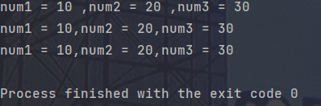

## 2.6.输入格式

输入格式一般使用以下两种函数：

```go
//普通获取
fmt.Scan(a ...any)

//格式化获取
fmt.Scanf(format string, a ...any)
```

示例如下：

```go
package main

import "fmt"

func main() {
   var a int
   fmt.Println("请输入a的内容：")
   fmt.Scan(&a)
   fmt.Println("a =", a)
}
```

```go
package main

import "fmt"

func main() {
   var a int
   fmt.Println("请输入a的内容：")
   fmt.Scanf("%d", &a)
   fmt.Println("a =", a)
}
```

打印效果如下：

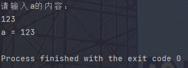

以后推荐使用 **`fmt.Scan()`** 函数进行输入获取；

但是遇到带有空格的输入时，fmt包中的函数就不再起作用了，因为他们会因为遇到空格而结束，此时我们需要用到 bufio 包中的标准输入输出格式：

==因为不常用，所以这里只写一个示例，可以后续深入了解；==

```go
package main

import (
	"bufio"
	"fmt"
	"os"
	"strings"
)

func main() {
	var msg string
	reader := bufio.NewReader(os.Stdin) // 标准输入输出
	msg, _ = reader.ReadString('\n')    // 回车结束
	msg = strings.TrimSpace(msg)        // 去除最后一个空格
	fmt.Printf(msg)
}
```

打印效果如下：

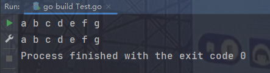

## 2.8.变量命名规范

在我们前面的编程中，我们定义变量时都是随意进行命名，但是在GO语言中，对变量的命名有一些规范性的要求，下面我们看一下具体的要求。

- 只有由数字，字母，下划线组成

- 不能以数字开头

- 区分大小写

- 不能使用关键字

  关键字如下：

  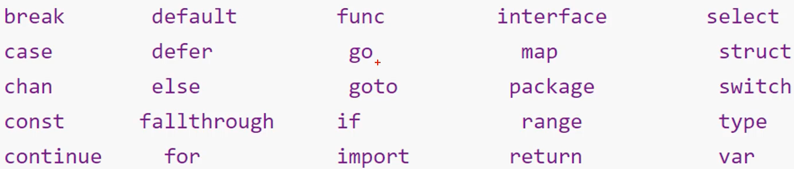

- 不能使用预定义名词

  预定义名词如下：

  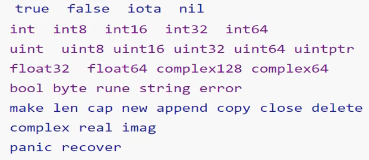

**命名方法如下：**

==做到见名知意是基本；==

- 驼峰命名法（推荐使用）
- 下划线分割法

# 3.数据类型

| **类型**  | **名称** | **长度** | **零值** | **说明**                                      |
| --------- | -------- | -------- | -------- | :-------------------------------------------- |
| bool      | 布尔类型 | 1        | false    | 其值不为真即为假，不可以用数字代表true或false |
| byte      | 字节型   | 1        | 0        | uint8别名                                     |
| int, uint | 整型     | -        | 0        | 有符号32位或无符号64位                        |
| int8      | 整型     | 1        | 0        | -128 ~ 127                                    |
| uint8     | 整型     | 1        | 0        | 0 ~ 255                                       |
| int16     | 整型     | 2        | 0        | -32768 ~ 32767                                |
| uint16    | 整型     | 2        | 0        | 0 ~ 65535                                     |
| int32     | 整型     | 4        | 0        | -2147483648 到  2147483647                    |
| uint32    | 整型     | 4        | 0        | 0 到 4294967295                               |
| int64     | 整型     | 8        | 0        | 0 到 18446744073709551615                     |
| uint64    | 整型     | 8        | 0        | -9223372036854775808到 9223372036854775807    |
| float32   | 浮点型   | 4        | 0.0      | 小数位精确到7位                               |
| float64   | 浮点型   | 8        | 0.0      | 小数位精确到15位                              |
| string    | 字符串   |          | ""       | utf-8字符串                                   |

## 3.1.整型

**有符号整型int**

```go
var a int
```

int可以包含正整数，负整数和零；

32位系统中，int是4个字节，范围是：-2147483648 ~ 2147483647（$-2^{31}到2^{31}-1$）；

64位系统中，int是8个字节，范围是：-9223372036854775808 ~ 9223372036854775807（$-2^{63}到2^{63}-1$）；

**无符号整型uint**

```go
var a uint
```

uint可以包含正整数和零；

32位系统中，int是4个字节，范围是：0 ~ 4294967295（$0到2^{32}-1$）；

64位系统中，int是8个字节，范围是：0 ~ 18446744073709551615（$0到2^{64}-1$）；

## 3.2.浮点型

**单精度浮点型float32**

小数位精确到7位；

```go
var a float32
```

**双精度浮点型float64**

小数位精确到15位；

```go
var a float64
```

**注意事项：**

- 这里推荐使用float64，以为Go语言中和数学计算相关的包都使用的是float64；

- 一旦使用格式化输出，小数位数会自动进行四舍五入的操作；

- 使用自动推导类型来创建浮点数，默认也是float64

## 3.3.bool型

```go
var a bool
```

声明默认为false，取值要么为 true ，要么为 false；

## 3.4.字符型

**字符类型定义**

使用单引号引起的单个字符为字符类型；

```go
var a byte = 'a'
fmt.Println("a =", a)
```

**打印结果如下：**

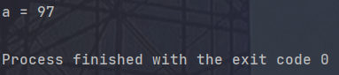

此时输出的是 97 ，而不是 a ，这是因为 Go 语言中普通输出默认是 int 类型，而 byte 转换为 int 需要ASCII码的支持，如果想看到打印内容为 a ，则需要对其进行格式化输出；

```go
package main

import "fmt"

func main() {
	var a byte = 'a'
	fmt.Printf("a = %c", a)
}
```

打印效果如下：

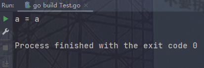

**ASCII码**

ASCII码是一套字符集，是美国国家标准局（ANSI）制定了ASCII（American Standard Code for Information Interchange）码；

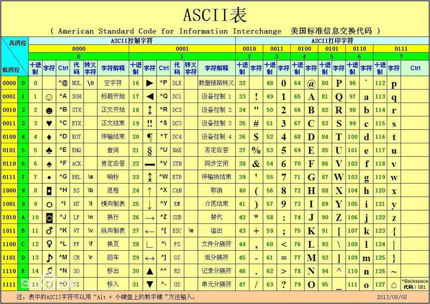

## 3.5.字符串型

**字符串类型定义**

双引号括起来的字符是字符串型；

```go
package main

import "fmt"

func main() {
	var a string = "name"
	fmt.Printf("a = %s\n", a)
}
```

打印效果如下：

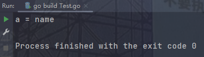

**字符串结束标志**

虽然看到 a 中包含了 4 个字符，但是还隐藏着一个字符串的结束标志 ’\0‘ ，而计算机打印的内容就是这个结束标志之前的内容；

**测试字符串中字符个数**

测试字符串字符个数的函数是 `len()` ；

```go
package main

import "fmt"

func main() {
	var a string = "name"
	i := len(a)
	fmt.Println("length of a is", i)
}
```

打印效果如下：

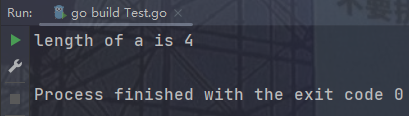

如果字符串内容中有汉字，那么一个汉字所在字符是 3 个，这是为了和 Linux 系统保持一直；

```go
package main

import "fmt"

func main() {
   var a string = "你好go"
   i := len(a)
   fmt.Println("length of a is", i)
}
```

打印效果如下：

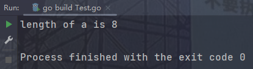

## 3.6.强制类型转换

**基本格式**

```go
//数据类型(被转换内容)
```

**示例如下：**

```go
package main

import "fmt"

func main() {
   var num float64 = 3.15
   var num1 int = 20
   fmt.Printf("%d\n", int(num))
   fmt.Printf("%f\n", float64(num1))

   var num2 float32 = 5.8
   var num3 float64 = 6.6
   fmt.Printf("%f\n", float64(num2)+num3)
}
```

打印效果如下：

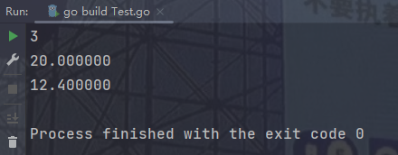

**强制类型转换总结：**

- 类型转换用于将一种数据类型的变量转换为另外一种类型的变量；
- 在转换时，建议低类型转换为高类型，保证数据精度；
- 如果高类型转换成低类型，可能会丢失精度或者出现数据溢出的情况；

## 3.7.数据类型综合案例

请输入用户姓名和年龄，当输入完成后在屏幕上显示：您好！XX，您的年龄是XX；

```go
package main

import "fmt"

func main() {
   name := ""
   age := 0
   fmt.Println("请输入你的姓名：")
   fmt.Scan(&name)
   fmt.Println("请输入你的年龄：")
   fmt.Scan(&age)
   fmt.Printf("您好！%s，你的年龄是%d", name, age)
}
```

打印效果如下：

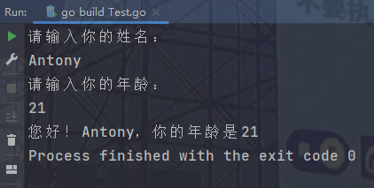

## 3.8.fmt输入输出格式

| **格式** | **含义**                                                     |
| -------- | ------------------------------------------------------------ |
| %%       | 一个%字面量                                                  |
| %b       | 一个二进制整数值(基数为2)，或者是一个(高级的)用科学计数法表示的指数为2的浮点数 |
| **%c**   | 字符型。可以把输入的数字按照ASCII码相应转换为对应的字符      |
| **%d**   | 一个十进制数值(基数为10)                                     |
| %f       | 以标准记数法表示的浮点数或者复数值                           |
| %o       | 一个以八进制表示的数字(基数为8)                              |
| %p       | 以十六进制(基数为16)表示的一个值的地址，前缀为0x,字母使用小写的a-f表示 |
| %q       | 使用Go语法以及必须时使用转义，以双引号括起来的字符串或者字节切片[]byte，或者是以单引号括起来的数字 |
| **%s**   | 字符串。输出字符串中的字符直至字符串中的空字符（字符串以'\0‘结尾，这个'\0'即空字符） |
| **%t**   | 以true或者false输出的布尔值                                  |
| **%T**   | 使用Go语法输出的值的类型                                     |
| %x       | 以十六进制表示的整型值(基数为十六)，数字a-f使用小写表示      |
| %X       | 以十六进制表示的整型值(基数为十六)，数字A-F使用小写表示      |

## 3.9.各种类型的大小

==unSafe.Sizeof()方法可以用来测试各种类型的默认内存大小，下面的示例来说明这些数据类型的默认大小：==

```go
package main

import (
   "fmt"
   "unsafe"
)

func main() {
   var i1 int8 = 1
   var i2 int16 = 1
   var i3 int32 = 1
   var i4 int64 = 1
   var f1 float32 = 1.1
   var f2 float64 = 1.1
   var b bool = true
   var by byte = 1
   fmt.Println("sizeof(int8) =", unsafe.Sizeof(i1))
   fmt.Println("sizeof(int16) =", unsafe.Sizeof(i2))
   fmt.Println("sizeof(int32) =", unsafe.Sizeof(i3))
   fmt.Println("sizeof(int16) =", unsafe.Sizeof(i4))
   fmt.Println("sizeof(float32) =", unsafe.Sizeof(f1))
   fmt.Println("sizeof(float64) =", unsafe.Sizeof(f2))
   fmt.Println("sizeof(bool) =", unsafe.Sizeof(b))
   fmt.Println("sizeof(byte) =", unsafe.Sizeof(by))
}
```

打印效果如下：

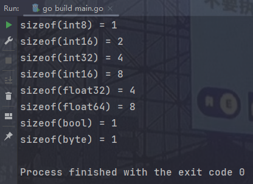

# 4.常量

**常量的定义**

常量，顾名思义在程序运行期间不可以改变的量；

**基本格式**

```go
const 常量名 数据类型 = 常量值
```

示例如下：

```go
package main

import "fmt"

func main() {
   const PI float64 = 3.14
   fmt.Printf("%.2f", PI)
}
```

打印效果如下：

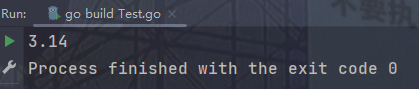

**常量命名规范**

- 只能由数字，字母和下划线组成；
- 不能以数字开头；
- 常量命名规范通常是使用全大写，单词与单词之间使用 `_` 隔离开；
- 不能是关键字；
- 见名知意

**常量注意事项**

- 不允许修改常量的值
- 不允许打印常量的地址

**字面常量**

所谓字面常量（literal），指的是程序中硬编码的常量，例如：

```go
123
3.1415
true
"foo"
```

**iota枚举**

常量声明可以使用iota常量生成器初始化，它用于生成一组以相似规则初始化的常量，但是不用每行都写一遍初始化表达式。

注意：在一个const声明语句中，在第一个声明的常量所在的行，iota将会被置为0，然后在每一个有常量声明的行加一。

具体使用方式如下：

```go
package main

import "fmt"

func main() {
   //1、iota常量自动生成器，每个一行，自动累加1
   //2、iota用于常量赋值
   const (
      a = iota
      b = iota
      c = iota
   )
   fmt.Println("line1 =", a, b, c)
   //3、iota遇到const，会被重置为0
   const d = iota
   fmt.Println("line2 =", d)
   //4、可以只写一个iota
   const (
      e = iota
      f
      g
   )
   fmt.Println("line3 =", e, f, g)
   //5、如果是同一行，值都一样
   const (
      h       = iota
      i, j, k = iota, iota, iota
      l       = iota
   )
   fmt.Println("line4 =", h, i, j, k, l)
}
```

打印效果如下：

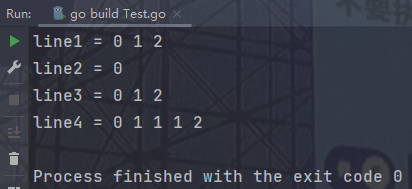

# 5.运算符

## 5.1.算术运算符

| **运算符** | **术语**           | **示例** | **结果** |
| ---------- | ------------------ | -------- | -------- |
| +          | 加                 | 10  + 5  | 15       |
| -          | 减                 | 10 - 5   | 5        |
| *          | 乘                 | 10 * 5   | 50       |
| /          | 除                 | 10 / 5   | 2        |
| %          | 取模(取余)         | 10 % 3   | 1        |
| ++         | 后自增，没有前自增 | a=0; a++ | a=1      |
| --         | 后自减，没有前自减 | a=2; a-- | a=1      |

示例如下：

```go
package main

import "fmt"

func main() {
   var a int = 10
   var b int = 3
   fmt.Printf("a + b = %d\n", a+b)
   fmt.Printf("a - b = %d\n", a-b)
   fmt.Printf("a * b = %d\n", a*b)
   fmt.Printf("a / b = %d\n", a/b)
   fmt.Printf("a %% b = %d\n", a%b)
   a++
   fmt.Printf("a++ = %d\n", a)
   b--
   fmt.Printf("b-- = %d\n", b)
}
```

打印效果如下：

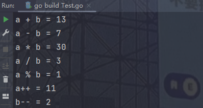

**注意**

- 除法算数运算符除数不能为0
- 取余算术运算符除数不能为0
- Go语言中自增自减只有 a++ 或者 a-- 的形式

**算术运算符案例一**

输入半径，计算圆的面积和周长，并且打印出来（PI为3.14）;

```go
package main

import "fmt"

func main() {
   const PI float64 = 3.14
   num := 0.0
   fmt.Println("请输入圆的半径：")
   fmt.Scan(&num)
   fmt.Printf("计算的结果如下：\n半径为 %f\n面积为 %f\n周长为 %f\n", num, PI*num*num, 2*PI*num)
}
```

打印效果如下：

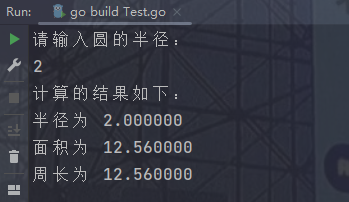

**算术运算符案例二**

某学生三门课成绩为：语文 90 、数学 89 、英语 69 ，编程求总分和平均分；

```go
package main

import "fmt"

func main() {
   chinese := 90
   mathematics := 89
   english := 69
   fmt.Printf("该学生语文成绩为%d，数学成绩为%d，英语成绩为%d\n", chinese, mathematics, english)
   fmt.Printf("该学生总分为%.2f\n", float64(chinese+mathematics+english))
   fmt.Printf("该学生平均分为%.2f\n", float64(chinese+mathematics+english)/3)
}
```

打印效果如下：

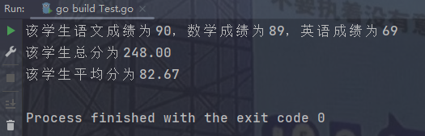

**算术运算符案例三**

问题1:某商店T恤(T-shirt)的价格为35元/件，裤子(trousers)的价格为120元/条。

小明在该店买了3件T恤和2条裤子并且打8.8折。请计算并显示小明应该付多少钱?

问题2:如上题中打完8.8折后出现小数商店为了结算方便，只收用户整数部分的钱，如本应收用户303.6，现在只收用户303元，应该如何做?

```go
package main

import "fmt"

func main() {
   tShirt := 35.0
   trousers := 120.0
   cost := 0.88
   fmt.Println("T恤价值35元，裤子价值120元，折扣是8.8折")
   fmt.Printf("小明买了3件T恤和2条裤子，一共花费：%.2f元\n", (3*tShirt+2*trousers)*cost)
   fmt.Printf("商店只收取整数部分，即收取%d元\n", int((3*tShirt+2*trousers)*cost))
}
```

打印效果如下：

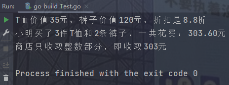

## 5.2.赋值运算符

关于赋值运算符前面我们已经使用过多次，赋值运算符  =  ，

varint num=9;num=num+1; 这里的=号是赋值运算符,不是数学义意上的相等.

常见的赋值运算符如下，前面我们使用的=是普通赋值，+=，-=等我们称为“复合赋值运算符”

| **运算符** | **说明**     | **示例**                              |
| ---------- | ------------ | ------------------------------------- |
| =          | 普通赋值     | c = a + b 将 a + b 表达式结果赋值给 c |
| +=         | 相加后再赋值 | c += a 等价于 c = c + a               |
| -=         | 相减后再赋值 | c -= a 等价于 c = c - a               |
| *=         | 相乘后再赋值 | c *= a 等价于 c = c * a               |
| /=         | 相除后再赋值 | c  /= a 等价于  c = c / a             |
| %=         | 求余后再赋值 | c  %= a 等价于  c = c % a             |

## 5.3.关系运算符

| **运算符** | **术语** | **示例** | **结果** |
| ---------- | -------- | -------- | -------- |
| ==         | 相等于   | 4 == 3   | false    |
| !=         | 不等于   | 4 != 3   | true     |
| <          | 小于     | 4 < 3    | false    |
| >          | 大于     | 4 > 3    | true     |
| <=         | 小于等于 | 4 <= 3   | false    |
| >=         | 大于等于 | 4 >= 1   | true     |

## 5.4.逻辑运算符

| **运算符** | **术语** | **示例** | **结果**                                                 |
| ---------- | -------- | -------- | -------------------------------------------------------- |
| !          | 非       | !a       | 如果a为假，则!a为真；<br />如果a为真，则!a为假。         |
| &&         | 与       | a && b   | 如果a和b都为真，则结果为真，否则为假。                   |
| \|\|       | 或       | a \|\| b | 如果a和b有一个为真，则结果为真，二者都为假时，结果为假。 |

**逻辑运算符案例一**

让用户输入老王的语文和数学成绩,输出以下判断是否正确,正确输出True,错误输出False；

老王的语文和数学成绩都大于90分；

语文和数学有一门是大于90分的；

```go
package main

import "fmt"

func main() {
   chinese := 0.0
   mathematics := 0.0
   fmt.Println("请输入老王的语文成绩：")
   fmt.Scan(&chinese)
   fmt.Println("请输入老王的数学成绩：")
   fmt.Scan(&mathematics)
   fmt.Printf("老王的语文和数学成绩都大于90分，结论：%t\n", chinese > 90 && mathematics > 90)
   fmt.Printf("语文和数学有一门是大于90分的，结论：%t\n", chinese > 90 || mathematics > 90)
}
```

打印效果如下：

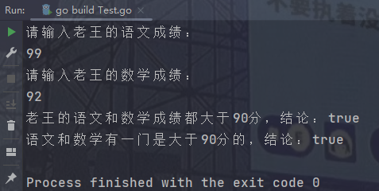

**逻辑运算符案例二**

让用户输入一个年份，如果是闰年，则输出 true，如果不是闰年，则输出 false；

```go
package main

import "fmt"

func main() {
   year := 0
   fmt.Println("请你输入一个年份：")
   fmt.Scan(&year)
   fmt.Printf("这一年是闰年么？结论：%t\n", (year%400 == 0) || (year%4 == 0 && year%100 != 0))
}
```

打印效果如下：

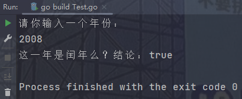

# 6.流程控制

## 6.1.分支结构

### 6.1.1.if

**基本结构：**

```go
if 条件语句 {
	结构体……
}
```

**示例如下：**

```go
package main

import "fmt"

func main() {
   if true {
      fmt.Println("为真就打印")
   }

   age := 19
   if age >= 18 {
      fmt.Println("成年就打印")
   }

   if num := 10; num == 10 {
      fmt.Println("if语句还支持一个初始化语句，初始化语句和条件判断语句以分号隔开")
   }
}
```

打印效果如下：

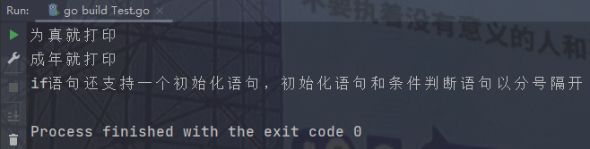

**案例一：**

让用户输入用户名和密码,如果用户名为admin,密码为mypass,则提示登录成功；

```go
package main

import "fmt"

func main() {
	account := ""
	password := ""
	fmt.Println("请输入账号：")
	fmt.Scan(&account)
	fmt.Println("请输入密码：")
	fmt.Scan(&password)

	if account == "admin" && password == "mypass" {
		fmt.Println("登陆成功！")
	}
}
```

打印效果如下：


### 6.1.2.if...else...

**基本结构：**

``` go
if 条件语句 {
	满足条件的结构体……
} else { //结构一定是这样，go语言不支持其他格式，例如else换行就不行
    不满足条件的结构体……
}
```

**案例一：**

小赵的考试成绩大于90(含)分,那么爸爸奖励他100元钱,否则的话,爸爸就让小赵抄课文。

```go
package main

import "fmt"

func main() {
   score := 0
   fmt.Println("请输入小赵的分数：")
   fmt.Scan(&score)

   if score >= 90 {
      fmt.Println("奖励100元")
   } else {
      fmt.Println("抄课文")
   }
}
```

打印效果如下：

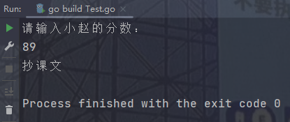

**案例二：**

输入一个数字，判断是否为偶数，如果是输出"该数是偶数”，否则输出"该数是奇数；

```go
package main

import "fmt"

func main() {
   num := 0
   fmt.Println("请输入一个数字：")
   fmt.Scan(&num)

   if num%2 == 0 {
      fmt.Println("该数是偶数")
   } else {
      fmt.Println("该数是奇数")
   }
}
```

打印效果如下：

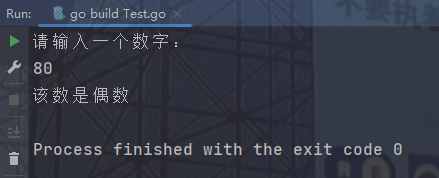

**案例三：**

输入公交卡当前的余额，只要超过2元，就可以上公交车，上车以后如果空座位的数量大于0，就可以坐下；

```go
package main

import "fmt"

func main() {
   money := 0
   fmt.Println("请输入余额：")
   fmt.Scan(&money)

   if money > 2 {
      fmt.Println("已经上车！")
      seat := 0
      fmt.Println("请输入空座位数量：")
      fmt.Scan(&seat)
      if seat > 0 {
         fmt.Println("有位置！可以坐下！")
      } else {
         fmt.Println("没有位置！不能坐下！")
      }
   } else {
      fmt.Println("不能上车！")
   }
}
```

打印效果如下：

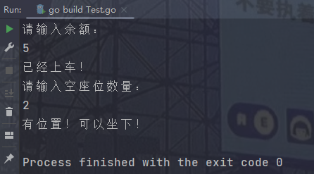

### 6.1.3.if...else if...

**基本结构：**

``` go
if 条件语句1 {
	满足条件1的结构体……
} else if 条件语句2 { //结构一定是这样，go语言不支持其他格式，例如else if换行就不行
    满足条件2的结构体……
} else if 条件语句3 {
    满足条件3的结构体……
} else {
    满足其他条件的结构体……
}
```

**案例一：**

成绩有以下分级：

- 90-100 ==> A
- 80-89 ==> B
- 70-79 ==> C
- 60-69 ==> D
- 0-59 ==> E

```go
package main

import "fmt"

func main() {
	score := 0
	fmt.Println("请输入成绩：")
	fmt.Scan(&score)

	if score < 0 {
		fmt.Println("分数不能小于0")
	} else if score < 60 {
		fmt.Println("E")
	} else if score < 70 {
		fmt.Println("D")
	} else if score < 80 {
		fmt.Println("C")
	} else if score < 90 {
		fmt.Println("B")
	} else if score <= 100 {
		fmt.Println("A")
	} else {
		fmt.Println("分数不能超过100")
	}
}
```

打印效果如下：

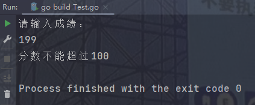

**案例二：**

提示用户输入用户名，然后再提示输入密码，如果用户输入的用户名是“admin”并目密码是“88888”，则提示正确，否则，如果用户名是admin提示密码错误（用户名输入正确，密码输入错误）如果密码是“88888”提示用户名错误（密码输入正确，用户名输入错误）。

```go
package main

import "fmt"

func main() {
	username := ""
	password := ""
	fmt.Println("请输入用户名：")
	fmt.Scan(&username)
	fmt.Println("请输入密码：")
	fmt.Scan(&password)
	if username == "admin" && password == "88888" {
		fmt.Println("登陆成功！")
	} else if username != "admin" && password == "88888" {
		fmt.Println("密码输入正确，用户名输入错误！")
	} else if username == "admin" && password != "88888" {
		fmt.Println("用户名输入正确，密码输入错误！")
	} else {
		fmt.Println("用户名和密码都不对！")
	}
}
```

打印效果如下：

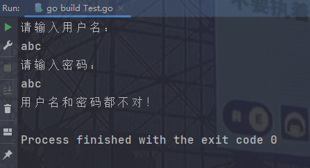

### 6.1.4.switch

**基本结构：**

``` go
switch (初始化语句;)变量或表达式{ //这里也可以像if一样，在条件部分初始化值
case 值1:
    要执行的代码1
case 值2:
    要执行的代码2
case 值3:
    要执行的代码3
……
default:
    默认执行的代码
}
```

**==switch语句中，case后面默认自带break，这一点要谨记；==**

由于每个case后面都自带有一个break，所以如果想强制执行后面的case，需要使用**fallthrough**关键字；

```go
package main

import "fmt"

func main() {
	num := 1
	switch {
	case num <= 1:
		fmt.Println("第一次执行")
		fallthrough
	case num <= 2:
		fmt.Println("第二次执行")
	default:
		fmt.Println("第三次执行")
	}
}
```

打印效果如下：

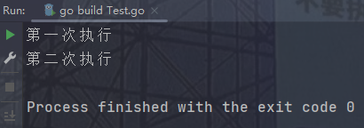

**案例一：**

输入数字1-7，输出”星期一“、……、”星期日“；

```go
package main

import "fmt"

func main() {
	date := 0
	fmt.Println("请输入今天的星期：")
	fmt.Scan(&date)
	switch date {
	case 1:
		fmt.Println("星期一")
	case 2:
		fmt.Println("星期二")
	case 3:
		fmt.Println("星期三")
	case 4:
		fmt.Println("星期四")
	case 5:
		fmt.Println("星期五")
	case 6:
		fmt.Println("星期六")
	case 7:
		fmt.Println("星期日")
	default:
		fmt.Println("输入有误")
	}
}
```

打印效果如下：

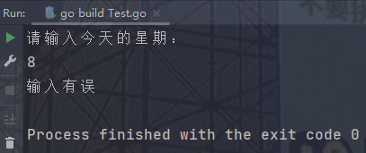

**案例二：**

考试成绩大于等于90输出A，大于等于80输出B，大于等于70输出C，大于等于60输出D，不及格输出E；

```go
package main

import "fmt"

func main() {
   score := 0
   fmt.Println("请输入成绩：")
   fmt.Scan(&score)
   switch {
   case score < 0:
      fmt.Println("输入成绩无效")
   case score < 60:
      fmt.Println("E")
   case score < 70:
      fmt.Println("D")
   case score < 80:
      fmt.Println("C")
   case score < 90:
      fmt.Println("B")
   case score <= 100:
      fmt.Println("A")
   default:
      fmt.Println("输入成绩无效")
   }
}
```

打印效果如下：

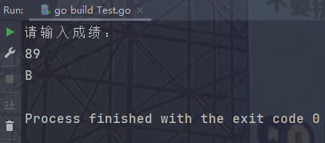

**案例三：**

李四的年终工作评定：

如果定为A级，则工资涨500元；

如果定为B级，则工资涨200元；

如果定为C级工资不变；

如果定为D级，则工资降200元；

如果定为E级，则工资降500元；

设李四的原工资为5000，请用户输入李四的评级然后显示李四来年的工资；

```go
package main

import "fmt"

func main() {
	salary := 0
	level := ""
	fmt.Println("请输入薪资：")
	fmt.Scan(&salary)
	fmt.Println("请输入工作定级：")
	fmt.Scan(&level)

	switch level {
	case "A":
		salary += 500
		fmt.Println(salary)
	case "B":
		salary += 200
		fmt.Println(salary)
	case "C":
		fmt.Println(salary)
	case "D":
		salary -= 200
		fmt.Println(salary)
	case "E":
		salary -= 500
		fmt.Println(salary)
	default:
		fmt.Println("Unknown data")
	}
}
```

打印效果如下：

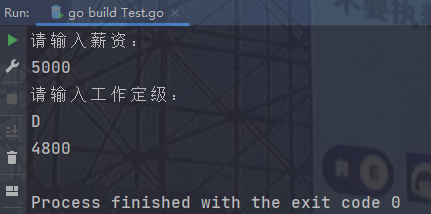

**案例四：**

请用户输年份,再输入月份,输出该月的天数(需要考虑闺年)；

```go
package main

import "fmt"

func main() {
   year := 0
   month := 0
   fmt.Println("请输入年份：")
   fmt.Scan(&year)
   fmt.Println("请输入月份：")
   fmt.Scan(&month)
   if year%400 == 0 || (year%4 == 0 && year%100 != 0) {
      switch month {
      case 1:
         fmt.Println(31)
      case 2:
         fmt.Println(28)
      case 3:
         fmt.Println(31)
      case 4:
         fmt.Println(30)
      case 5:
         fmt.Println(31)
      case 6:
         fmt.Println(30)
      case 7:
         fmt.Println(31)
      case 8:
         fmt.Println(31)
      case 9:
         fmt.Println(30)
      case 10:
         fmt.Println(31)
      case 11:
         fmt.Println(30)
      case 12:
         fmt.Println(31)
      }
   } else {
      switch month {
      case 1:
         fmt.Println(31)
      case 2:
         fmt.Println(29)
      case 3:
         fmt.Println(31)
      case 4:
         fmt.Println(30)
      case 5:
         fmt.Println(31)
      case 6:
         fmt.Println(30)
      case 7:
         fmt.Println(31)
      case 8:
         fmt.Println(31)
      case 9:
         fmt.Println(30)
      case 10:
         fmt.Println(31)
      case 11:
         fmt.Println(30)
      case 12:
         fmt.Println(31)
      }
   }
}
```

打印效果如下：

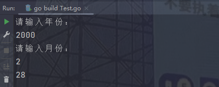

## 6.2.循环结构

==Go语言中只有for循环，没有while和do……while循环；==

**基本结构：**

```go
for 初始化变量;判断条件;修正变量(){
	循环体……
}
```

当然break，continue，return关键字的作用和其他语言的作用相同；

**for range结构：**

for range结构主要用于数组，集合等结构；

```go
for index,value := range 集合名(数组名){
    循环体……
}
```

- index：集合索引
- value：对应索引的值

示例如下（下面涉及还没有学习到的结构，只需要观察结果即可）：

```go
package main

import "fmt"

func main() {
   arr := [5]int{10, 20, 30, 40, 50}
   for index, value := range arr {
      fmt.Printf("%d = %d\n", index, value)
   }
}
```

打印效果如下：

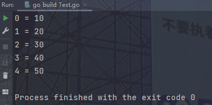

但是通常我们并不需要操作一个数组或者集合的索引，所以我们可以把基本结构改成如下：

```go
for _,value := range 集合名(数组名){
    循环体……
}
```

示例如下：

```go
package main

import "fmt"

func main() {
   arr := [5]int{10, 20, 30, 40, 50}
   for _, value := range arr {
      fmt.Printf("%d\n", value)
   }
}
```

打印效果如下：

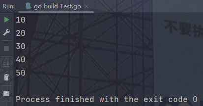

**案例一：**

求1-100的偶数之和；

```go
package main

import "fmt"

func main() {
	num := 0
	for i := 0; i <= 100; i += 2 {
		num += i
	}
	fmt.Println("num =", num)
}
```

打印效果如下：

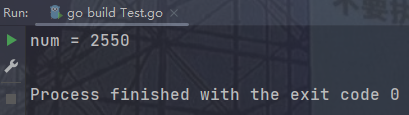

**案例二：**

要求用户输入用户名和密码，只要不是admin、888888就一直提示用户名，密码错误，请重新输入。

```go
package main

import "fmt"

func main() {
	username := ""
	password := ""
	for {
		fmt.Println("请输入用户名：")
		fmt.Scan(&username)
		fmt.Println("请输入密码：")
		fmt.Scan(&password)
		if username != "admin" || password != "888888" {
			fmt.Println("用户名和密码错误！")
		} else {
			fmt.Println("登陆成功！")
			break
		}
	}
}
```

打印效果如下：

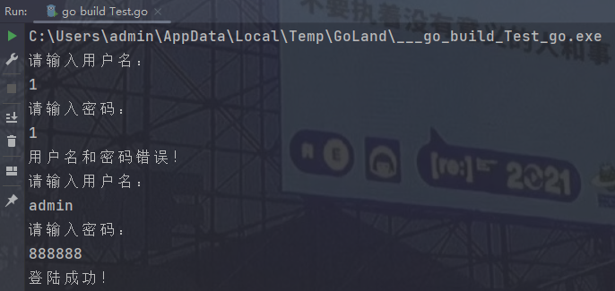

**案例三：**

用户名密码输入错误，最多输错3次，超过3次，提示“输入错误信息次数太多,并且结束整个程序“；

```go
package main

import "fmt"

func main() {
   username := ""
   password := ""
   for i := 0; i < 3; i++ {
      fmt.Println("请输入用户名：")
      fmt.Scan(&username)
      fmt.Println("请输入密码：")
      fmt.Scan(&password)
      if username != "admin" || password != "888888" {
         fmt.Println("用户名和密码错误！")
      } else {
         fmt.Println("登陆成功！")
         break
      }
      if i == 2 {
         fmt.Println("输入错误信息次数太多！")
      }
   }
}
```

打印效果如下：

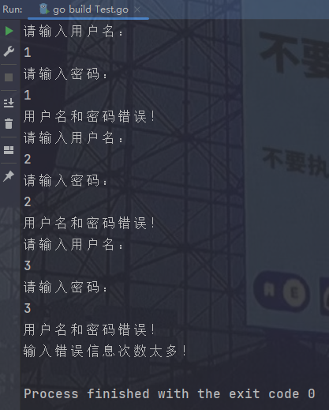

**案例四：**

2006年营业额80000元，每年增长25%，请问按此增长速度，到哪一年营业额将达到20万元；

```go
package main

import "fmt"

func main() {
   money := 80000.0
   count := 0
   for {
      money += money * 0.25
      count++
      if money > 200000 {
         break
      }
   }
   fmt.Printf("到%d年可以达到20万\n", 2006+count)
}
```

打印效果如下：


**案例五：**

找出100-999之间的水仙花数；

```go
package main

import "fmt"

func main() {
   for i := 100; i < 1000; i++ {
      a := i % 10
      b := i % 100 / 10
      c := i / 100
      if a*a*a+b*b*b+c*c*c == i {
         fmt.Println(i)
      }
   }
}
```

打印效果如下：


**案例六：**

编写三角乘法口诀表；

```go
package main

import "fmt"

func main() {
   for i := 1; i < 10; i++ {
      for j := 1; j <= i; j++ {
         fmt.Printf("%d*%d=%d  ", j, i, i*j)
      }
      fmt.Println()
   }
}
```

打印效果如下：


# 7.函数

## 7.1.基础函数

函数是将具有独立功能的代码块组织成为一个整体，使其具有特殊功能的代码集；

使用函数可以加强代码的复用性，提高程序编写的效率；

**基本结构：**

```go
//函数返回单个值的情况（和其他语言相似）
func 函数名(形参名 数据类型,……) 返回值类型 {
	函数体……（）
    return 返回值类型变量
}
//或者在函数签名处指定返回值变量，指定同时也就创建了该变量，所以函数体中不声明该返回值变量
func 函数名(形参名 数据类型,……) (指定返回变量名 返回值类型) {
    函数体……
    return 指定返回变量
}

//函数返回多个值的情况
func 函数名(形参名 数据参数,……) (返回值1类型,返回值2类型,……) {
    函数体……
    return 返回值1,返回值2,……
}
//调用函数时：变量1,变量2,…… = 函数名(参数……)
//如果有不需要的返回值，使用‘_’进行接收
//或者也能够指定返回值变量，和单个值的情况一样
```

函数调用时需要实参位置和形参位置相对应；

**不定参数列表基本结构：**

```go
//不定参数列表的基本结构
func 函数名(参数列表名 ...T类型){
    函数体……
}

//不定参数列表和已知参数列表混用
func 函数名(已知参数名 类型,……,参数列表名 ...T类型){
    函数体……
}
//已知的参数需要写在不定参数之前
```

==此处的函数列表是一个T类型的数组，此时就可以用到 for range 结构进行遍历；==

示例如下：

```go
package main

import "fmt"

func main() {
	TestSum(1, 2, 3, 4, 5, 6, 7, 8, 9, 10)
}
func TestSum(args ...int) {
	sum := 0
	for _, value := range args {
		sum += value
	}
	fmt.Printf("sum = %d\n", sum)
}
```

打印效果如下：


**函数作用域：**

- 定义在函数内部的变量成为局部变量，局部变量的作用域在函数内部；
- 所谓的全局变量：既能在一个函数中使用，也能在其他的函数中使用，这样的变量就是全局变量，也就是定义在函数外部的变量就是全局变量；
- 如果全局变量的名字和局部变量的名字相同，那么使用的是局部变量；

**==全局变量中声明并且初始化一个值，不能使用 a:=10 的形式；==**

**案例一：**

定义一个函数，计算1-100的和；

```go
package main

import "fmt"

func main() {
	sum()
}
func sum() {
	num := 0
	for i := 0; i <= 100; i++ {
		num += i
	}
	fmt.Printf("num = %d\n", num)
}
```

打印效果如下：


**案例二：**

定义一个函数，计算1-n的和；

```go
package main

import "fmt"

func main() {
	init := 0
	fmt.Println("请输入一个数：")
	fmt.Scan(&init)
	sum(init)
}
func sum(init int) {
	num := 0
	for i := 0; i <= init; i++ {
		num += i
	}
	fmt.Printf("num = %d\n", num)
}
```

打印效果如下：


**案例三：**

输入一个人的姓名，并且获取语数外成绩，利用不定参数形式计算总成绩；

```go
package main

import "fmt"

func main() {
   name := ""
   chinese := 0
   mathematics := 0
   english := 0
   fmt.Println("请输入你的姓名：")
   fmt.Scan(&name)
   fmt.Println("请以此输入你的语数外成绩：")
   fmt.Scan(&chinese, &mathematics, &english)
   TestSum(name, chinese, mathematics, english)
}
func TestSum(name string, args ...int) {
   sum := 0
   for _, value := range args {
      sum += value
   }
   fmt.Printf("%s 的总成绩为 %d\n", name, sum)
}
```

打印效果如下：


**示例四：**

用函数模拟用户注册，当用户输入完用户名，密码和邮箱后，进行校验。如果发现用户名，密码和邮箱是空的，则给出“信息不能为空，用户注册失败”的提示，否则，进行邮件发送，并给出“用户注册成功”的提示。

```go
package main

import "fmt"

func main() {
   register()
}

func register() {
   username := ""
   password := ""
   email := ""
   fmt.Println("请输入用户名：")
   fmt.Scan(&username)
   fmt.Println("请输入密码：")
   fmt.Scan(&password)
   fmt.Println("请输入邮箱：")
   fmt.Scan(&email)
   if checkInfo(username, password, email) {
      sendEmail()
      fmt.Println("用户注册成功！")
   } else {
      fmt.Println("信息不能为空，用户注册失败！")
   }
}

func checkInfo(username string, password string, email string) bool {
   if username != "" && password != "" && email != "" {
      return true
   } else {
      return false
   }
}

func sendEmail() {
   fmt.Println("邮件已经发送")
}
```

打印效果如下：


## 7.2.延迟调用

如果想要一个语句延迟调用，那么就需要用到 **defer** 关键字，例如：

```go
package main

import "fmt"

func main() {
   defer fmt.Println("Hello, world!")
   fmt.Println("GoLang")
}
```

打印效果如下：


当有多个 defer 关键字时，被标识的所有语句会安装 LIFO（后进先出）的方式进行调用；

```go
package main

import "fmt"

func main() {
   defer fmt.Println("Hello, world!")
   fmt.Println("GoLang")
   defer fmt.Println("Hello, China!")
   fmt.Println("Java")
   defer fmt.Println("Hello,USA!")
   fmt.Println("C++")
}
```

打印效果如下：


## 7.3.递归函数

**递归函数简介**

如果一个函数在内部调用自身，这个函数就是递归函数；

**举例说明递归函数语法**

寻找自己的排数；

```go
package main

import "fmt"

func main() {
   c := test(3)
   fmt.Println(c)
}

func test(n int) int {
   //只有第一排的人才知道自己的排数
   if n == 1 {
      return 1
   }
   //如果不是第一排，就问一下前一排的人
   r := test(n - 1)
   fmt.Println("前一排的排数：", r)
   //把前一排的排数+1，计算出自己的排数
   return r + 1
}
```

打印效果如下：


**案例一：**

计算一个数的阶乘；

```go
package main

import "fmt"

var a int = 1

func main() {
   calcFactorial(5)
   fmt.Println(a)
}

func calcFactorial(n int) {
   if n == 1 {
      return
   }
   a *= n
   calcFactorial(n - 1)
}
```

打印效果如下：


## 7.4.匿名函数

匿名函数的定义格式如下：

```go
func(参数列表)(返回参数列表){
  函数体
}(实参列表)

//必要的形式框架如下
func (){
    
}()
```

匿名函数的定义就是没有名字的普通函数定义。

**示例如下：**

```go
package main

import "fmt"

func main() {
   a := 1
   b := 2
   sum := func(a int, b int) int {
      return a + b
   }(a, b)
   fmt.Println("sum =", sum)
}
```

打印效果如下：


# 8.数组

数组，指一系列同一类型数据的集合；

## 8.1.一维数组

**数组的声明**

```go
//var 数组名 [元素数量]类型
var nums [5]int
```

**数组的初始化**

```go
//var 数组名 [元素数量]类型 = [元素数量]类型{对应数量的内容……}
var nums [5]int = [5]int{1, 2, 3, 4, 5}

//var 数组名 = [元素数量]类型{对应数量的内容……}
var nums = [5]int{1, 2, 3, 4, 5}

//数组名 := [元素数量]类型{对应数量的内容……}
nums := [5]int{1, 2, 3, 4, 5}

//模糊数量的数组
//数组名 := [...]int{1,2,3}
nums := [...]int{1, 2, 3, 4, 5}
```

**数组的赋值**

```go
var nums [5]int
nums = [5]int{1, 2, 3, 4, 5}
```

**数组的便利**

```go
//主要有for……len和for……range的方式
package main

import "fmt"

func main() {
	nums := [...]int{1, 2, 3, 4, 5}
    
	//方法一
	for i := 0; i < len(nums); i++ {
		fmt.Println(nums[i])
	}

    //方法二
	for _, v := range nums {
		fmt.Println(v)
	}
}
```

**数组作为数组参数**

```go
package main

import "fmt"

func main() {
   nums := [5]int{1, 2, 3, 4, 5}
   i := add(nums)
   fmt.Println(i)
}

func add(arr [5]int) int {
   sum := 0
   for i := 0; i < len(arr); i++ {
      sum += arr[i]
   }
   return sum
}
```

打印效果如下：


**案例一：**

完成两个数组中元素的比较，判断其相同下标对应的元素是否完全一致；

```go
package main

import "fmt"

func main() {
   nums1 := [5]int{1, 2, 3, 4, 5}
   nums2 := [5]int{1, 2, 3, 4, 5}
   b := compare(nums1, nums2)
   fmt.Println(b)
}

func compare(a [5]int, b [5]int) bool {
   for i := 0; i < len(a); i++ {
      if a[i] != b[i] {
         return false
      }
   }
   return true
}
```

打印效果如下：


还有一个更简单的方法，那就是直接用 **==** ，这个就区别于Java了，Java中双等号表示比较哈希zhi;

```go
package main

import "fmt"

func main() {
   nums1 := [5]int{1, 2, 3, 4, 5}
   nums2 := [5]int{1, 2, 3, 4, 5}
   b := compare(nums1, nums2)
   fmt.Println(b)
}

func compare(a [5]int, b [5]int) bool {
   if a == b {
      return true
   } else {
      return false
   }
}
```

打印效果如下：


**案例二：**

从一个整数数组中取出最大的整数，最小整数，并且求总和，求平均值；

```go
package main

import "fmt"

func main() {
   arr := [6]int{87, 23, 3, 442, 534, 6983}
   min := arr[0]
   max := arr[0]
   sum := 0
   for i := 0; i < len(arr); i++ {
      sum += arr[i]
      if arr[i] < min {
         min = arr[i]
      }
      if arr[i] > max {
         max = arr[i]
      }
   }
   avg := sum / len(arr)
   fmt.Println("最大值：", max)
   fmt.Println("最小值：", min)
   fmt.Println("求和：", sum)
   fmt.Println("求平均值：", avg)
}
```

打印效果如下：


**案例三：**

有一个字符串数组：{"马龙","迈克尔乔丹","雷吉米勒","蒂姆邓肯","科比布莱恩特"}；请输出最长的字符串；

```go
package main

import "fmt"

func main() {
   str := [5]string{"马龙", "迈克尔乔丹", "雷吉米勒", "科比布莱恩特", "蒂姆邓肯"}
   length := len(str[0])
   index := 0
   for i, s := range str {
      if len(s) > length {
         length = len(s)
         index = i
      }
   }
   fmt.Println("the max arr = ", str[index])
}
```

打印效果如下：


## 8.2.二维数组

**==二维数组的声明和初始化和一维数组相当；==**

**二维数组声明**

```go
var 数组名[行数][列数]类型
```

**二维数组初始化**

```go
package main

import "fmt"

func main() {
	var arr1 [2][3]int = [2][3]int{{1, 2, 3}, {4, 5, 6}}
	arr2 := [2][3]int{{1, 2, 3}, {4, 5, 6}}
	var arr3 = [2][3]int{{1, 2, 3}, {4, 5, 6}}
	//行的下标可以用三个点来代替，但是列的下标不可以用三个点来代替
	arr4 := [...][3]int{{1, 2, 3}, {4, 5, 6}}
	fmt.Println("arr1 =", arr1)
	fmt.Println("arr2 =", arr2)
	fmt.Println("arr3 =", arr3)
	fmt.Println("arr4 =", arr4)
}
```

打印效果如下：


**二维数组遍历**

for……len() 遍历：

```go
package main

import "fmt"

func main() {
	arr := [2][3]int{{1, 2, 3}, {4, 5, 6}}
	for _, i := range arr {
		for _, j := range i {
			fmt.Printf("%d ", j)
		}
		fmt.Println()
	}
}
```

打印效果如下：


for……len() 遍历：

```go
package main

import "fmt"

func main() {
	arr := [2][3]int{{1, 2, 3}, {4, 5, 6}}
	for i := 0; i < len(arr); i++ {
		for j := 0; j < len(arr[0]); j++ {
			fmt.Printf("%d ", arr[i][j])
		}
		fmt.Println()
	}
}
```

打印效果如下：


# 9.切片

**数组的思考**

数组定义完之后，长度是固定的，一旦遇到动态变化的程序，数组使用就可能非常麻烦，所以Go语言提出了切片的概念，可以把切片理解成“动态数组”，但是他本质不是数组，在以后的编程中，切片会逐渐替代掉数组；

## 9.1.切片创建

```go
//切片创建有三种方式：
//1.var 切片名 []数据类型
//2.切片名 := []数据类型
//3.使用make()函数创建：
//  3.1.make(切片类型,长度,容量)
//      切片类型就是 []数据类型
//      长度就是 初始化后真实存在的元素个数
//      容量就是 初始化最大能包含的元素个数
//      注意：容量 >= 长度
//  3.2.make(切片类型,容量)
//      这种参数列表的容量和长度相同；
package main

import "fmt"

func main() {
	var num1 []int
	fmt.Println("num1 =", num1, ",len(num1) =", len(num1), ",cap(num1) =", cap(num1))

	num2 := []int{}
	fmt.Println("num2 =", num2, ",len(num2) =", len(num2), ",cap(num2) =", cap(num2))

	num3 := make([]int, 0, 0)
	fmt.Println("num3 =", num3, ",len(num3) =", len(num3), ",cap(num3) =", cap(num3))

	num4 := make([]int, 3)
	fmt.Println("num4 =", num4, ",len(num4) =", len(num4), ",cap(num4) =", cap(num4))
}
```

打印效果如下：


## 9.2.切片初始化

```go
package main

import "fmt"

func main() {
   var num1 []int
   fmt.Println("num1 =", num1, ",len(num1) =", len(num1), ",cap(num1) =", cap(num1))
   num1 = append(num1, 1, 2, 3, 4, 5)
   fmt.Println("num1 =", num1, ",len(num1) =", len(num1), ",cap(num1) =", cap(num1))
   num1 = append(num1, 6, 7, 8, 9, 10)
   fmt.Println("num1 =", num1, ",len(num1) =", len(num1), ",cap(num1) =", cap(num1))

   num2 := []int{1, 2, 3, 4, 5}
   fmt.Println("num2 =", num2, ",len(num2) =", len(num2), ",cap(num2) =", cap(num2))
   num2 = append(num2, 6, 7, 8, 9, 10)
   fmt.Println("num2 =", num2, ",len(num2) =", len(num2), ",cap(num2) =", cap(num2))

   num3 := make([]int, 10)
   fmt.Println("num3 =", num3, ",len(num3) =", len(num3), ",cap(num3) =", cap(num3))
   //这里循环条件是小于长度，而不是容量
   for i := 0; i < len(num3); i++ {
      num3[i] = i + 1
   }
   fmt.Println("num3 =", num3, ",len(num3) =", len(num3), ",cap(num3) =", cap(num3))
}
```

打印效果如下：


## 9.3.切片的遍历

```go
package main

import "fmt"

func main() {
   nums := []int{1, 2, 3, 4, 5, 6, 7, 8, 9, 10}
   for i := 0; i < len(nums); i++ {
      fmt.Printf("%d ", nums[i])
   }
   fmt.Println()
   for _, v := range nums {
      fmt.Printf("%d ", v)
   }
}
```

打印效果如下：


## 9.4.切片的截取


```go
package main

import "fmt"

func main() {
   nums := []int{1, 2, 3, 4, 5, 6, 7, 8, 9, 10}
   fmt.Println("len(nums) =", len(nums), ",cap(nums) =", cap(nums))
   fmt.Println("nums[1] =", nums[1])
   fmt.Println("nums[:] =", nums[:])
   fmt.Println("nums[5:] =", nums[5:])
   fmt.Println("nums[:5] =", nums[:5])
   fmt.Println("nums[3:7] =", nums[3:7])
   //nums[low:high:max]中 max >= high >= low
   fmt.Println("nums[3:7:5] =", nums[3:7:7])
}
```

打印效果如下：


**问题：如果我们将切片截取后返回新切片。对新切片的值进行修改，会影响原切片么；**

```go
package main

import "fmt"

func main() {
   num1 := []int{1, 2, 3, 4, 5, 6, 7, 8, 9, 10}
   num2 := []int{}
   num2 = num1[1:5]
   fmt.Println(num1)
   fmt.Println(num2)
   num2[0] = 999
   fmt.Println(num1)
   fmt.Println(num2)
}
```

打印效果如下：


==关于切片截取的问题，在Go语言中会影响原来的切片，和Java中ArrayList相似；==

## 9.5.append函数扩容机制

一般扩容方式是扩容至扩容前容量的2倍，如果超过1024字节，每次扩容至扩容前的1.25倍；Java中扩容机制是扩容至扩容前的1.5倍；

```go
package main

import "fmt"

func main() {
   num := make([]int, 3, 5)
   num = append(num, 1)
   num = append(num, 2)
   fmt.Println("len(num) =", len(num))
   fmt.Println("cap(num) =", cap(num))
   num = append(num, 3)
   fmt.Println("len(num) =", len(num))
   fmt.Println("cap(num) =", cap(num))
}
```

打印效果如下：


## 9.6.copy拷贝函数

**基本结构**

```go
//将切片2拷贝至切片1
copy(切片1,切片2)
```

示例如下：

```go
package main

import "fmt"

func main() {
   num1 := []int{1, 2, 3, 4}
   num2 := []int{5, 6, 7, 8}
   fmt.Println("num1 =", num1)
   fmt.Println("num2 =", num2)
   copy(num1, num2)
   fmt.Println("num1 =", num1)
   fmt.Println("num2 =", num2)
}
```

打印效果如下：


**如果拷贝的两个切片长度不一致，那么拷贝的长度为两个切片中长度较小的长度值；**

```go
package main

import "fmt"

func main() {
	num1 := []int{1, 2}
	num2 := []int{5, 6, 7, 8}
	fmt.Println("num1 =", num1)
	fmt.Println("num2 =", num2)
	copy(num1, num2)
	fmt.Println("num1 =", num1)
	fmt.Println("num2 =", num2)
}
```

打印效果如下：


## 9.7.切片作为函数参数

```go
package main

import "fmt"

func main() {
   num := []int{1, 2, 3, 4}
   ints := add1(num)
   fmt.Println(ints)
}

func add1(num []int) []int {
   fmt.Println("原切片如下：")
   for _, v := range num {
      fmt.Printf("%d ", v)
   }
   fmt.Println()
   num = append(num, 1)
   fmt.Println("已经添加数字1")
   return num
}
```

打印效果如下：


==如果传入后对其中的值进行了修改，原来的切片也会被一并修改，这个和数组就有区别了，和Java中的ArrayList类似；==

```go
package main

import "fmt"

func main() {
   num := []int{1, 2, 3, 4, 5}
   updateAllZero(num)
   fmt.Println("修改后的切片：")
   fmt.Println(num)
}

func updateAllZero(num []int) {
   fmt.Println("原切片如下：")
   for _, v := range num {
      fmt.Printf("%d ", v)
   }
   fmt.Println()
   for i := 0; i < len(num); i++ {
      num[i] = 0
   }
}
```

打印效果如下：


==append() 函数本就返回了一个切片，并不是对原切片进行的操作，所以没办法改变原切片；==

## 9.8.切片案例

**案例一：**

计算出一组整型数据之和；（Go与C语言类似，不能在创建数组时使用变量作为数组个数）

```go
package main

import (
	"fmt"
)

func main() {
	num := 0
	sum := 0
	fmt.Println("请输入你要输入的数的个数：")
	fmt.Scan(&num)

	arr := make([]int, num)
	for i := 0; i < len(arr); i++ {
		fmt.Println("请输入第", i+1, "个数：")
		fmt.Scan(&arr[i])
		sum += arr[i]
	}
	fmt.Printf("sum = %d\n", sum)
}
```

打印效果如下：


**案例二：**

输出一组整型数据最大的值；

```go
package main

import (
   "fmt"
)

func main() {
   num := 0
   fmt.Println("请输入你要比较的数的个数：")
   fmt.Scan(&num)
   arr := make([]int, num)
   for i := 0; i < len(arr); i++ {
      fmt.Println("请输入第", i+1, "个数：")
      fmt.Scan(&arr[i])
   }
   max := arr[0]
   for i := 0; i < len(arr); i++ {
      if arr[i] > max {
         max = arr[i]
      }
   }
   fmt.Println("max =", max)
}
```

打印效果如下：


## 9.9.排序

### 9.9.1.冒泡排序

```go
package main

import "fmt"

func main() {
   num := []int{10, 9, 8, 7, 6, 5, 4, 3, 2, 1}
   for i := 0; i < len(num); i++ {
      for j := 0; j < i; j++ {
         if num[j] >= num[i] {
            temp := num[j]
            num[j] = num[i]
            num[i] = temp
         }
      }
      fmt.Println(num)
   }
}
```

打印效果如下：


### 9.9.2.选择排序

```go
package main

import "fmt"

func main() {
   num := []int{38, 20, 46, 38, 74, 91, 12, 25}
   for i := 0; i < len(num); i++ {
      min := num[i]
      index := i
      for j := i; j < len(num); j++ {
         if num[j] < min {
            min = num[j]
            index = j
         }
      }
      temp := num[i]
      num[i] = min
      num[index] = temp
      fmt.Println(num)
   }
}
```

打印效果如下：


# 10.map

**数组和切片的思考**

当我们想要查询一个元素是，我们需要知道索引才能找到我们想要找的元素，这样就显得很麻烦，因为我们并不能每次找一个元素都需要把索引熟悉一边，所以引入了键值对的概念；

## 10.1.map概念

map是一种无序的键值对的集合，map最重要的一点就是通过key来快速检索数据，key就类似于索引，指向数据的值，所以键具有唯一性；

## 10.2.map创建与初始化

**map创建：==创建和声明不一样，创建是指声明并且初始化为空，map类型第一步一定是创建；==**

```go
//map创建有以下三种方式
//1.var map名 map[键的类型]值的类型 = map[键的类型]值的类型{}
//2.map名 := map[键的类型]值的类型{}
//3.map名 := make(map[键的类型]值的类型,map容量)  map容量一般不设置
package main

import "fmt"

func main() {
	var mapName1 map[int]string = map[int]string{}
	fmt.Println("mapName1 =", mapName1)

	mapName2 := map[int]string{}
	fmt.Println("mapName2 =", mapName2)

	mapName3 := make(map[int]string)
	fmt.Println("mapName3 =", mapName3)
}
```

打印效果如下：


**map初始化：**

```go
package main

import "fmt"

func main() {
   var mapName1 map[int]string = map[int]string{1: "张三", 2: "李四", 3: "王五", 4: "Antony"}
   fmt.Println("mapName1 =", mapName1)

   mapName2 := map[int]string{1: "张三", 2: "李四", 3: "王五", 4: "Antony"}
   fmt.Println("mapName2 =", mapName2)

   mapName3 := make(map[int]string)
   mapName3[1] = "张三"
   mapName3[2] = "李四"
   mapName3[3] = "王五"
   mapName3[4] = "Antony"
   fmt.Println("mapName3 =", mapName3)
}
```

打印效果如下：


## 10.3.键值操作

**通过Key获取值**

基本格式：

```go
map名[键]
```

示例如下：

```go
package main

import "fmt"

func main() {
   var mapName1 map[int]string = map[int]string{1: "张三", 2: "李四", 3: "王五", 4: "Antony"}
   fmt.Println(mapName1[1])
}
```

**通过Key获取值时，判断其是否存在**

基本格式：

```go
变量1,变量2 := map名[键]
//如果该键所对应的值存在，那么变量1中存储对应值，并且变量2的值变为true；
//如果该键所对应的值不存在，那么变量1中存储为空,并且变量2的值变为false；
```

示例如下：

```go
package main

import "fmt"

func main() {
   var mapName1 map[int]string = map[int]string{1: "张三", 2: "李四", 3: "王五", 4: "Antony"}
   var v1, b1 = mapName1[1]
   var v2, b2 = mapName1[100]
   fmt.Printf("mapName[1] ==> %s : %t\n", v1, b1)
   fmt.Printf("mapName[2] ==> %s : %t\n", v2, b2)
}
```

打印效果如下：


**通过循环方式获取值**

```go
package main

import "fmt"

func main() {
   var mapName map[int]string = map[int]string{1: "张三", 2: "李四", 3: "王五", 4: "Antony"}
   for k, v := range mapName {
      fmt.Printf("%d: %s\n", k, v)
   }
}
```

打印效果如下：


**通过Key删除某个值**

```go
package main

import "fmt"

func main() {
   var mapName map[int]string = map[int]string{1: "张三", 2: "李四", 3: "王五", 4: "Antony"}
   delete(mapName, 1)
   delete(mapName, 3)
   for k, v := range mapName {
      fmt.Println(k, ":", v)
   }
}
```

打印效果如下：


## 10.4.map作为函数参数

==Go语言中map作为函数参数，内容被修改后，会影响原map的内容；==

```go
package main

import (
   "fmt"
)

func main() {
   key := 0
   fmt.Println("请输入你要验证的key值：")
   fmt.Scan(&key)
   m := map[int]string{1: "张三", 2: "李四"}
   exists, result := checkExists(m, key)
   fmt.Println(exists, ":", result)
}

func checkExists(m map[int]string, key int) (bool, string) {
   var v, b = m[key]
   if b {
      return b, v
   } else {
      return b, "null"
   }
}
```

打印效果如下：


**10.5.map案例**

**案例一：**

有一个英文字符串，统计每个字母出现的次数；

```go
package main

import "fmt"

func main() {
   str := ""
   fmt.Println("请输入英文字符串：")
   fmt.Scan(&str)
   m := map[byte]int{}
   for _, v := range str {
      var _, b = m[byte(v)]
      if b {
         m[byte(v)] = m[byte(v)] + 1
      } else {
         m[byte(v)] = 1
      }
   }
   for k, v := range m {
      fmt.Printf("%c : %d\n", k, v)
   }
}
```

打印效果如下：


# 11.结构体

## 11.1.结构体简介

结构体是由一系列具有相同类型或者不同类型的数据构成的数据集合；结构体可以很好的管理一批有联系的数据，使用结构体可以提高程序的易读性；

## 11.2.结构体的创建和初始化

### 11.2.1.结构体创建

**基本格式**

==结构体中的元素是成员而不是变量，所以不能使用关键字var；==

```go
type 结构体名 struct{
	成员名 数据变量
	……
}
```

示例如下：

```go
type Student struct{
    id int
    name string
    sex string
    age int
    addr string
}
```

### 11.2.2.初始化

**顺序初始化**

```go
package main

import "fmt"

func main() {
   type Student struct {
      id   int
      name string
      sex  string
      age  int
      addr string
   }
   //创建结构体变量后进行顺序初始化
   var s Student = Student{2022, "Antony", "male", 18, "China"}
   fmt.Println(s)
}
```

打印效果如下：


**指定成员初始化**

```go
package main

import "fmt"

func main() {
   type Student struct {
      id   int
      name string
      sex  string
      age  int
      addr string
   }
   var s Student = Student{id: 2022, name: "Antony", age: 18}
   fmt.Println(s)
}
```

打印结果如下：


**通过“结构体变量.成员”来完成初始化**

```go
package main

import "fmt"

func main() {
   type Student struct {
      id   int
      name string
      sex  string
      age  int
      addr string
   }
   var s Student = Student{}
   s.id = 2022
   s.name = "Antony"
   s.sex = "male"
   s.age = 18
   fmt.Println(s)
}
```

打印结果如下：


## 11.3.结构体和数组

**结构体数组基本结构**

```go
//结构体数组声明
var 结构体数组名 [元素个数]结构体类型{}
结构体数组名 := [元素个数]结构体类型{}

//结构体数组初始化
var 结构体数组名 [元素个数]结构体类型{
    结构体类型{},
    结构体类型{},
    ……
    结构体类型{}, //结尾需要有 ‘,’
}
结构体数组名 := [元素个数]结构体类型{
    结构体类型{},
    结构体类型{},
    ……
    结构体类型{},
}
```

示例如下：

```go
package main

import (
   "fmt"
)

type Student struct {
   id   int
   name string
   sex  string
   age  int
   addr string
}

func main() {
   students1 := [3]Student{
      Student{101, "Antony", "male", 18, "China"},
      Student{102, "Tom", "male", 18, "China"},
      Student{103, "Amy", "male", 18, "China"},
   }
   for _, student := range students1 {
      fmt.Println(student)
   }
}
```

打印效果如下：


## 11.4.结构体和切片

**结构体切片基本结构**

```go
//结构体切片声明
var 结构体切片名 []结构体类型{}
结构体切片名 := []结构体类型{}
结构体切片名 := make([]结构体类型,长度,容量)

//结构体切片初始化
var 结构体切片名 []结构体类型{
    结构体类型{},
    结构体类型{},
    ……
    结构体类型{}, //结尾需要有 ‘,’
}
结构体切片名 := []结构体类型{
    结构体类型{},
    结构体类型{},
    ……
    结构体类型{},
}
```

示例如下：

```go
package main

import "fmt"

type Student struct {
   id   int
   name string
   sex  string
   age  int
   addr string
}

func main() {
   var students []Student = []Student{
      Student{201, "Antony1", "male", 21, "China"},
      Student{202, "Antony2", "male", 22, "China"},
      Student{203, "Antony3", "male", 23, "China"},
      Student{204, "Antony4", "male", 24, "China"},
      Student{205, "Antony5", "male", 25, "China"},
   }
   students = append(students, Student{206, "Antony6", "male", 26, "China"}, Student{207, "Antony7", "male", 27, "China"})
   for _, student := range students {
      fmt.Println(student)
   }
}
```

打印效果如下：


## 11.5.结构体和map

**结构体map基本结构**

```go
//结构体map创建
var 结构体map名 map[键数据类型]结构体类型 = map[键数据类型]结构体类型{}
var 结构体map名 map[结构体类型]值数据类型 = map[结构体类型]值数据类型
var 结构体map名 map[结构体类型]结构体类型 = map[结构体类型]结构体类型
结构体map名 := map[键数据类型]结构体类型{}
结构体map名 := map[结构体类型]值数据类型{}
结构体map名 := map[结构体类型]结构体类型{}
结构体map名 := make(map[键数据类型]结构体类型)
结构体map名 := make(map[结构体类型]值数据类型)
结构体map名 := make(map[结构体类型]结构体类型)

//结构体map初始化
var 结构体map名 map[键类型]值类型{
    键值对,
    键值对,
    ……
    键值对, //结尾需要有 ‘,’
}
结构体map名 := [键类型]值类型{
    键值对,
    键值对,
    ……
    键值对,
}
```

示例如下：

```go
package main

import "fmt"

type Student struct {
   id   int
   name string
   sex  string
   age  int
   addr string
}

func main() {
   var studentMap1 map[Student]string = map[Student]string{}
   studentMap1[Student{301, "Antony1", "male", 22, "China"}] = "Student1"
   studentMap1[Student{302, "Antony2", "male", 22, "China"}] = "Student2"
   studentMap1[Student{303, "Antony3", "male", 22, "China"}] = "Student3"
   for k, v := range studentMap1 {
      fmt.Println(k, v)
   }

   studentMap2 := map[string]Student{}
   studentMap2["Student1"] = Student{301, "Antony1", "male", 22, "China"}
   studentMap2["Student2"] = Student{302, "Antony2", "male", 22, "China"}
   studentMap2["Student3"] = Student{303, "Antony3", "male", 22, "China"}
   for k, v := range studentMap2 {
      fmt.Println(k, v)
   }

   studentMap3 := make(map[Student]Student)
   studentMap3[Student{301, "Antony1", "male", 22, "China"}] = Student{301, "Antony1", "male", 22, "China"}
   studentMap3[Student{302, "Antony2", "male", 22, "China"}] = Student{302, "Antony2", "male", 22, "China"}
   studentMap3[Student{303, "Antony3", "male", 22, "China"}] = Student{303, "Antony3", "male", 22, "China"}
   for k, v := range studentMap3 {
      fmt.Println(k, v)
   }
}
```

打印效果如下：


## 11.6.结构体作为函数参数

==在函数中修改结构体的成员值，不会影响到原结构体；==

```go
package main

import "fmt"

type Employee struct {
	id     int
	name   string
	salary float64
}

func main() {
	employee := Employee{101, "Antony", 8000}
	employee = addSalary1000(employee)
	fmt.Println(employee.name, "修改后的薪水是：", employee.salary)
}

func addSalary1000(e Employee) Employee {
	fmt.Println(e.name, "修改前的薪水是：", e.salary)
	e.salary += 1000
	return e
}
```

打印效果如下：


**案例一：**

输出年龄最大的学生的详细信息；

```go
package main

import "fmt"

type Student struct {
   name string
   age  int
}

func main() {
   num := 0
   fmt.Println("请输入学生个数：")
   fmt.Scan(&num)
   students := make([]Student, num)
   for i := 0; i < len(students); i++ {
      fmt.Printf("请输入第%d个学生的姓名：", i+1)
      fmt.Scan(&students[i].name)
      fmt.Printf("请输入第%d个学生的年龄：", i+1)
      fmt.Scan(&students[i].age)
   }
   max := students[0].age
   index := 0
   for i, student := range students {
      if student.age > max {
         index = i
      }
   }
   fmt.Printf("年龄最大的学生姓名为%s，年龄为%d", students[index].name, students[index].age)
}
```

打印效果如下：


# 12.指针

## 12.1.指针简介

指针也是一个变量，但它是一种特殊的变量，因为它存储的数据不仅仅是一个普通的值，如简单的整数或者字符串，而是另一个变量的内存地址；

## 12.2.指针使用

**指针类型基本格式**

```go
var 指针变量名 *数据类型 = &变量名
指针变量名 := &变量名
```

**指针注意事项**

- 不要操作空指针；

  ```go
  package main
  
  import "fmt"
  
  func main() {
     var p *int
     fmt.Println(p)
  }
  ```

  打印效果如下：

  

- 不要操作没有合法指向的内存；

  ```go
  package main
  
  import "fmt"
  
  func main() {
     var p *int
     *p = 56
     fmt.Println(p)
  }
  ```

  打印效果如下：

  

- new(对应数据类型) 函数使用，==类似于C语言中的malloc和calloc==；

  `new()` 使用后得到的是一个对象的指针类型；
  
  ```go
  package main
  
  import "fmt"
  
  func main() {
     var p *int
     p = new(int)
     *p = 56
     fmt.Println(p)
  }
  ```

  打印效果如下：
  
  

## 12.3.将指针作为函数参数

**基本格式**

```go
func 函数名(指针类型) {
	函数体
}
```

示例如下：

```go
package main

import "fmt"

func main() {
   num := 10
   update(&num)
   fmt.Println("num =", num)
}

func update(num *int) {
   *num = 60
}
```

打印效果如下：


## 12.4.数组指针

示例如下：

```go
package main

import "fmt"

func main() {
	num := [5]int{1, 2, 3, 4, 5}
	p := &num
	fmt.Println(p)
	update(p)
	fmt.Println("num =", num)
}

func update(num *[5]int) {
	num[0] = 0
	num[1] = 0
	num[2] = 0
	num[3] = 0
	num[4] = 0
}
```

打印效果如下：


## 12.5.指针数组

示例如下：

```go
package main

import (
	"fmt"
)

func main() {
	var num1 int
	var num2 int
	var num3 int
	var num4 int
	var num5 int
	nums := [5]*int{&num1, &num2, &num3, &num4, &num5}
	initArr(nums)
	fmt.Println("初始化后的数组为：")
	for _, num := range nums {
		fmt.Printf("%d ", *num)
	}
}
func initArr(nums [5]*int) {
	fmt.Println("初始化数组：")
	for i, v := range nums {
		fmt.Println("初始化第", i+1, "个数：")
		fmt.Scan(v)
	}
}
```

打印效果如下：


## 12.6.指针与切片

==该操作和数组指针的差别就在于用指针取值的时候，指针数组既可以使用 **p[index]** ，也可以用 **(\*p)[index]** ，但是指针切片只能用 **(\*p)[index]**；==

示例如下：

```go
package main

import "fmt"

func main() {
   nums := []int{1, 2, 3, 4, 5, 6, 7, 8}
   p := &nums
   (*p)[0] = 200
   fmt.Println(nums)
   for i := 0; i < len(*p); i++ {
      fmt.Println((*p)[i])
   }
}
```

打印效果如下：


## 12.7.指针与结构体

示例如下：

```go
package main

import "fmt"

type Student struct {
   id   int
   name string
   age  int
}

func main() {
   student := Student{1, "Antony", 18}
   p := &student
   fmt.Println("student =", *p)
   fmt.Println("id =", (*p).id)
   fmt.Println("name =", p.name)
   p.age = 20
   fmt.Println("student =", p)
}
```

打印效果如下：


用函数修改结构体：

```go
package main

import "fmt"

type Student struct {
   id   int
   name string
   age  int
}

func main() {
   student := Student{1, "Antony", 18}
   p := &student
   updateStudent(p)
   fmt.Println("student =", p)
}

func updateStudent(student *Student) {
   student.id = 2
   student.age = 99
}
```


## 12.8.多级指针

示例如下：

```go
package main

import "fmt"

func main() {
   var num int
   var p *int
   var pp **int
   p = &num
   pp = &p
   **pp = 99
   fmt.Println("修改后的值：")
   fmt.Println(num, *p, **pp)
   fmt.Println("三者的地址：")
   fmt.Printf("%p %p %p\n", &num, p, *pp)
}
```

打印效果如下：


# 13.基础进阶

## 13.1.深浅拷贝

**浅拷贝：**仅仅拷贝的是变量的值，没有对指向的空间进行任何的拷贝；

拷贝的是数据地址，只复制指向的对象的指针，此时新对象和老对象指向的内存地址是一样的，新对象值修改时老对象也会变化。释放内存地址时，同时释放内存地址；

引用类型的数据，默认全部都是浅复制，slice切片，map；

**深拷贝：**将原有的变量的空间全部拷贝一份；

拷贝的是数据本身，创造一个样的新对象，新创建的对象与原对象不共享内存，新创建的对象在内存中开辟一个新的内存地址，新对象值修改时不会影响原对象值。既然内存地址不同，释放内存地址时，可分别释放；

值类型的数据，默认全部都是深复制，array数组、int、string、struct、float32/64、bool；

### 区别

**本质区别：**是否真正获取（复制）对象的实体，而不是引用；

**表象区别：**是否能同时释放资源；

### 示例

比如P2复制了P1，修改P1属性的时候，观察P2的属性是否会产生变化：

- P2的属性变化了，说明这是浅拷贝，堆中内存还是同一个值；

  ```go
  p2=&p1 // 浅拷贝，p2为指针，p1和p2共用一个内存地址
  ```

- P2的属性没变化，说明这是深拷贝，堆中内存是不同的值了；

  ```go
  p2=p1 // 深拷贝，生成两个内存地址 
  ```

## 13.2.传参分析

==这里分析切片，其实map底层也类似，所以结论通用；==

**切片部分源码如下：**

```go
package runtime

import (
   "internal/abi"
   "internal/goarch"
   "runtime/internal/math"
   "runtime/internal/sys"
   "unsafe"
)

type slice struct {
   array unsafe.Pointer
   len   int
   cap   int
}

// A notInHeapSlice is a slice backed by go:notinheap memory.
type notInHeapSlice struct {
   array *notInHeap
   len   int
   cap   int
}

func panicmakeslicelen() {
   panic(errorString("makeslice: len out of range"))
}

func panicmakeslicecap() {
   panic(errorString("makeslice: cap out of range"))
}
......
```

可以看出切片在底层是一个结构体，成员有切片的指针，切片的长度和切片的容量；

当切片在传参时，传递的是切片的指针，满足**浅拷贝**的条件，所以切片作为参数引入函数后，里面的值一旦发生修改，那么原切片也会被修改；

**append方法：**

源码如下：

```go
// The append built-in function appends elements to the end of a slice. If
// it has sufficient capacity, the destination is resliced to accommodate the
// new elements. If it does not, a new underlying array will be allocated.
// Append returns the updated slice. It is therefore necessary to store the
// result of append, often in the variable holding the slice itself:
//
// slice = append(slice, elem1, elem2)
// slice = append(slice, anotherSlice...)
//
// As a special case, it is legal to append a string to a byte slice, like this:
//
// slice = append([]byte("hello "), "world"...)
func append(slice []Type, elems ...Type) []Type
```

当我们使用append时必须给返回值赋值，如下：

```go
package main

func main() {
    var nums []int
	getContain(nums)
}

func getContain(nums []int) {
	nums = append(nums, 1, 2, 3, 4)
}
```

通过以前的学习，我们得知上面的getContain()方法并不能修改nums的值，这是因为append的返回值使用的是**深拷贝**的机制，也就是说使用append函数是为了添加元素，但是以前的地址容量不足以再添加元素，所以底层又申请了一块足够大的空间，先将原有的元素内容拷贝进去，再往后添加；

## 13.3.for……range分析

==这个就类似于Java中的增强For循环；==

- 作用：用于遍历容器类型的数据，例如数组、切片、map等；
- range 本质上是一个函数；
- 修改 range 得到后的 value 不影响原始切片或者数组；

# 14.通讯录案例介绍


**代码如下：**

```go
package main

import (
   "fmt"
)

type Person struct {
   name  string
   phone map[string]string
}

var persons []Person

func main() {
   for {
      scanNum()
   }
}

func scanNum() {
   fmt.Println("1.添加联系人信息")
   fmt.Println("2.删除联系人信息")
   fmt.Println("3.查询联系人信息")
   fmt.Println("4.编辑联系人信息")
   fmt.Println("5.显示联系人信息")
   num := 0
   fmt.Scan(&num)
   switchType(num)
}

func switchType(num int) {
   switch num {
   case 1:
      addConnection()
   case 2:
      deleteConnection()
   case 3:
      queryConnection()
   case 4:
      updateConnection()
   case 5:
      showPersonList()
   }
}

func updateConnection() {
   name := ""
   fmt.Println("请输入要修改的联系人名字：")
   fmt.Scan(&name)
   flag := true
   for i := 0; i < len(persons); i++ {
      if persons[i].name == name {
         updateName := ""
         updatePhone := map[string]string{}
         updateKey := ""
         updateValue := ""
         updateExit := ""
         fmt.Println("请输入修改后的联系人姓名：")
         fmt.Scan(&updateName)
         persons[i].name = updateName
         for {
            fmt.Println("请输入修改后的联系人电话类型：")
            fmt.Scan(&updateKey)
            fmt.Println("请输入修改后的联系人电话：")
            fmt.Scan(&updateValue)
            updatePhone[updateKey] = updateValue
            fmt.Println("修改电话成功，输入0继续退出修改，输入其他继续修改：")
            fmt.Scan(&updateExit)
            if updateExit == "0" {
               break
            }
         }
         persons[i].phone = updatePhone
         flag = false
         break
      }
   }
   if flag {
      fmt.Println("无法找到该联系人！")
   }
}

func queryConnection() {
   name := ""
   fmt.Println("请输入要查找的联系人名字：")
   fmt.Scan(&name)
   flag := true
   for i := 0; i < len(persons); i++ {
      if persons[i].name == name {
         fmt.Print("姓名：")
         fmt.Println(persons[i].name)
         fmt.Print("电话列表：")
         for k, v := range persons[i].phone {
            fmt.Print(k, " : ", v, "\t")
         }
         fmt.Println()
         flag = false
         break
      }
   }
   if flag {
      fmt.Println("无法找到该联系人！")
   }
}

func deleteConnection() {
   name := ""
   fmt.Println("请输入要删除的联系人名字：")
   fmt.Scan(&name)
   flag := true
   for i := 0; i < len(persons); i++ {
      if persons[i].name == name {
         fmt.Println(persons[i].name, "已经被删除!")
         persons = append(persons[:i], persons[i+1:]...)
         flag = false
         break
      }
   }
   if flag {
      fmt.Println("无法找到该联系人！")
   }
}

func addConnection() {
   p := Person{}
   phoneMap := make(map[string]string)
   key := ""
   value := ""
   exit := ""
   fmt.Println("请输入联系人姓名：")
   fmt.Scan(&p.name)
   for {
      fmt.Println("请输入联系人电话类型：")
      fmt.Scan(&key)
      fmt.Println("请输入联系人电话：")
      fmt.Scan(&value)
      phoneMap[key] = value
      fmt.Println("录入电话成功，输入0继续退出录入，输入其他继续录入：")
      fmt.Scan(&exit)
      if exit == "0" {
         break
      }
   }
   p.phone = phoneMap
   persons = append(persons, p)
}

func showPersonList() {
   if len(persons) == 0 {
      fmt.Println("后台无数据！")
      return
   }
   fmt.Println("后台数据展示如下：")
   for _, person := range persons {
      fmt.Print("姓名：")
      fmt.Println(person.name)
      fmt.Print("电话列表：")
      for k, v := range person.phone {
         fmt.Print(k, " : ", v, "\t")
      }
      fmt.Println()
   }
}
```

# 15.面向对象

面向对象中最重要的一个概念就是类，类是一些列事物的统称，同类事物必定具有相同的特征和行为；

在程序当中，可以通过属性和方法来描述类。属性就是特征，方法就是行为；

面向对象的三大特征就是：封装，继承，多态；

## 15.1.对象的创建

在Java和C++语言中，一个对象的创建需要class关键字去实现，在Go语言中，结构体就可以实现一个对象的创建；

```go
type Student struct {
    id uint
    name string
    male bool
    score float64
}
```

类名为 `Student`，并且包含了 `id`、`name`、`male`、`score` 四个属性，Go 语言中也不支持构造函数、析构函数，取而代之地，可以通过定义形如 `NewXXX` 这样的全局函数（首字母大写）作为类的初始化函数：

```go
func NewStudent(id uint, name string, male bool, score float64) *Student {
    return &Student{id, name, male, score}
}
```

在这个函数中，我们通过传入的属性字段对 `Student` 类进行初始化并返回一个指向该类的指针，除此之外，还可以初始化指定字段：

```go
func NewStudent(id uint, name string, score float64) *Student {
    return &Student{id: id, name:name, score:score}
}
```

在 Go 语言中，未进行显式初始化的变量都会被初始化为该类型的零值，例如 `bool` 类型的零值为 `false`，`int` 类型的零值为 0，`string` 类型的零值为空字符串，`float` 类型的零值为 `0.0`。

```
student := NewStudent(1, "学院君", 100)
fmt.Println(student)
```

## 15.2.继承

继承是一种类间关系，描述一个类从另一个类获取成员信息的类间关系，继承必定发生在两个类之间，参与继承关系的双方称为父类和子类，父类提供成员信息，子类获取成员信息；

**继承就是把父类使用匿名字段的形式引入到子类中，这样子类就能够继承父类中的内容；**

**示例如下：**

```go
package main

import "fmt"

type Person struct {
	id   int
	name string
	age  int
}

type Student struct {
	Person
	score float64
}

type Teacher struct {
	Person
	salary int
}

func main() {
	stu1 := Student{Person{1, "Antony", 21}, 99.5}
	tea2 := Teacher{Person: Person{name: "Antony"}, salary: 9990}
	fmt.Println(stu1)
	fmt.Println(tea2)
}
```

打印效果如下：


## 15.3.成员操作

```go
//获取成员
对象名.成员名

//修改成员
对象名.成员名 = 修改值
```

**示例如下：**

```go
package main

import "fmt"

type Person struct {
   id   int
   name string
   age  int
}

type Student struct {
   Person
   score float64
}

func main() {
   var stu Student = Student{Person{1, "Antony", 20}, 99.5}
   fmt.Println("修改前：", stu)
   stu.id = 2
   stu.name = "Antony2"
   stu.age = 21
   stu.score = 100
   fmt.Println("修改前：", stu)
}
```

打印效果如下：


## 15.4.指针类型匿名字段

```go
package main

import "fmt"

type Person struct {
   id   int
   name string
   age  int
}

type Student struct {
   *Person
   score float64
}

func main() {
   var stu Student = Student{&Person{1, "Antony", 20}, 99.5}
   fmt.Println("修改前：", stu.Person, stu.score)
   stu.id = 2
   stu.name = "Antony2"
   stu.age = 21
   stu.score = 100
   fmt.Println("修改前：", stu.Person, stu.score)
}
```

打印效果如下：


## 15.5.多重继承

==尽量不要使用多重继承；==

**示例如下：**

```go
package main

import "fmt"

type Object struct {
   hashCode int
}

type Person struct {
   Object
   id   int
   name string
   age  int
}

type Student struct {
   Person
   score float64
}

func main() {
   stu := Student{Person{Object{0x0ffff}, 1, "Antony", 20}, 100}
   fmt.Println(stu)
}
```

打印效果如下：


## 15.6.为结构体添加方法

**基本语法：**

```go
//这里的结构体类型通常是结构体的指针类型
func (接收者对象 结构体类型)方法名 (参数列表)(返回值列表){
	方法体……
}
```

示例如下：

```go
package main

import "fmt"

type Student struct {
	id   int
	name string
	age  int
}

func (stu *Student) displayStudent() {
	fmt.Println(stu)
}

func (stu *Student) updateStudent() {
	stu.id = 2
	stu.name = "Antony2"
	stu.age = 22
}

func main() {
	stu := Student{1, "Antony1", 21}
	stu.displayStudent()
	stu.updateStudent()
	stu.displayStudent()
}
```

打印效果如下：


## 15.7.使用方法的注意事项

**只要接收者类型不一样，这个方法就算同名，也是不同的方法；**

示例如下（对象的同名方法不冲突）：

```go
package main

import (
   "fmt"
)

type Student struct {
   id   int
   name string
   age  int
}

func (stu *Student) displayStudent() {
   fmt.Println(stu)
}

type Teacher struct {
   id   int
   name string
}

func (teacher *Teacher) displayTeacher() {
   fmt.Println(teacher)
}

func main() {
   stu := Student{1, "Antony1", 21}
   stu.displayStudent()
   teacher := Teacher{2, "Antony2"}
   teacher.displayTeacher()
}
```

打印效果如下：


**接收者为指针类型；**

当接收者类型为指针类型时，使用**接收者对象名.方法名**可以调用此方法；

实际上，Go语言会自动转变它的类型，转换成**&接收者对象名.方法名**；

示例如下：

```go
package main

import (
   "fmt"
)

type Teacher struct {
   id   int
   name string
}

func (teacher *Teacher) displayTeacher() {
   fmt.Println(teacher)
}

func main() {
   teacher := Teacher{2, "Antony2"}
   teacher.displayTeacher()
   (&teacher).displayTeacher()
}
```

打印效果如下：


## 15.8.面向对象方法案例

**案例一：**

定义一个学生类，有六个属性，分别为姓名，性别，年龄，语文，数学，英语成绩；

定义两个方法，一个是打招呼方法，介绍自己叫什么，多少岁，是男是女；第二个是分数，计算总分和平均分的方法；

代码如下：

```go
package main

import "fmt"

type Student struct {
	name        string
	gender      string
	age         int
	chinese     float64
	mathematics float64
	english     float64
}

func (stu *Student) sayHello() {
	fmt.Printf("我叫%s，今年%d岁了，是%s同学\n", stu.name, stu.age, stu.gender)
}
func (stu *Student) calcScore() {
	fmt.Printf("姓名：%s，语文成绩：%.2f，数学成绩：%.2f，英语成绩：%.2f\n", stu.name, stu.chinese, stu.mathematics, stu.english)
	fmt.Printf("平均分是：%.2f，总分是：%.2f\n", (stu.chinese+stu.mathematics+stu.english)/3, stu.chinese+stu.mathematics+stu.english)
}
func main() {
	stu1 := Student{"Antony", "male", 20, 97, 98, 99}
	stu1.sayHello()
	stu1.calcScore()
}
```

打印效果如下：


**案例二：**

设计一个类似于JavaBean的类；

```go
package main

import (
	"fmt"
	"strconv"
)

type Student struct {
	name        string
	gender      string
	age         int
	chinese     float64
	mathematics float64
	english     float64
}

// NewStudentNone 空参构造器
func NewStudentNone() *Student {
	return &Student{}
}

// NewStudent 全参构造器
func NewStudent(name string, gender string, age int, chinese float64, mathematics float64, english float64) *Student {
	return &Student{name, gender, age, chinese, mathematics, english}
}

// Getter And Setter
func (s *Student) getName() string {
	return s.name
}

func (s *Student) getGender() string {
	return s.gender
}

func (s *Student) getAge() int {
	return s.age
}

func (s *Student) getChinese() float64 {
	return s.chinese
}

func (s *Student) getMathematics() float64 {
	return s.mathematics
}

func (s *Student) getEnglish() float64 {
	return s.english
}

func (s *Student) setName(name string) {
	s.name = name
}

func (s *Student) setGender(gender string) {
	s.gender = gender
}

func (s *Student) setAge(age int) {
	s.age = age
}

func (s *Student) setChinese(chinese float64) {
	s.chinese = chinese
}

func (s *Student) setMathematics(mathematics float64) {
	s.mathematics = mathematics
}

func (s *Student) setEnglish(english float64) {
	s.english = english
}

// toString toString方法
func (s *Student) toString() string {
	// strconv包实现字符串与数据的转换
	return "Student:name=" + s.getName() + ",gender=" + s.getGender() + ",age=" + strconv.Itoa(s.getAge()) + ",chinese=" + strconv.FormatFloat(s.getChinese(), 'f', 2, 64) + ",mathematics=" + strconv.FormatFloat(s.getMathematics(), 'f', 2, 64) + ",english=" + strconv.FormatFloat(s.getEnglish(), 'f', 2, 64)
}

func main() {
	stu := NewStudent("Antony", "male", 20, 98, 99, 100)
	fmt.Println(*stu)
	age := stu.getAge()
	fmt.Println(age)
	stu.setAge(100)
	result := stu.toString()
	fmt.Println(result)
}
```

打印效果如下：


## 15.9.方法继承

**示例如下：**

```go
package main

import "fmt"

type Person struct {
	id   int
	name string
	age  int
}

// toString OF Person
func (p *Person) toString() {
	fmt.Println(*p)
}

type Student struct {
	Person
	score float64
}

func main() {
	stu := Student{
		Person: Person{1, "Antony", 20},
		score:  100,
	}
	stu.toString()
	stu.Person.toString()
}
```

**打印效果如下：**


**案例一：**

根据以下信息，实现对应的继承关系：

记者：我叫李四，我的爱好是采访，我的年龄是34，我是一个女生；

程序员：我叫张三，我的年龄是23，我是男生，我的工作年限是3年；

怎样抽取类，成员，是否有父类，用代码实现；

代码如下：

```go
package main

import (
   "fmt"
)

type Person struct {
   name   string
   age    int
   gender string
}

func (p *Person) initPerson(name string, age int, gender string) {
   p.name = name
   p.age = age
   p.gender = gender
}

type Reporter struct {
   Person
   hobbies string
}

func (r *Reporter) toString() {
   fmt.Printf("我叫%s，我的爱好是%s，我的年龄是%d，我是一个%s生\n", r.name, r.hobbies, r.age, r.gender)
}

type Coder struct {
   Person
   workTime int
}

func (c *Coder) toString() {
   fmt.Printf("我叫%s，我的年龄是%d，我是%s生，我的工作年限是%d年\n", c.name, c.age, c.gender, c.workTime)
}

func main() {
   reporter := Reporter{
      Person:  Person{},
      hobbies: "采访",
   }
   reporter.initPerson("李四", 34, "女")

   coder := Coder{
      Person:   Person{},
      workTime: 3,
   }
   coder.initPerson("张三", 23, "男")

   reporter.toString()
   coder.toString()
}
```

打印效果如下：


## 15.10.方法重写

当父类方法和子类方法重名，子类方法会覆盖父类的方法，这就是方法的重写；

```go
package main

import "fmt"

type Person struct {
   name string
   age  int
}

func (p *Person) toString() {
   fmt.Println("这是父类的方法")
}

type Student struct {
   Person
   score float64
}

func (s *Student) toString() {
   fmt.Println("这是子类的方法")
}

func main() {
   student := Student{
      Person: Person{},
      score:  0,
   }
   student.toString()
}
```

打印效果如下：


## 15.11.方法值和方法表达式

==就是另外两种调用函数的方式，了解即可！==

```go
package main

import "fmt"

type Person struct {
   name string
   age  int
}

func (p *Person) toString() {
   fmt.Println(*p)
}

func main() {
   p := Person{
      name: "Antony",
      age:  20,
   }
   p.toString()
   // 方法值
   f1 := p.toString
   f1()
   // 方法表达式
   f2 := (*Person).toString
   f2(&p)
}
```

打印效果如下：


## 15.12.包装类

在Java中，为了更合理地使用各种数据类型，提出并实现了包装类的概念，在Go语言中并没有原生的包装类，但是我们可以自己根据类的定义写出一个类似的包装类来；

```go
package main

import "fmt"

type Integer int

func (a Integer) add(b Integer) Integer {
   return a + b
}

func main() {
   a := Integer(10)
   b := Integer(20)
   a = a.add(b)
   fmt.Println(a)
}
```

打印效果如下：


## 15.13.面向对象案例（类）

使用面向对象的方式，实现两个数加减的计数器；

```go
package main

import "fmt"

type Calc struct {
	num1 int
	num2 int
}
type IncreaseCalc struct {
	Calc
}

func (add *IncreaseCalc) getResult(num1 int, num2 int) int {
	add.num1 = num1
	add.num2 = num2
	return add.num1 + add.num2
}

type DecreaseCalc struct {
	Calc
}

func (sub *DecreaseCalc) getResult(num1 int, num2 int) (result int) {
	sub.num1 = num1
	sub.num2 = num2
	return sub.num1 - sub.num2
}

func main() {
	add := IncreaseCalc{}
	resultOfAdd := add.getResult(10, 5)
	fmt.Println("resultOfAdd =", resultOfAdd)

	sub := DecreaseCalc{}
	resultOfSub := sub.getResult(10, 5)
	fmt.Println("resultOfSub =", resultOfSub)
}
```

打印效果如下：


## 15.14.接口

接口就是一种规范和标准，只是规定了要做哪些事情，具体怎么做，接口不管。接口把所有的具有共性的方法定义在一起，任何其他类型只要实现了这些方法就是实现了这个接口；

**接口定义方式**

基本格式：

```go
type 接口名 interface {
	方法声明……
}
```

接口实现如下：

```go
package main

import "fmt"

type Person interface {
	sayHello()
	// sayGoodbye() 这个注释一旦取消，下面调用就会报错，也就是说，一个类实现了一个接口，那么就需要实现这个接口中的所有方法
}

type Student struct {
}

func (s *Student) sayHello() {
	fmt.Println("Hello,teacher")
}

type Teacher struct {
}

func (s *Teacher) sayHello() {
	fmt.Println("Hello,everyone")
}

func main() {
	//调用方式一：对象名.方法名
	teacher1 := Teacher{}
	teacher1.sayHello()
	student1 := Student{}
	student1.sayHello()
	//调用方式二：通过接口变量来调用
	var student2 Student
	var teacher2 Teacher
	var person Person
	person = &teacher2
	person.sayHello()
	person = &student2
	person.sayHello()
}
```

打印效果如下：


## 15.15.多态

所谓多态，就是一个事物的多种表现形式；

多态就是同一个接口，使用不同的实例而执行不同的操作；

例如，都是打印机，但是彩色打印机和黑白打印机的最终效果就是不同；

**基本格式：**

```go
func 函数名(参数名 接口类型){
	方法体……
}
```

示例如下：

```go
package main

import "fmt"

type Person interface {
	sayHello()
}
type Student struct {
}

func (s *Student) sayHello() {
	fmt.Println("Hello,Teacher")
}

type Teacher struct {
}

func (t *Teacher) sayHello() {
	fmt.Println("Hello,Everyone")
}

// 多态的实现
func whoSayHello(p Person) {
	p.sayHello()
}

func main() {
	student := Student{}
	teacher := Teacher{}
	whoSayHello(&teacher)
	whoSayHello(&student)
}
```

打印效果如下：


**案例如下：**

用多态来模拟实现，将移动硬盘或者U盘插在电脑上进行读写数据；

```go
package main

import "fmt"

type Equipment interface {
   readData()
   writeData()
}

type MDisk struct {
}

func (mdisk *MDisk) readData() {
   fmt.Println("移动硬盘读取数据！")
}

func (mdisk *MDisk) writeData() {
   fmt.Println("移动硬盘写入数据！")
}

type UDisk struct {
}

func (uDisk *UDisk) readData() {
   fmt.Println("U盘读取数据！")
}
func (uDisk *UDisk) writeData() {
   fmt.Println("U盘写入数据！")
}

func whoReadeData(e Equipment) {
   e.readData()
}

func whoWriteData(e Equipment) {
   e.writeData()
}

func main() {
   m := MDisk{}
   u := UDisk{}
   whoReadeData(&m)
   whoReadeData(&u)
   whoWriteData(&m)
   whoWriteData(&u)
}
```

打印效果如下：


## 15.16.面向对象案例（多态）

**使用类方法优化面向对象案例（类）；**

```go
package main

import "fmt"

type Calculator struct {
}

func (calc *Calculator) getResult(a int, b int, op string) (result int) {
   //1.添加参数
   if op == "+" {
      result = a + b
   }
   if op == "-" {
      result = a - b
   }
   //2.判断运算方式
   return result
}

func main() {
   calculator := Calculator{}
   result := calculator.getResult(8, 6, "+")
   fmt.Println("result =", result)
}
```

打印效果如下：


但是以上方法确实一个方法就完成了加减法，但是所有代码写入了一个方法里，下面使用接口和多态来优化这个方法；

**使用接口多态优化面向对象案例（类）；**

```go
package main

import "fmt"

type Result interface {
   getResult() int
}
type Calc struct {
   a int
   b int
}
type Add struct {
   Calc
}

func (add Add) getResult() int {
   return add.a + add.b
}

type Sub struct {
   Calc
}

func (sub Sub) getResult() int {
   return sub.a - sub.b
}

func getCalcResult(result Result) int {
   return result.getResult()
}

func main() {
   add := Add{Calc{10, 20}}
   sub := Sub{Calc{10, 20}}
   resultOfAdd := getCalcResult(&add)
   resultOfSub := getCalcResult(&sub)
   fmt.Println("resultOfAdd =", resultOfAdd)
   fmt.Println("resultOfSub =", resultOfSub)
}
```

打印效果如下：


但是如果我们单独需要改变需求的时候，main函数中修改的内容比较多，我们再进行优化一下；

```go
package main

import "fmt"

type Result interface {
   getResult() int
}
type Calc struct {
   a int
   b int
}
type Add struct {
   Calc
}

func (add Add) getResult() int {
   return add.a + add.b
}

type Sub struct {
   Calc
}

func (sub Sub) getResult() int {
   return sub.a - sub.b
}

func getCalcResult(result Result) int {
   return result.getResult()
}

// 这个优化版本和上个优化版本的区别就是创建对象的问题
// 解决方案就是定义一个新的类，在这个类中创建方法用以创建对象
type CreateObject struct {
}

func (c *CreateObject) createObject(op string, a int, b int) int {
   if op == "+" {
      add := Add{Calc{a, b}}
      return operationWho(&add)
   }
   if op == "-" {
      sub := Sub{Calc{a, b}}
      return operationWho(&sub)
   }
   return 0
}
func operationWho(result Result) int {
   return result.getResult()
}

// ================================================

func main() {
   object := CreateObject{}
   createObject := object.createObject("+", 20, 10)
   fmt.Println("createObject =", createObject)
}
```

打印效果如下：


## 15.17.接口继承和转换

**基本格式**

```go
type 接口名 interface {
	继承的接口名
	……
}
```

示例如下：

```go
package main

import "fmt"

type People interface {
   sayHello()
}

type Person interface {
   People
   sayGoodbye()
}

type Student struct {
}

func (s *Student) sayHello() {
   fmt.Println("Say Hello")
}

func (s *Student) sayGoodbye() {
   fmt.Println("Say Goodbye")
}

func main() {
   var person Person
   person = &Student{}
   person.sayHello()
   person.sayGoodbye()
}
```

打印效果如下：


## 15.18.空接口定义与使用

空接口（interface{}）不包含任何的方法，正因为如此，所有的类型都实现了空接口，因此空接口可以存储任意类型的数值，这个接口可以相当于Java中的Object类；

```go
package main

import "fmt"

func main() {
	var object1 interface{}
	object1 = 1
	fmt.Println(object1)
	object1 = "123"
	fmt.Println(object1)
	var object2 []interface{}
	object2 = append(object2, 1, "123", "abc", 1.90)
	fmt.Println(object2)
}
```

打印效果如下：


**类型断言：**

通过类型断言，可以判断空接口中存储的数据类型；

基本语法：

```go
value,ok := m.(T)
//m:表示空接口类型变量
//T:是断言的类型
//value:若ok为true，value就为m的值，若ok为false，value就为0
//ok:如果断言成功则为true，失败则为false
```

示例如下：

```go
package main

import "fmt"

func main() {
	var object interface{}
	object = 123
	v1, b1 := object.(int)
	fmt.Println("object-value1 =", v1, "\nobject-bool1 =", b1)
	v2, b2 := object.(float64)
	fmt.Println("object-value2 =", v2, "\nobject-bool2 =", b2)
}
```

打印效果如下：


## 15.19.空接口与断言综合应用

计算器，并且完成数据的校验；

```go
package main

import "fmt"

type Result interface {
	getResult() int
	setData(data ...interface{}) bool //完成参数运算的数据的类型校验
}
type Calc struct {
	a int
	b int
}
type Add struct {
	Calc
}

func (add *Add) setData(data ...interface{}) bool {
	//1.对数据个数进行校验
	if len(data) > 2 {
		fmt.Println("参数个数错误！")
		return false
	}
	//2.对数据类型进行校验
	v1, b1 := data[0].(int)
	v2, b2 := data[1].(int)
	if !(b1 && b2) {
		fmt.Println("参数类型错误！")
		return false
	}
	add.a = v1
	add.b = v2
	return true
}

func (add *Add) getResult() int {
	return add.a + add.b
}

type Sub struct {
	Calc
}

func (sub *Sub) setData(data ...interface{}) bool {
	//1.对数据个数进行校验
	if len(data) > 2 {
		fmt.Println("参数个数错误！")
		return false
	}
	//2.对数据类型进行校验
	v1, b1 := data[0].(int)
	v2, b2 := data[1].(int)
	if !(b1 && b2) {
		fmt.Println("参数类型错误！")
		return false
	}
	sub.a = v1
	sub.b = v2
	return true
}
func (sub *Sub) getResult() int {
	return sub.a - sub.b
}

func getCalcResult(result Result) int {
	return result.getResult()
}

// 这个优化版本和上个优化版本的区别就是创建对象的问题
// 解决方案就是定义一个新的类，在这个类中创建方法用以创建对象
type CreateObject struct {
}

func (c *CreateObject) createObject(op string) Result {
	if op == "+" {
		add := new(Add)
		return add
	}
	if op == "-" {
		sub := new(Sub)
		return sub
	}
	return nil
}
func operationWho(result Result) int {
	return result.getResult()
}

// ================================================

func main() {
	object := CreateObject{}
	obj1 := object.createObject("+")
	if obj1.setData(30, 10) {
		who := operationWho(obj1)
		fmt.Println("who =", who)
	}

	obj2 := object.createObject("-")
	if obj2.setData(30, 10.9) {
		who := operationWho(obj2)
		fmt.Println("who =", who)
	}
}
```

打印效果如下：


# 16.异常

## 16.1.panic函数（出现异常）

**基本格式**

```go
panic(interface{})
```

示例如下：

```go
package main

import "fmt"

func test() {
   fmt.Println("panic")
   // 一般开发者不会调用该函数，但是如果开发者自己写的程序中出现了比较严重的异常，那么系统中就会调用该函数来终止整个程序的运行；
   panic("abc")
   fmt.Println("hello")
}

func main() {
   test()
}
```

打印效果如下：


## 16.2.error接口（抛异常和抓异常）

**以下是关于异常处理的步骤；**

- 导入errors包
- 通过 errors.New() 函数描述错误信息
- 用 err 变量来接收错误信息并且返回
- 收到返回的信息并且进行判断

示例如下：

```go
package main

import (
   "errors"
   "fmt"
)

func testError(a int, b int) (result int, err error) {
   if b == 0 {
      err = errors.New("除数不能为零")
      if err != nil {
         return 0, err
      }
   }
   return a / b, nil
}

func main() {
   result, err := testError(10, 0)
   if err != nil {
      fmt.Println("err =", err)
      return
   }
   fmt.Println("result =", result)
}
```

打印效果如下：


## 16.3.recover错误拦截（冷处理异常）

==recover() 函数只有在defer调用的函数中有效，这意味着最好的方法就是将 recover() 函数封装在一个单独的函数中；==

示例如下：

```go
package main

import "fmt"

func test(n int) {
	defer testRecover()
	var num [10]int
	num[n] = 1
	fmt.Println(num)
	fmt.Println("异常处理完毕")
}

func testRecover() {
	recover()
}

func main() {
	test(11)
}
```

打印效果如下：


# 17.文本文件处理

## 17.1.创建文件

**基本步骤**

- 导入“os”包，创建文件，读写文件的函数都在该包里；
- 指定创建的文件存放路径以及文件名；
- 执行Create()方法，进行文件创建；
- 关闭文件；

示例如下：

```go
package main

import (
   "fmt"
   "os"
)

func main() {
   //创建文件需要指定文件路径和文件名
   file, err := os.Create("D:/GOLearning/Project01/a.txt")
   //判断是否出现异常
   if err != nil {
      fmt.Println(err)
   }
   //对创建的文件进行读写

   //关闭文件，可以使用defer关键字
   defer file.Close()
}
```

## 17.2.打开文件

**os.OpenFile()方法**

```go
func OpenFile(name string, flag int, perm FileMode) (*File, error) {}
//name：文件路径和文件名
//flag：文件访问权限（取值0-7）
//		0：没有任何权限
//		1：执行权限（如果是可执行文件，那么就可以运行）
//		2：写权限
//		3：写权限与执行权限
//		4：读权限
//		5：读权限与执行权限
//		6：读权限和写权限
//		7：读权限和写权限和执行权限
//FileMode：
//		os.O_APPEND：追加模式
//		os.O_RDONLY：只读模式
//		os.O_WRONLY：只写模式
//		os.O_RDWR：可读可写模式
```

**os.Open()方法**

源码可知，这个方法是以没有权限的只读方式打开文件的；

```go
func Open(name string) (*File, error) {}
//name：文件路径和权限
```

## 17.3.写入数据

**WriteString()方法**

```go
func (f *File) WriteString(s string) (n int, err error) {}
//s：写入的内容
//n：返回写入的文件内容长度
```

以string类型的数据写入文件；

```go
package main

import (
   "fmt"
   "os"
)

func main() {
   file, err := os.Create("D:/GOLearning/Project01/a.txt")
   if err != nil {
      fmt.Println(err)
   }
   //n表示写入数据的长度
   length, err := file.WriteString("hello world")
   if err != nil {
      fmt.Println(err)
   }
   fmt.Println("len(WriteString) =", length)

   defer file.Close()
}
```

写入结果如下：


**Write()方法**

```go
func (f *File) Write(b []byte) (n int, err error) {}
//b：写入的内容
//n：返回写入的文件内容长度
```

以[]byte类型的数据写入文件；

```go
package main

import (
   "fmt"
   "os"
)

func main() {
   file, err := os.Create("D:/GOLearning/Project01/a.txt")
   if err != nil {
      fmt.Println(err)
   }
   // Write方法需要的参数是一个byte切片
   length, err := file.Write([]byte("hello world"))
   if err != nil {
      fmt.Println(err)
   }
   fmt.Println("len('hello world') =", length)
   defer file.Close()
}
```

写入结果如下：


**WriteAt()方法**

```go
func (f *File) WriteAt(b []byte, off int64) (n int, err error) {}
//b：写入的内容
//off：相对文件零指针处的偏移量
//n：返回写入的文件内容长度
```

在某一位置==覆盖式==写入[]byte类型的数据；

下面是在空文件中演示：

```go
package main

import (
   "fmt"
   "os"
)

func main() {
   file, err := os.Create("D:/GOLearning/Project01/a.txt")
   if err != nil {
      fmt.Println(err)
   }
   length, err := file.WriteAt([]byte("hello world"), 1)
   if err != nil {
      fmt.Println(err)
   }
   fmt.Println("len('hello world') =", length)
   defer file.Close()
}
```

写入结果如下：


下面是对于==非覆盖式写入==的演示：

```go
package main

import (
   "fmt"
   "os"
)

func main() {
   file, err := os.Create("D:/GOLearning/Project01/a.txt")
   if err != nil {
      fmt.Println(err)
   }
   _, err = file.WriteString("abc")
   if err != nil {
      fmt.Println(err)
   }
   length, err := file.WriteAt([]byte("AB"), 0)
   if err != nil {
      fmt.Println(err)
   }
   fmt.Println("len('hello world') =", length)
   defer file.Close()
}
```

写入结果如下：


此时需要注意，Go语言中的写入数据是通过指针去操作的，WriteString()和Write()方法都是在原有内容末尾进行继续写入，但是如果想使用WriteAt()方法在原有内容的末尾进行写入，那么需要搭配一个寻找位置的函数Seek()一起使用；

**Seek()方法**

主要用于设置下一次读写时指针的位置：

```go
func (f *File) Seek(offset int64, whence int) (ret int64, err error) {}
//whence：表示指针所要指向的位置
//offset：表示指向位置后的指针偏移量
//ret：返回的文件内容长度
```

示例如下（WriteAt()方法在原有内容的末尾进行写入）：

```go
package main

import (
   "fmt"
   "io"
   "os"
)

func main() {
   file, err := os.Create("D:/GOLearning/Project01/a.txt")
   if err != nil {
      fmt.Println(err)
   }
   _, err = file.WriteString("abc")
   if err != nil {
      fmt.Println(err)
   }
   length, err := file.Seek(0, io.SeekEnd)
   file.WriteAt([]byte("123"), length)
   fmt.Println("len('hello world') =", length)
   defer file.Close()
}
```

打印效果如下：


**以打开文件的方式写入：**

```go
package main

import (
   "fmt"
   "os"
)

func main() {
   file, err := os.OpenFile("D:/GOLearning/Project01/a.txt", os.O_APPEND, 6)
   if err != nil {
      fmt.Println(err)
   }
   length, err := file.WriteString("abc")
   if err != nil {
      fmt.Println(err)
   }
   fmt.Println("len(file) =", length)
   defer file.Close()
}
```

写入前：


写入后：


## 17.4.读取数据

**读取数据的基本流程：**

- 打开要读取的文件；
- 对文件进行读取；
- 关闭文件；

**Read()方法**

==该方法读取后会自动将默认的指针停留在读取后的位置，并不会重置指针；==

```go
func (f *File) Read(b []byte) (n int, err error) {}
//b：保存读取数据的字符切片
//n：读取的内容长度
```

示例如下：

```go
package main

import (
	"fmt"
	"os"
)

func main() {
	//打开文件
	file, err := os.Open("D:/GOLearning/Project01/a.txt")
	if err != nil {
		fmt.Println(err)
	}
	//读取文件
	str := make([]byte, 2048)
	n, err := file.Read(str)
	if err != nil {
		fmt.Println(err)
	}
	fmt.Printf("str = %s，数据长度为 = %d\n", str, n)
	//关闭文件
	defer file.Close()
}
```

打印效果如下：


**长度限制问题**

当Read()方法传入的字符切片长度小于文件内容长度时，以字符切片的大小为准，但是如果我们依然想把文件所有内容读取出来，此时就需要用到循环读取的操作；

```go
package main

import (
   "fmt"
   "io"
   "os"
)

func main() {
   //打开文件
   file, err := os.Open("D:/GOLearning/Project01/a.txt")
   if err != nil {
      fmt.Println(err)
   }
   //读取文件
   str := make([]byte, 5)
   for {
      n, err := file.Read(str)
      if err != nil {
         if err == io.EOF {
            break
         }
         fmt.Println(err)
      }
      fmt.Print(string(str[:n]))
   }
   //关闭文件
   defer file.Close()
}
```

打印效果如下：


**17.5.文件操作案例**

文件 a.txt 创建并且输入内容，最后拷贝为文件 b.txt；

文件内容如下：Hello World,Hello Go,Hello Java,Hello C And C++ 

```go
package main

import (
   "bufio"
   "fmt"
   "io"
   "os"
)

func main() {
   file1, err := os.Create("a.txt")
   if err != nil {
      fmt.Println(err)
   }
   scanner := bufio.NewReader(os.Stdin)
   readString, err := scanner.ReadString('\n')
   _, err = file1.WriteString(readString)
   if err != nil {
      fmt.Println(err)
   }
   file1.Close()

   file1, err = os.Open("a.txt")

   file2, err := os.Create("b.txt")
   if err != nil {
      fmt.Println(err)
   }
   output := make([]byte, 5)
   for {
      _, err := file1.Read(output)
      if err != nil {
         if err == io.EOF {
            break
         }
         fmt.Println(err)
      }
      _, err = file2.Write(output)
      if err != nil {
         fmt.Println(err)
      }
   }
   file1.Close()
   file2.Close()
}
```

打印效果如下：


# 18.字符串

## 18.1.常用方法

==主要涉及的包是 strings==

**strings.Contains()方法**

判断字符串中是否包含传入的子串；

```go
func Contains(s, substr string) bool {}
//s：表示所要判断的字符串
//substr：表示需要判断的子串
//返回为bool表示是否存在
```

示例如下：

```go
package main

import (
	"fmt"
	"strings"
)

func main() {
	str := "hello world"
	contains := strings.Contains(str, "hello")
	fmt.Println("result =", contains)
}
```

打印效果如下：


**strings.Join()方法**

进行字符串的拼接；

```go
func Join(elems []string, sep string) string {}
//elems：表示需要拼接的字符串切片；
//sep：切片拼接时需要用到的分隔符
//返回被拼接好的字符串
```

示例如下：

```go
package main

import (
   "fmt"
   "strings"
)

func main() {
   strs := []string{"Hello", "World", "And", "Go"}
   result := strings.Join(strs, " ")
   fmt.Println(result)
}
```

打印效果如下：


**strings.Index()方法**

查找子串的位置；

```go
func Index(s, substr string) int {}
//s：表示原来的字符串
//substr：表示需要查找的子串
//返回从零开始的位置下标
```

示例如下：

```go
package main

import (
   "fmt"
   "strings"
)

func main() {
   str := "abcabcABCHello"
   index := strings.Index(str, "ABCH")
   fmt.Println("index =", index)
}
```

打印效果如下：


**strings.Repeat()方法**

制造重复的字符串；

```go
func Repeat(s string, count int) string {}
//s：需要被重复字符串
//count：被重复的次数
//返回重复后的完整字符串
```

示例如下：

```go
package main

import (
   "fmt"
   "strings"
)

func main() {
   str := "abc"
   repeat := strings.Repeat(str, 3)
   fmt.Println("repeat =", repeat)
}
```

打印效果如下：


**strings.Replace()方法**

替换字符串；

```go
func Replace(s, old, new string, n int) string {}
//s：原字符串
//old：需要被替换的子串
//new：替换字串的字符串
//n：替换的次数，正数表示次数，次数超过实际情况，就是全部替换，负数可以直接表示全部替换
```

示例如下：

```go
package main

import (
	"fmt"
	"strings"
)

func main() {
	str := "ABCABCABCDEFGHIJKLMNOPQRSTUVWXYZ"
	replace := strings.Replace(str, "ABC", "abc", -1)
	fmt.Println("replace =", replace)
}
```

打印效果如下：


**strings.Split()方法**

分割字符串；

```go
func Split(s, sep string) []string {}
//s：表示原字符串
//sep：表示作为分割界限的子串，作为分界线一旦分割后就消失了
//返回被分割完毕的字符串切片
```

示例如下：

```go
package main

import (
   "fmt"
   "strings"
)

func main() {
   str := "A*B*C**D*E"
   split := strings.Split(str, "*")
   fmt.Println("split =", split)
}
```

打印效果如下：


## 18.2.相关案例

**案例一：**

让用户输入一个日期格式，如：2018-01-02，输出日期为2008年1月2日；

```go
package main

import (
   "fmt"
   "strconv"
   "strings"
)

func main() {
   input := ""
   fmt.Scan(&input)
   split := strings.Split(input, "-")
   for i := 0; i < len(split); i++ {
      strings.Replace(split[i], "0", "", 1)
   }
   var arr []int
   for i := 0; i < len(split); i++ {
      atoi, _ := strconv.Atoi(split[i])
      arr = append(arr, atoi)
   }
   fmt.Printf("%d年%d月%d日\n", arr[0], arr[1], arr[2])
}
```

打印效果如下：


**案例二：**

让用户输入一句话，判断这句话有没有“傻逼”，如果有“傻逼”就替换成“**”，然后输出。例如：老汪很傻逼，输出为老王很\*\*；

```go
package main

import (
   "fmt"
   "strings"
)

func main() {
   input := ""
   fmt.Scan(&input)
   if strings.Contains(input, "傻逼") {
      input = strings.Replace(input, "傻逼", "**", -1)
   }
   fmt.Println(input)
}
```

打印效果如下：


## 18.3.字符串和自他类型的转换

==主要涉及到的包是 strconv==

**其他类型转换为字符串**

```go
package main

import (
	"fmt"
	"strconv"
)

func main() {
	//bool类型的转换
	var b bool = true
	formatBool := strconv.FormatBool(b)
	fmt.Printf("format:%T; content:%s\n", formatBool, formatBool)

	//int类型的转换
	var i int = 1900
	itoa := strconv.Itoa(i)
	fmt.Printf("format:%T; content:%s\n", itoa, itoa)

	//float64类型的转换
	//func FormatFloat(f float64, fmt byte, prec, bitSize int) string {}
	//                 f:需要转换的 float64 类型的变量
	//                 fmt:使用 'f' 表示不使用指数的形式
	//                 prec:保留几位小数
	//                 bitSize:如果为 32，表示是 float32 类型，如果是 64，表示是 float64 类型
	var f float64 = 1.98
	formatFloat := strconv.FormatFloat(f, 'f', 2, 64)
	fmt.Printf("format:%T; content:%s\n", formatFloat, formatFloat)

	//byte类型的转换
	//先将byte类型数据转换成 []byte 类型，然后进行转换
	temp := []byte{'A'}
	formatByte := string(temp)
	fmt.Printf("format:%T; content:%s\n", formatByte, formatByte)
}
```

打印效果如下：


**字符串转换成其他类型**

```go
package main

import (
   "fmt"
   "strconv"
)

func main() {
   //string转换成bool
   string1 := "true"
   parseBool, err := strconv.ParseBool(string1)
   if err != nil {
      fmt.Println(err)
   }
   fmt.Printf("format:%T; content:%t\n", parseBool, parseBool)

   //string转换成int
   string2 := "123"
   atoi, err := strconv.Atoi(string2)
   if err != nil {
      fmt.Println(err)
   }
   fmt.Printf("format:%T; content:%d\n", atoi, atoi)

   //string转换成float64
   string3 := "1.98"
   parseFloat, err := strconv.ParseFloat(string3, 64)
   if err != nil {
      fmt.Println(err)
   }
   fmt.Printf("format:%T; content:%f\n", parseFloat, parseFloat)

   //string转换成byte
   parseByte := []byte("A")
   fmt.Printf("format:%T; content:%d\n", parseByte[0], parseByte[0])
}
```

打印效果如下：


# 19.工程管理

目前，我们所有的代码都是写在一个文件中的，如果我们做的项目代码越来越多，那么该文件会变得非常臃肿；

**创建同级目录步骤**

- 创建src目录，在该目录下创建go源码文件

- 进行配置

  

**创建不同级目录步骤**

- 在src目录下创建不同目录
- 进行配置
  - 与创建同级目录的配置相同
- 方法调用
  - 函数名称的首字母要大写
  - 要导入相对应的包

**运行项目**


**项目案例如下：**


src/test.go

```go
package main

import "fmt"

func Add(a int, b int) {
   fmt.Printf("%d + %d = %d\n", a, b, a+b)
}
```

src/Product/productInfo.go

```go
package Product

import "fmt"

func ShowInfo() {
   fmt.Println("这是商品信息")
}
```

src/User/userLogin.go

```go
package User

import "fmt"

func Login() {
	fmt.Println("用户登录")
}
```

src/User/userRegister.go

```go
package User

import "fmt"

func Register() {
	fmt.Println("用户注册")
}
```

src/main.go

```go
package main

import "./User"
import "./Product"

func main() {
   Add(3, 6)
   User.Login()
   User.Register()
   Product.ShowInfo()
}
```

运行效果如下：


# 20.基础巩固加强

## 20.1.指针强化

### 计算机中内存分布

.png)

**栈帧补充：**

用来给函数运行提供内存空间，取内存于stack上；

当函数调用时，产生栈帧。函数调用结束，释放栈帧；

栈帧存储如下内容：

- 局部变量；
- 形参（形参与局部变量存储地位相同）；
- 内存字段描述值；

### 指针介绍

指针是一个代表着某个内存地址的值。这个内存地址往往是在内存中存储的另一个变量的值的起始位置。Go语言对指针的支持介于Java语言和C/C++语言之间，它既没有想Java语言那样取消了代码对指针的直接操作的能力，也避免了C/C++语言中由于对指针的滥用而造成的安全和可靠性问题。

Go语言保留了指针，但与C语言指针有所不同。主要体现在：

- 指针具有默认值 nil；
- 操作符“&”取变量地址，“*”通过指针访问目标对象；
- 不支持指针运算，即不支持“->”运算符，直接使用“.”访问目标成员；

示例如下：

```go
package main

import "fmt"

func main() {
   var a int = 100             // 声明 int 变量 a
   fmt.Printf("&a = %p\n", &a) // "&" 取 a 地址

   var p *int = nil // 声明变量p, 类型为 *int
   p = &a           // p指向a
   fmt.Printf("p = %p\n", p)
   fmt.Printf("a = %d, *p = %d\n", a, *p)
   *p = 324 //*p操作指针所指向的内存，即为a
   fmt.Printf("a = %d, *p = %d\n", a, *p)
}
```

打印效果如下：


### 野指针和空指针

野指针：被一片无效的地址空间初始化；

```go
package main

import "fmt"

func main() {
   var p *int = 0
   fmt.Println(*p)
}
```

报错如下（编译时错误）：

```go
cannot use 0 (untyped int constant) as *int value in variable declaration
```

空指针：未背初始化的指针；

```go
package main

import "fmt"

func main() {
	var p *int
	fmt.Println(*p)
}
```

报错如下（运行时错误）：

```go
panic: runtime error: invalid memory address or nil pointer dereference
```

### new()方法

我们发现当我们没有其他可引用变量，想单独使用一个指针变量时，就会报错，此时我们可以通过new()方法来规避这个错误；

表达式new(T)将创建一个T类型的匿名变量，所做的是为T类型的新值分配并清零一块内存空间，然后将这块内存空间的地址作为结果返回，而这个结果就是指向这个新的T类型值的指针值，返回的指针类型为*T；

new创建的内存空间位于heap上，空间的默认值为数据类型默认值。如：new(int) 则 *p为0，new(bool) 则 *p为false；

```go
package main

import "fmt"

func main() {
   var p1 *int
   var p2 *bool
   var p3 *string
   p1 = new(int)
   p2 = new(bool)
   p3 = new(string)
   fmt.Printf("%q\n", *p1)
   fmt.Printf("%t\n", *p2)
   fmt.Printf("%q\n", *p3)
}
```

打印效果如下：


### 左值和右值

左值：等号 左边的变量，代表 变量所指向的内存空间。	（写）

右值：等号 右边的变量，代表 变量内存空间存储的数据值。	（读）

### 指针的函数传参

- 传地址（引用）：将实参的 地址值 作为函数参数传递。


- 传值（数据值）：将实参的 值 拷贝一份给形参。


指针的函数传参作用：在A栈帧内部，修改B栈帧中的变量值。

示例如下：

```go
package main

import "fmt"

func swapWithoutP(a, b int) {
   a, b = b, a
   fmt.Println("swapWithoutP函数中的变化：a =", a, "b =", b)
}

func swapWithP(a, b *int) {
   *a, *b = *b, *a
   fmt.Println("swapWithP函数中的变化：a =", *a, "b =", *b)
}
func main() {
   a := 1
   b := 2
   fmt.Println("调用函数之前：a =", a, "b =", b)
   swapWithoutP(a, b)
   fmt.Println("wapWithoutP之后的变化：a =", a, "b =", b)
   swapWithP(&a, &b)
   fmt.Println("wapWithP之后的变化：a =", a, "b =", b)
}
```

打印效果如下：


## 20.2.切片强化

### 数组的缺点

- 数组的容量固定，不能自动拓展。
- 值传递。 数组作为函数参数时，将整个数组值拷贝一份给形参。

在Go语言当，我们几乎可以在所有的场景中，使用切片替换数组使用。

### 切片的本质

切片的作用可以类比Java中的ArrayList，它并不是数组的指针，而是一种数据结构体（类），用来操作数组内部元素，印证这句话可以看源码：

```go
// A notInHeapSlice is a slice backed by go:notinheap memory.
type notInHeapSlice struct {
   array *notInHeap
   len   int
   cap   int
}
```

**切片的补充：**

切片隐含的一些定义如下：

- 切片名称 [ low : high : max ]

  - low：起始下标位置


  - high：结束下标位置	
  - 长度：len = high - low

  - 容量：cap = max - low

- 截取数组，初始化 切片时，没有指定切片容量时， 切片容量跟随原数组（切片）。

  - s[:high:max]：从 0 开始，到 high结束（不包含）；
  - s[low:]：从low 开始，到 末尾；
  - s[:]：从0开始len(arr)-1处所获得的切片；
  - s[:high]：从 0 开始，到 high结束。**容量跟随原先容量。**【常用】

证明以上结论，我们使用数组来对切片进行初始化如下：

```go
package main

import "fmt"

func main() {
   arr := [6]int{1, 2, 3, 4, 5, 6}
   p := arr[1:2]
   fmt.Println(p)
   fmt.Println("len(p) =", len(p))
   fmt.Println("cap(p) =", cap(p))
}
```

打印效果如下：


**==切片做函数参数 —— 传引用。（传地址）==**

### 增删查改

统一示例：{1，2，3，4，5}

**切片的增加：（增加6）**

```go
package main

import "fmt"

func main() {
	arr := []int{1, 2, 3, 4, 5}
	arr = append(arr, 6)
	fmt.Println(arr)
}
```

打印效果如下：


**切片的删除：（删除3）**

```go
package main

import "fmt"

func main() {
	arr := []int{1, 2, 3, 4, 5}
	arr = append(arr[:2], arr[3:]...)
	fmt.Println(arr)
}
```

打印效果如下：


**切片的查找：（查找3）**

```go
package main

import "fmt"

func main() {
   arr := []int{1, 2, 3, 4, 5}
   fmt.Println(arr[2])
}
```

打印效果如下：


**切片的修改：（修改5为6）**

```go
package main

import "fmt"

func main() {
   arr := []int{1, 2, 3, 4, 5}
   arr[4] = 6
   fmt.Println(arr)
}
```

打印效果如下：


### 强化案例

**案例一：**

给定一个字符串列表，在原有slice上返回不包含空字符串的列表；

```go
package main

import "fmt"

func noEmpty(str []string) []string {
	for i := 0; i < len(str); i++ {
		if str[i] == "" {
			str = append(str[:i], str[i+1:]...)
			i--  //删除后让其索引位置不变，进行原地判断
		}
	}
	return str
}
func main() {
	str := []string{"red", "", "black", "", "", "pink", "blue"}
	str = noEmpty(str)
	fmt.Println(str)
}
```

打印效果如下：


**案例二：**

写一个函数，消除slice中重复的字符串；

```go
package main

import "fmt"

func noRepeat(str []string) []string {
   var temp []string
   for j := 0; j < len(str); j++ {
      flag := 0
      for i := 0; i < len(temp); i++ {
         if str[j] == temp[i] {
            flag++
            break
         }
      }
      if flag == 0 {
         temp = append(temp, str[j])
      }
   }
   return temp
}
func main() {
   str := []string{"red", "black", "red", "pink", "blue", "pink", "blue"}
   str = noRepeat(str)
   fmt.Println(str)
}
```

打印效果如下：


## 20.3.map强化

Go语言中的map(映射、字典)是一种内置的数据结构，它是一个无序的key-value对的集合，比如以身份证号作为唯一键来标识一个人的信息。Go语言中并没有提供一个set类型，但是map中的key也是不相同的，可以用map实现类似set的功能；


在一个map里所有的键都是唯一的，而且必须是支持==和!=操作符的类型，**切片、函数**以及包含切片的结构类型这些类型由于具有**引用**语义，**不能作为映射的键**，使用这些类型会造成编译错误：

```go
dict := map[ []string ]int{} //err, invalid map key type []string
```

map值可以是任意类型，没有限制。map里所有键的数据类型必须是相同的，值也必须如此，但键和值的数据类型可以不相同。

**注意：**

- map是无序的，我们无法决定它的返回顺序，所以，每次打印结果的顺序有可能不同。

- **==如果要使用map，必须将其初始化，而不仅仅是声明出来！==**
- map不能使用cap()方法。

### map的创建

```go
var m1 map[int]string   //只是声明一个map，没有初始化, 为空(nil)map
fmt.Println(m1 == nil) 	//true
//m1[1] = "Luffy" 		//nil的map不能使用err, panic: assignment to entry in nil map

m2 := map[int]string{}	//m2, m3, m4的创建方法是等价的
m3 := make(map[int]string)
var m4 map[int]string = map[int]string{}
fmt.Println(m2, m3, m4) 		//map[] map[] map[]

m5 := make(map[int]string, 10) 	//第2个参数指定容量
fmt.Println(m5)                	//map[]
```

### map的赋值

赋值过程中，如果新map元素的key与原map元素key 相同 	——> 覆盖（替换）

赋值过程中，如果新map元素的key与原map元素key 不同	——> 添加

```go
package main

import "fmt"

func main() {
	m := map[int]string{1: "one"}
	m[1] = "two"
	m[2] = "three"
	fmt.Println(m)
}
```

打印效果如下：


### 增删查改

统一示例：{1:"aaa" 2:"bbb" 3:"ccc"}

**map的增加：（增加4:"ddd"）**

```go
package main

import "fmt"

func main() {
   m := map[int]string{1: "aaa", 2: "bbb", 3: "ccc"}
   m[4] = "ddd"
   fmt.Println(m)
}
```

打印效果如下：


**map的删除：（删除1:"aaa"）**

```go
package main

import "fmt"

func main() {
   m := map[int]string{1: "aaa", 2: "bbb", 3: "ccc"}
   delete(m, 1)
   fmt.Println(m)
}
```

打印效果如下：


**map的查找：（查找索引2的内容）**

```go
package main

import "fmt"

func main() {
   m := map[int]string{1: "aaa", 2: "bbb", 3: "ccc"}
   fmt.Println(m[2])
}
```

打印效果如下：


**map的修改：（修改1的内容为”111“）**

```go
package main

import "fmt"

func main() {
   m := map[int]string{1: "aaa", 2: "bbb", 3: "ccc"}
   m[1] = "111"
   fmt.Println(m)
}
```

打印效果如下：


### 强化案例

键盘输入一段英文，统计单词及其个数；

```go
package main

import (
   "fmt"
   "strings"
)

func countString(s string) map[string]int {
   split := strings.Split(s, " ")
   m := make(map[string]int)
   for i := 0; i < len(split); i++ {
      if m[split[i]] == 0 {
         m[split[i]] = 1
      } else {
         m[split[i]] = m[split[i]] + 1
      }
   }
   return m
}
func main() {
   s := "I love my work and I love my family too"
   m := countString(s)
   fmt.Println(m)
   for k, v := range m {
      fmt.Println(k, "=", v)
   }
}
```

打印效果如下：


## 20.4.结构体强化

有时我们需要将不同类型的数据组合成一个有机的整体，如：一个学生有学号/姓名/性别/年龄/地址等属性。显然单独定义以上变量比较繁琐，数据不便于管理。


结构体是一种聚合的数据类型，它是由一系列具有相同类型或不同类型的数据构成的数据集合。每个数据称为结构体的成员。

### 结构体传参

结构体可以按值传递也可以按引用传递，但是按值传递在实际开发中几乎不用，因为就够提可以嵌套，如果按值传递进行深拷贝，就会使内存紧张，操作危险系数高，所以实际开发中基本上用到的是按引用传递；

从地址上来看，结构体首地址和结构体首元素地址相同；

所以下面给出一个结构体传参的示例：

```go
package main

import "fmt"

type Person struct {
   name string
   age  int
}

func main() {
   person := Person{}
   updatePerson(&person)
   fmt.Println(person)
}

func updatePerson(person *Person) {
   person.name = "John"
   person.age = 20
}
```

打印效果如下：


### 结构体案例

定义一个结构体，包含成员 string、int、bool、[]string，在main函数中定义结构体”指针变量“，不初始化，封装函数initFunc，在该函数中进行初始化，main函数中打印查看；

```go
package main

import "fmt"

type Person struct {
   name    string
   age     int
   gender  bool
   hobbies []string
}

func main() {
   var p *Person = new(Person)
   initFunc(p)
   fmt.Println(*p)
}

func initFunc(person *Person) {
   name := "John"
   age := 20
   gender := true
   hobbies := []string{"Football", "Basketball"}
   person.name = name
   person.age = age
   person.gender = gender
   person.hobbies = hobbies
}
```

打印效果如下：


## 20.5.文件操作强化

### 文件指针

文件操作中有一个非常重要的概念叫做文件指针，每次打开文件，文件指针默认定位到文件首部，一般我们操作文件都是为了在其尾部添加内容，所以我们需要迅速将文件指针定位到我们想要的地方，此时就需要用到 Seek() 方法

这个方法在以前的笔记里就已经提到过了，现在主要需要了解三个常用的参数值：

```go
func (f *File) Seek(offset int64, whence int) (ret int64, err error) {}
//whence有三个常用的参数值：
//	1、os.SeekEnd ==> 指向文件尾部的指针
//  2、os.SeekStart ==> 指向文件首部的指针
//  3、os.SeekCurrent ==> 指向当前位置的指针
```

### 打开文件

可以记住一个固定的打开文件参数格式：

```go
file, err := os.OpenFile("fileName", os.O_RDWR, 6)
if err != nil {
    fmt.Println("打开文件失败:", err)
    return
}
```

### 写文件操作

#### 按字符串写

```go
file.WriteString("Output")
```

```go
package main

import (
   "fmt"
   "os"
)

func main() {
   file, err := os.OpenFile("text.txt", os.O_RDWR, 6)
   if err != nil {
      fmt.Println("打开文件失败:", err)
      return
   }
   defer file.Close()
   n, err := file.WriteString("123")
   if err != nil {
      fmt.Println("WriteString Err:", err)
      return
   }
   fmt.Println("WriteString n:", n)
}
```

该方法默认的起始位置就是文件头部，也就是该方法从文件头部开始覆盖式写入；

#### 按字节写

```go
file.Write([]byte("output"))

//一般结合Seek()方法一起使用，在按位置写方式中进行演示
file.WriteAt([]byte("output"),index)
```

```go
package main

import (
	"fmt"
	"os"
)

func main() {
	file, err := os.OpenFile("text.txt", os.O_RDWR, 6)
	if err != nil {
		fmt.Println("打开文件失败:", err)
		return
	}
	defer file.Close()
	n1, err := file.Write([]byte("第一次字节写入数据"))
	if err != nil {
		fmt.Println("Write Err:", err)
		return
	}
	fmt.Println("Write Number:", n1)
	n2, err := file.Write([]byte("第二次字节写入数据"))
	if err != nil {
		fmt.Println("Write Err:", err)
		return
	}
	fmt.Println("Write Number:", n2)
}
```

#### 按位置写

这种写操作需要让 WriteString() 或 WriteAt() 方法和 Seek() 方法相结合；

**字符串写入方式和 Seek() 方法结合示例：**

主要思想是改变利用 Seek() 方法本身改变文件指针的位置；

```go
package main

import (
   "fmt"
   "io"
   "os"
)

func main() {
   file, err := os.OpenFile("text.txt", os.O_RDWR, 6)
   if err != nil {
      fmt.Println("打开文件失败:", err)
      return
   }
   defer file.Close()
   file.Seek(0, io.SeekEnd) //首先找到文件尾部位置
   n1, err := file.WriteString("第一次在尾部写入数据")
   if err != nil {
      fmt.Println("WriteString Err:", err)
      return
   }
   fmt.Println("WriteString Number:", n1)
   //只要文件不关闭，WriteString()方法调用后，文件指针也会跟着改变
   //所以下面就不需要再次寻找文件尾部位置
   n2, err := file.WriteString("第二次在尾部写入数据")
   if err != nil {
      fmt.Println("WriteString Err:", err)
      return
   }
   fmt.Println("WriteString Number:", n2)

}
```

**字节写入方式和 Seek() 方法结合示例：**

主要思想是利用 Seek() 方法的返回值获取到 WriteAt() 的合理参数；

```go
package main

import (
   "fmt"
   "io"
   "os"
)

func main() {
   file, err := os.OpenFile("text.txt", os.O_RDWR, 6)
   if err != nil {
      fmt.Println("打开文件失败:", err)
      return
   }
   defer file.Close()
   //首先找到文件内容大小
   result1, err := file.Seek(0, io.SeekEnd)
   //将该参数传给WriteAt()方法
   n1, err := file.WriteAt([]byte("第一次在尾部写入数据"), result1)
   if err != nil {
      fmt.Println("WriteAt Err:", err)
      return
   }
   fmt.Println("WriteAt Number:", n1)
   //此时文件指针指向的是第一次写入内容的头部，如果直接进行二次写入会失败
   //以下有两种方式：
   //第一种：使用Seek方法将指针移动到尾部，然后直接进行Write方法字节写入
   //file.Seek(0, io.SeekEnd)
   //n2, err := file.Write([]byte("第二次在尾部写入数据"))
   //if err != nil {
   // fmt.Println("Write Err:", err)
   // return
   //}
   //fmt.Println("Write Number:", n2)
   //第二种：再次利用Seek方法的返回值，继续使用WriteAt方法字节写入
   result2, err := file.Seek(0, io.SeekEnd)
   n2, err := file.WriteAt([]byte("第二次在尾部写入数据"), result2)
   if err != nil {
      fmt.Println("Write Err:", err)
      return
   }
   fmt.Println("Write Number:", n2)
}
```

### 读文件操作

#### 按行读

以前读文件内容用到的是 file.Read() 方法，现在需要使用一个包装后的包 bufio（类似于Java中的字符流中的缓冲流）；读文件主要使用 bufio.NewReader() 方法（类似于Java中的BufferedReader类）创建一个Reader结构体（也叫读缓冲区）；

```go
func NewReader(rd io.Reader) *Reader {}
```

所以如果我们要读取一个文件中的一行内容，我们需要做到以下操作：

```go
package main

import (
   "bufio"
   "fmt"
   "os"
)

func main() {
   file, err := os.OpenFile("text.txt", os.O_RDWR, 6)
   if err != nil {
      fmt.Println("打开文件失败:", err)
      return
   }
   defer file.Close()
   reader := bufio.NewReader(file) //创建一个读缓冲区
   //调用缓冲区方法ReadBytes(delim byte)读取内容
   // delim:表示读取结束的字符
   //  返回读取到的字符切片
   bytes, err := reader.ReadBytes('\n')
   if err != nil {
      fmt.Println("reader err:", err)
      return
   }
   fmt.Println(string(bytes))
}
```

如果我们要按行去读取整个文件，我们只需要在此基础上结合以往学过的读文件知识即可完成：

```go
package main

import (
   "bufio"
   "fmt"
   "io"
   "os"
)

func main() {
   file, err := os.OpenFile("text.txt", os.O_RDWR, 6)
   if err != nil {
      fmt.Println("打开文件失败:", err)
      return
   }
   defer file.Close()
   reader := bufio.NewReader(file) //创建一个读缓冲区
   for {
      //调用缓冲区方法ReadBytes(delim byte)读取内容
      // delim:表示读取结束的字符
      //  返回读取到的字符切片
      bytes, err := reader.ReadBytes('\n')
      if err != nil {
         //
         if err == io.EOF {
            break
         } else {
            fmt.Println("reader err:", err)
            return
         }
      }
      fmt.Print(string(bytes))
   }
}
```

#### 按字节读

这个具体的一个例子就是对文件进行拷贝，以前做过类似的案例，但是这次会单独做出来并加以解释：

```go
package main

import (
   "fmt"
   "io"
   "os"
)

func main() {
   //首先把涉及到的文件全部准备好
   fr, err := os.Open("read.xyz")
   if err != nil {
      fmt.Println("Open err: ", err)
   }
   fw, err := os.Create("write.xyz")
   if err != nil {
      fmt.Println("Create err: ", err)
   }
   defer fw.Close()
   defer fr.Close()

   //准备一块内存缓冲区，一次可以读取4KB大小的内容
   buf := make([]byte, 4096)

   //循环
   for {
      //将文件内容读取到buf缓冲区种，n返回是读取到的内容大小
      //当n == 0时，就已经读完了，也可以判断err是否为io.EOF异常，是则代表读完了
      n, err := fr.Read(buf)
      if err != nil {
         if err == io.EOF {
            return
         }
         fmt.Println("Read err:", err)
      }
      //这个地方使用buf[:n]是为了让其读多少写多少
      _, err = fw.Write(buf[:n])
      if err != nil {
         fmt.Println("Write err:", err)
      }
   }
}
```

### 目录操作

#### 打开目录

OpenFile() 方法不仅可以打开文件，也可以用于打开目录（Open() 不行），以前那三个参数依旧适用于此，写目录指的是创建文件或者子路径，读目录指的是修改文件或者子目录；

参数如下：

```go
参数1：name,表示要打开的目录;
参数2：打开目录权限——O_RDONLY,O_WRONLY,O_RDWR
参数3：读文件时通常传入 6 ,当我们要读取目录信息的时候，通常传入os.ModeDir
返回值：返回一个可以读写目录的文件指针
```

#### 读目录内容

这与读文件有所不同。目录中存放的是文件名和子目录名。所以使用Readdir函数来完成。

```go
func (f *File) Readdir(n int) ([]FileInfo, error) {}
//参数：n,表读取目录的成员个数。通常传 -1 ,表读取目录所有文件对象。
//返回值：FileInfo类型的切片。其内部保存了文件名。error中保存错误信息。
```

FileInfo结构体如下：

```go
type FileInfo interface {
   Name() string       // base name of the file
   Size() int64        // length in bytes for regular files; system-dependent for others
   Mode() FileMode     // file mode bits
   ModTime() time.Time // modification time
   IsDir() bool        // abbreviation for Mode().IsDir()
   Sys() interface{}   // underlying data source (can return nil)
}
```

得到 FileInfo 类型切片后，我们可以 range 遍历切片元素，使用 .Name() 获取文件名。使用 .Size() 获取文件大小，使用 .IsDir() 判断文件是目录还是非目录文件。

**综合示例如下：**

```go
package main

import (
   "fmt"
   "os"
)

func main() {
   //以下要完成一个输入目录，获取其目录项的程序
   //用户输入目录
   fileName := ""
   fmt.Println("请输入一个正确形式的目录:")
   fmt.Scan(&fileName)

   //打开目录
   openFile, err1 := os.OpenFile(fileName, os.O_RDONLY, os.ModeDir)
   if err1 != nil {
      fmt.Println("目录打开错误:", err1)
      return
   }
   defer openFile.Close()

   //读目录，得到目录项切片
   fileInfos, err2 := openFile.Readdir(-1)
   if err2 != nil {
      fmt.Println("读取目录错误:", err2)
      return
   }

   //遍历目录项切片
   for _, fileInfo := range fileInfos {
      if !fileInfo.IsDir() {
         fmt.Println("文件名:", fileInfo.Name(), "文件大小：", fileInfo.Size())
      }
      if fileInfo.IsDir() {
         fmt.Println("目录名:", fileInfo.Name())
      }
   }
}
```

打印效果如下：


#### 目录操作案例

指定目录原本内容如下：


**案例一：**

指定目录检索特定文件：从用户给出的目录中，找出所有的 .md 文件；

```go
package main

import (
   "fmt"
   "os"
   "strings"
)

func main() {
   //以下要完成一个输入目录，获取其目录项的程序
   //用户输入目录
   fileName := ""
   fmt.Println("请输入一个正确形式的目录:")
   fmt.Scan(&fileName)

   //打开目录
   openFile, err1 := os.OpenFile(fileName, os.O_RDONLY, os.ModeDir)
   if err1 != nil {
      fmt.Println("目录打开错误:", err1)
      return
   }
   defer openFile.Close()

   //读目录，得到目录项切片
   fileInfos, err2 := openFile.Readdir(-1)
   if err2 != nil {
      fmt.Println("读取目录错误:", err2)
      return
   }

   //遍历目录项切片
   fmt.Println("遍历目录如下：")
   for _, fileInfo := range fileInfos {
      if !fileInfo.IsDir() {
         split := strings.Split(fileInfo.Name(), ".")
         if split[1] == "md" {
            fmt.Println("文件名:", fileInfo.Name(), "文件大小：", fileInfo.Size(), "B")
         }
      }
   }
}
```

打印效果如下：


**案例二：**

指定目录拷贝特定文件：从用户给出的目录中，拷贝 .mp4 文件到指定目录中；

```go
package main

import (
	"fmt"
	"io"
	"os"
	"strings"
)

func main() {
	//以下要完成一个输入目录，获取其目录项的程序
	//用户输入目录
	fileName := ""
	fmt.Println("请输入一个正确形式的目录:")
	fmt.Scan(&fileName)

	//打开目录
	openFile, err1 := os.OpenFile(fileName, os.O_RDONLY, os.ModeDir)
	if err1 != nil {
		fmt.Println("目录打开错误:", err1)
		return
	}
	defer openFile.Close()

	//读目录，得到目录项切片
	fileInfos, err2 := openFile.Readdir(-1)
	if err2 != nil {
		fmt.Println("读取目录错误:", err2)
		return
	}

	//遍历目录项切片
	for _, fileInfo := range fileInfos {
		if !fileInfo.IsDir() {
			split := strings.Split(fileInfo.Name(), ".")
			if split[1] == "mp4" {
				name := fileName + "\\" + fileInfo.Name()
				defer fmt.Println(name, "拷贝成功")
				open, err3 := os.Open(name)
				if err3 != nil {
					fmt.Println("打开文件失败:", err3)
					return
				}
				create, err4 := os.Create("test.mp4")
				if err4 != nil {
					fmt.Println("文件创建失败:", err4)
					return
				}

				buf := make([]byte, 4096)

				for {
					n, err5 := open.Read(buf)
					if err5 != nil {
						if err5 == io.EOF {
							return
						}
						fmt.Println("文件读取失败:", err5)
						return
					}
					_, err6 := create.Write(buf[:n])
					if err6 != nil {
						fmt.Println("文件写入失败:", err6)
						return
					}
				}
				create.Close()
				open.Close()
			}
		}
	}
}
```

打印效果如下：


**案例三：**

统计指定目录内单词出现的次数：统计指定目录下，所有 .txt 文件中，”love“这个词的次数；

```go
package main

import (
   "bufio"
   "fmt"
   "io"
   "os"
   "strings"
)

func main() {
   //以下要完成一个输入目录，获取其目录项的程序
   //用户输入目录
   fileName := ""
   fmt.Println("请输入一个正确形式的目录:")
   fmt.Scan(&fileName)

   //打开目录
   openFile, err1 := os.OpenFile(fileName, os.O_RDONLY, os.ModeDir)
   if err1 != nil {
      fmt.Println("目录打开错误:", err1)
      return
   }
   defer openFile.Close()

   //读目录，得到目录项切片
   fileInfos, err2 := openFile.Readdir(-1)
   if err2 != nil {
      fmt.Println("读取目录错误:", err2)
      return
   }
   count := 0
   //遍历目录项切片
   for _, fileInfo := range fileInfos {
      if !fileInfo.IsDir() {
         split := strings.Split(fileInfo.Name(), ".")
         if split[1] == "txt" {
            name := fileName + "\\" + fileInfo.Name()
            file, err3 := os.Open(name)
            if err3 != nil {
               fmt.Println("打开文件失败：", err3)
               return
            }
            reader := bufio.NewReader(file)
            for {
               bytes, err4 := reader.ReadBytes('\n')
               if err4 != nil {
                  if err4 == io.EOF {
                     break
                  }
                  fmt.Println("读取文件失败：", err4)
                  return
               }
               bytes = append(bytes[0 : len(bytes)-2])
               for i := 0; i < len(bytes)-3; i++ {
                  temp := bytes[i : i+4]
                  if string(temp) == "love" {
                     count++
                  }
               }
            }
         }
      }
   }
   fmt.Println("the number of love =", count)
}
```

打印效果如下：


# 21.Go语言并发编程

## 21.1.并发和并行的区别

**并行（Parallelism）：**指在同一时刻，有多条指令在**多个处理器上**同时执行；（真并行，主要靠硬件）


**并发（Concurrency）：**指在同一时刻只能有一条指令执行，但多个进程指令被快速的轮换执行，使得在宏观上具有多个进程同时执行的效果，但在微观上并不是同时执行的，只是把时间分成若干段，通过cpu**时间片轮转**使多个进程快速交替的执行；（假并行，主要靠软件）


## 21.2.进程并发（了解）

### 程序和进程

**程序：**是指编译好的二进制文件，在磁盘上，不占用系统资源（CPU、内存、打开的文件、设备、锁……）；

**进程：**是一个抽象的概念，与操作系统原理联系紧密，进程是活跃的程序，占用系统资源，在内存中执行（程序运行起来会产生一个进程或者多个进程）；

### 进程状态

进程的基本状态有5种，分别是初始态、就绪态、运行态、挂起态（阻塞态）、终止态，其中初始态为进程的准备阶段，常与就绪态结合来看；


### 进程并发相关问题

在使用进程 实现并发时会出现什么问题呢？

- 系统开销比较大，占用资源比较多，开启进程数量比较少。
- 在unix/linux系统下，还会产生“孤儿进程”和“僵尸进程”。

==在 unix/linux 系统==中，正常情况下最开始有且只有一个父进程进程 init 进程，子进程是通过父进程调用 fork 函数创建的，子进程再执行 fork 函数创建新的进程。并且父进程永远无法预测子进程 到底什么时候结束。 当一个 进程完成它的工作终止之后，它的父进程需要调用系统调用取得子进程的终止状态。

**孤儿进程：**

孤儿进程: 父进程先于子进程结束，则子进程成为孤儿进程，随机这个孤儿进程的父进程成为 init 进程，称为 init 进程领养孤儿进程。

**僵尸进程：**

僵尸进程: 进程终止，父进程尚未回收，子进程残留资源（PCB）存放于内核中，变成僵尸（Zombie）进程。

==在 Windows 系统==中，进程和Linux下的进程是不一样的，它比较懒惰，从来不执行任何东西，只是为线程提供执行环境。然后由线程负责执行包含在进程的地址空间中的代码。当创建一个进程的时候，操作系统会自动创建这个进程的第一个线程，成为主线程。

## 21.3.线程并发（了解）

### 线程（LWP）简介

**LWP：**light weight process 轻量级的进程，本质仍是进程（Linux下）；

**进程：**独立地址空间，拥有PCB，是最小的资源分配单位，可以看成只有一个线程的进程；

**线程：**有独立的PCB，但没有独立的地址空间（共享），是最小的执行单位；

==下图可以看出一个进程的空间可以开辟多个线程，拥有多个PCB，那么这样一来，该进程抢占CPU资源的概率就变大，提高CPU的利用率；==


**Windows系统下**，可以直接忽略进程的概念，只谈线程。因为线程是最小的执行单位，是被系统独立调度和分派的基本单位。而**进程只是给线程提供执行环境**。

### 线程同步

==这里的同步并不是同时进行，而是协同步调，按预定的先后次序运行；==

**线程同步，指一个线程发出某一功能调用时，在没有得到结果之前，该调用不返回。同时其它线程为保证数据一致性，不能调用该功能。**

**举个例子：**平常来说我们一般是先交钱，才能买到自己喜欢的货，后来延申出来一个“一手交钱一手交货”，这里的同步就是不支持一手交钱一手交货（交钱交货同时进行），而是严格按照先交钱再交货的方式；

能看出来线程同步的作用就是为了避免数据混乱，解决与现实时间有关的错误；

一般线程需要同步的问题往往出现在**多个操作源对同一个资源进行操作**的场景，此时就**需要进行线程的同步**；

### 锁的应用

#### 互斥量mutex

Linux对于线程同步问题提供了一把互斥锁mutex（也称之为互斥量）；

每个线程在对资源操作前都尝试先加锁，成功加锁后才能执行操作，操作结束后再进行解锁；

资源还是共享的，线程间也还是竞争的，但通过“锁”就将资源的访问变成互斥操作，而后与时间有关的错误也不会再产生了。


但是应该注意，同一时刻只能有一个线程持有该锁；当A线程对某个全局变量加锁访问，B在访问前尝试加锁，拿不到锁，B阻塞。C线程不去加锁，而直接访问该全局变量，依然能够访问，但会出现数据混乱。所以，互斥锁实质上是操作系统提供的一把“建议锁”（又称“协同锁”），建议程序中有多线程访问共享资源的时候使用该机制，但并没有强制限定。因此，即使有了mutex，如果有线程不按规则来访问数据，依然会造成数据混乱

#### 读写锁

与互斥量类似，但读写锁允许更高的并行性。其特性为：**写独占，读共享。**

**读写锁状态：**

读写锁==只有一把==，但其具备两种方式：

- 读模式下加锁状态（读锁）；
- 写模式下加锁状态（写锁）；

**读写锁特性：**

- 读写锁是“写模式加锁”时，解锁前，所有对该锁加锁的线程都会被阻塞；
- 读写锁是“读模式加锁”时，如果线程以读模式对其加锁会成功；如果线程以写模式加锁会阻塞；
- 读写锁是“读模式加锁”时，既有试图以写模式加锁的线程，也有试图以读模式加锁的线程。那么读写锁会阻塞随后的读模式锁请求。优先满足写模式锁。**读锁、写锁并行阻塞，写锁优先级高**；

读写锁也叫共享-独占锁。当读写锁以读模式锁住时，它是以共享模式锁住的；当它以写模式锁住时，它是以独占模式锁住的。**写独占、读共享。**读写锁非常适合于对数据结构读的次数远大于写的情况。

## 21.4.协程并发（了解）

**协程：**coroutine。也叫轻量级线程，轻量的程度堪比调用一个函数；

与传统的系统级线程和进程相比，协程最大的优势在于“轻量级”。可以轻松创建上万个而不会导致系统资源衰竭。而线程和进程通常很难超过1万个。这也是协程别称“轻量级线程”的原因。

一个线程中可以有任意多个协程，但某一时刻只能有一个协程在运行，**多个协程分享该线程分配到的计算机资源**。

多数语言在语法层面并不直接支持协程，而是通过库的方式支持，但用库的方式支持的功能也并不完整，比如仅仅提供协程的创建、销毁与切换等能力。如果在这样的轻量级线程中调用一个同步 IO 操作，比如网络通信、本地文件读写，都会阻塞其他的并发执行轻量级线程，从而无法真正达到轻量级线程本身期望达到的目标。

**目前有协程的主流语言有：Python，Lua，Rust，Go（有另外的名字）；**

在协程中，调用一个任务就像调用一个函数一样，消耗的系统资源最少！但能达到进程、线程并发相同的效果。

在一次并发任务中，进程、线程、协程均可以实现。从系统资源消耗的角度出发来看，进程相当多，线程次之，协程最少。

## 21.5.Go并发

Go语言的一大特点就是易实现高并发，而实现高并发的基础就是同步方式，Go语言中的同步方式关键就在于Go在语言级别支持协程，叫做 goroutine，这让轻量级线程的切换管理不依赖于系统的线程和进程，也不需要依赖于CPU的核心数量。

把Go比作21世纪的C语言。第一是因为Go语言设计简单，第二，21世纪最重要的就是并行程序设计，而**Go从语言层面就支持并行**（Java是从程序设计层面支持并发）。同时，并发程序的内存管理有时候是非常复杂的，而Go语言提供了自动垃圾回收机制。

Go语言为并发编程而内置的上层API基于顺序通信进程模型CSP（communicating sequential processes）。这就意味着显式锁都是可以避免的，因为Go通过相对安全的通道发送和接受数据以实现同步，这大大地简化了并发程序的编写。

Go语言中的并发程序主要使用两种手段来实现。goroutine和channel。

## 21.6.Goroutine协程

goroutine协程（Go程）是Go并行设计的核心。goroutine说到底其实就是协程，它比线程更小，十几个goroutine可能体现在底层就是五六个线程，Go语言内部帮你实现了这些goroutine之间的内存共享。执行goroutine只需极少的栈内存（大概是4~5KB），当然会根据相应的数据伸缩。也正因为如此，可同时运行成千上万个并发任务。goroutine比thread更易用、更高效、更轻便。

一般情况下，一个普通计算机跑几十个线程就有点负载过大了，但是同样的机器却可以轻松地让成百上千个goroutine进行资源竞争。

### 代码示例

**基本格式：**

```go
go function()
```

就很简单的一步就把function方法放入了一个子Go程中进行运行，但是子Go程运行的前提是主Go程处于运行状态，最简单的方式就是将主Go程设计成死循环，当然也可以主Go程中写上代码，但是这个代码运行所需要的时间应该要比子Go程长，否则子Go程可能会中途终止；

**示例如下：**

```go
package main

import (
   "fmt"
   "time"
)

func sing() {
   for i := 0; i < 5; i++ {
      fmt.Println("正在唱歌！")
      time.Sleep(time.Second) //目的是使该函数所在go程休眠1秒
   }
}

func dance() {
   for i := 0; i < 5; i++ {
      fmt.Println("正在跳舞！")
      time.Sleep(time.Second) //目的是使该函数所在go程休眠1秒
   }
}

func main() {
   //子go程
   go sing()
   go dance()
   //主go程
   for {

   }
}
```

打印效果如下：


**中途终止的示例如下：**

```go
package main

import (
   "fmt"
   "time"
)

func main() {
   go func() { //创建一个子Go程
      for i := 0; i < 5; i++ {
         fmt.Println("====I'm Goroutine====")
         time.Sleep(time.Millisecond * 1000)
      }
   }()

   for i := 0; i < 5; i++ {
      fmt.Println("====I'm Main====")
      time.Sleep(time.Millisecond * 1000)
      if i == 2 {
         break
      }
   }
}
```

打印效果如下：


### runtime包常用方法

#### runtime.Gosched()

runtime.Gosched() 用于让出CPU时间片，让出当前goroutine的执行权限，调度器安排其他等待的任务运行，并在**下次再获得cpu时间轮片的时候，从该出让cpu的位置恢复执行**。

有点像跑接力赛，A跑了一会碰到代码runtime.Gosched() 就把接力棒交给B了，A歇着了，B继续跑。

**示例如下：**

首先需要知道一个线程/协程中的常识，当运行时，其中一个占用了CPU资源，那么其他线程/协程是很难拿到这个CPU资源的，意思就是说，加入协程A占用了CPU，下一次争夺CPU时，占用CPU的极大概率还是协程A，所以下面这个示例就能够说明Gosched()方法的问题；

```go
package main

import (
   "fmt"
   "runtime"
)

func main() {
   go func() {
      for {
         fmt.Println("this is goroutine")
      }
   }()

   for true {
      runtime.Gosched() //出让当前CPU时间片
      fmt.Println("this is main")
   }
}
```

打印部分效果如下：

主协程进入main()函数，进行代码的执行。当执行到go func()匿名函数时，创建一个新的协程，开始执行匿名函数中的代码，主协程继续向下执行，执行到runtime.Gosched( )时会暂停向下执行，直到其它协程执行完后，再回到该位置，主协程继续向下执行。


#### runtime.Goexit()

调用 runtime.Goexit() 将立即终止当前 goroutine 执⾏，调度器确保所有已注册 defer 延迟调用被执行。

==在XX之前注册指的是代码执行顺序在XX之前；==

**比较return和Goexit()方法：**

- **return**：返回当前函数返回值到调用者，defer关键字在return之前注册才生效；

- **Goexit()**：结束调用该函数的当前Go程，defer关键字在Goexit()之前注册才生效；

**示例如下：**

```go
package main

import (
   "fmt"
   "runtime"
)

func test() {
   defer fmt.Println("A")
   return
   defer fmt.Println("a")
}

func main() {
   go func() {
      defer fmt.Println("B")
      fmt.Println("C")
      test()
      runtime.Goexit()
      defer fmt.Println("b")
   }()

   for true {

   }
}
```

打印效果如下：


#### runtime.GOMAXPROCS()

调用 runtime.GOMAXPROCS() 用来设置可以并行计算的CPU核数的最大值，并返回上一次调用该函数设置的CPU核数（如果是第一次设置，则返回电脑默认的CPU核数）。

**验证核数效果如下：**

```go
package main

import (
   "fmt"
   "runtime"
)

func main() {
   //n := runtime.GOMAXPROCS(1) // 第一次 测试
   //打印结果：111111111111111111110000000000000000000011111...

   n := runtime.GOMAXPROCS(2) // 第二次 测试
   //打印结果：010101010101010101011001100101011010010100110...
   fmt.Printf("n = %d\n", n)

   for {
      go fmt.Print(0)
      fmt.Print(1)
   }
}
```

第一次测试打印效果如下：


第二次测试打印效果如下：


**验证返回值打印结果如下：**

```go
package main

import (
   "fmt"
   "runtime"
)

func main() {
   n := runtime.GOMAXPROCS(1)
   fmt.Printf("n = %d\n", n)

   n = runtime.GOMAXPROCS(2)
   fmt.Printf("n = %d\n", n)

   n = runtime.GOMAXPROCS(3)
   fmt.Printf("n = %d\n", n)
}
```

打印效果如下：

==能看出电脑自带的默认CPU核数是12个；==


## 21.7.channel通道

channel是Go语言中的一个**核心类型**，可以把它看成管道。并发核心单元通过它就可以发送或者接收数据进行通讯，这在一定程度上又进一步降低了编程的难度。

channel是一个数据类型，类似于队列（FIFO），主要用来解决协程的同步问题以及协程之间数据共享（数据传递）的问题。

goroutine运行在相同的地址空间，因此访问共享内存必须做好同步。==goroutine 奉行通过通信来共享内存，而不是共享内存来通信，==这句话怎么解释呢，大部分编程语言在多个进程/协程共享一块CPU资源时，通常先会把资源存入一块内存中，然后多个进程/协程去访问这块内存，Go语言中是把这块CPU资源封装成一个channel通道，然后进行通道的传递；


### 初试channel

定义一个channel时，也需要定义发送到channel的值的类型。channel可以使用内置的make()函数来创建：

```go
make(chan 在channel中传递的数据类型,capital容量)
//这个数据类型和原有代码无关
//如果容量=0，那么就是无缓冲channel；
//		这种情况就需要读写channel的两个Go程同时读写
//如果容量>0，那么就是有缓冲channel；
```

当我们复制一个channel或用于函数参数传递时，我们只是拷贝了一个channel引用，因此调用者和被调用者将引用同一个channel对象。和其它的引用类型一样，channel的默认值也是nil。

当参数capacity= 0 时，channel 是无缓冲阻塞读写的；当capacity > 0 时，channel 有缓冲、是非阻塞的，直到写满 capacity个元素才阻塞写入。

**channel通过操作符 <- 来接收和发送数据，发送和接收数据语法：**

```go
channel <- value      //发送value到channel
<-channel             //接收并将其丢弃
x := <-channel        //从channel中接收数据，并赋值给x
x, ok := <-channel    //功能同上，同时检查通道是否已关闭或者是否为空
```

默认情况下，channel接收和发送数据都是阻塞的，除非另一端已经准备好，这样就使得Go程同步变的更加的简单，而**不需要显式的lock**。

**示例如下：**

```go
package main

import (
   "fmt"
   "time"
)

// 全局定义一个channel
var channel = make(chan int)

// 定义一个打印机
func printer(s string) {
   for _, ch := range s {
      fmt.Printf("%c", ch)
      time.Sleep(time.Millisecond * 500)
   }
}

// 定义两个人去完成 helloworld 的打印
func person1() { //person1先执行
   printer("hello")
   channel <- 0
}

func person2() { //person2后执行
   <-channel
   printer("world")
}

func main() {
   go person1()
   go person2()

   for true {

   }
}
```

打印效果如下：


**解释一下以上channel运行逻辑：**

以上描述可知，无缓冲channel非阻塞态是channel的读写对象同时在线的情况，那反之就是阻塞态，那么上述代码种person1()和person2()按理说是同时进行的，但是在person2()中首先执行的就是读channel操作，但是此时channel中并没有写操作，所以person2()方法并不会执行，所以会阻塞，既然person2()阻塞，那么CPU资源就应该让步于主Go程和person1()方法，person1()方法中先执行printer()打印函数，打印完之后再往channel中进行写，此时此刻person2()中的读操作立即生效，随后运行其中的printer()方法；

此时就需要注意channel读写的位置，如果在person1()中channel写操作在打印方法之前，那么无论什么时候person1()和person2()两者的打印方法都不处于阻塞状态，因为person1()写的同时，person2()读也处于就绪状态，所以起不到先后的作用，并发不同步；相似的，如果person2()中位置对调了也会产生一样的并发不同步；

### 数据通信

**示例如下：**

```go
package main

import "fmt"

func main() {
   channel := make(chan string)

   go func() {
      for i := 0; i < 5; i++ {
         fmt.Println(i)
      }
      channel <- "函数执行完了，这是一个通信消息！"
   }()

   s := <-channel
   fmt.Println(s)
}
```

打印效果如下：


### 无缓冲channel

无缓冲的通道（unbuffered channel）是指在接收前没有能力保存任何值的通道。

这种类型的通道要求发送goroutine和接收goroutine同时准备好，才能完成发送和接收操作。否则，通道会导致先执行发送或接收操作的 goroutine 阻塞等待。

这种对通道进行发送和接收的交互行为本身就是同步的。其中任意一个操作都无法离开另一个操作单独存在。

==无缓冲channel的通道容量为0，而且应用于两个Go程；一个Go程读，另一个Go程去写，因此具备同步的能力，即读写同步；（类似于打电话）==

**下图展示两个 goroutine 如何利用无缓冲的通道来共享一个值：**


- 在第 1 步，两个 goroutine 都到达通道，但两个都没有开始执行发送或者接收。
- 在第 2 步，左侧的 goroutine 将它的手伸进了通道，这模拟了向通道发送数据的行为。这时，这个 goroutine 会在通道中被锁住，直到交换完成。
- 在第 3 步，右侧的 goroutine 将它的手放入通道，这模拟了从通道里接收数据。这个 goroutine 一样也会在通道中被锁住，直到交换完成。
- 在第 4 步和第 5 步，进行交换，并最终，在第 6 步，两个 goroutine 都将它们的手从通道里拿出来，这模拟了被锁住的 goroutine 得到释放。两个 goroutine 现在都可以去做别的事情了。

**创建格式：**

```go
make(chan Type)   //等价于make(chan Type, 0)
```

如果没有指定缓冲区容量，那么该通道就是同步的，因此会阻塞到发送者准备好发送和接收者准备好接收。

**示例如下：**

```go
package main

import "fmt"

func main() {
   channel := make(chan string)
   fmt.Println("len(channel) =", len(channel), ",cap(channel) =", cap(channel))
   //len(channel)求得channel中剩余未读取数据个数，cap(channel)求得channel的总容量
   go func() {
      for i := 0; i < 5; i++ {
         fmt.Println("子Go程，i =", i)
      }
      channel <- "函数执行完了，这是一个通信消息！"
   }()

   s := <-channel
   fmt.Println(s)
}
```

打印效果如下：


### 有缓冲channel

有缓冲的通道（buffered channel）是一种在被接收前能存储一个或者多个数据值的通道。

这种类型的通道并不强制要求 goroutine 之间必须同时完成发送和接收。通道会阻塞发送和接收动作的条件也不同。

只有通道中没有要接收的值时，接收动作才会阻塞。

只有通道没有可用缓冲区容纳被发送的值时，发送动作才会阻塞。

这导致有缓冲的通道和无缓冲的通道之间的一个很大的不同：无缓冲的通道保证进行发送和接收的 goroutine 会在同一时间进行数据交换；有缓冲的通道没有这种保证。

==有缓冲channel的通道容量为非0，channel应用于两个Go程中，一个Go程读，另一个Go程写，缓冲区可以进行数据存储，存储至容量上限后阻塞，具有异步的能力，即不需要同时操作缓冲区；（类似于发信息）==


- 在第 1 步，右侧的 goroutine 正在从通道接收一个值。
- 在第 2 步，右侧的这个 goroutine独立完成了接收值的动作，而左侧的 goroutine 正在发送一个新值到通道里。
- 在第 3 步，左侧的goroutine 还在向通道发送新值，而右侧的 goroutine 正在从通道接收另外一个值。这个步骤里的两个操作既不是同步的，也不会互相阻塞。
- 最后，在第 4 步，所有的发送和接收都完成，而通道里还有几个值，也有一些空间可以存更多的值。

**创建格式：**

```go
make(chan Type, capacity)
```

如果给定了一个缓冲区容量，通道就是异步的。只要缓冲区有未使用空间用于发送数据，或还包含可以接收的数据，那么其通信就会无阻塞地进行。

**示例如下：**

```go
package main

import (
   "fmt"
   "time"
)

func main() {
   channel := make(chan int, 3)
   fmt.Println("len(channel) =", len(channel), ",cap(channel) =", cap(channel))
   go func() {
      for i := 0; i < 8; i++ {
         channel <- i
         fmt.Println("len(channel) =", len(channel), ",cap(channel) =", cap(channel))
         fmt.Println("子Go程写：", i)
      }
   }()
   time.Sleep(time.Second * 2)
   for i := 0; i < 8; i++ {
      num := <-channel
      fmt.Println("主Go程读：", num)
   }
}
```

打印效果如下：


### 关闭channel

如果发送者知道，没有更多的值需要发送到channel的话，那么让接收者也能及时知道没有多余的值可接收将是有用的，因为接收者可以停止不必要的接收等待。这可以通过内置的close函数来关闭channel实现。

```go
//关闭channel
close(channel)

//验证channel状态
content,ok <- channel
//当ok-->false，表示对端已经关闭，content无数据
//当ok-->true，表示对端还没关闭，content保存读到的数据
```

**示例如下：**

```go
package main

import "fmt"

func main() {
	channel := make(chan int)

	go func() {
		for i := 0; i < 8; i++ {
			channel <- i
			fmt.Println("子Go程写入：", i)
		}
		//写端写完数据，主动关闭channel
		close(channel)
	}()

	for {
		num, ok := <-channel
		if ok {
			fmt.Println("主线程读取：", num)
		} else {
			fmt.Println("读取完毕！")
			break
		}
	}
}
```

打印效果如下：


**补充点：**

可以使用 range 替代 ok，我们修改上例即可：

```go
package main

import "fmt"

func main() {
	channel := make(chan int)

	go func() {
		for i := 0; i < 8; i++ {
			channel <- i
			fmt.Println("子Go程写入：", i)
		}
		//写端写完数据，主动关闭channel
		close(channel)
	}()

	for num := range channel {
		fmt.Println("主Go程读取：", num)
	}
	fmt.Println("读取完毕！")
}
```

打印效果如下：


**注意点：**

- 数据没有发送完毕，不应该关闭；
- 已经关闭的channel，不能再向里面写数据，报错：send on closed channel；
- 已经关闭的无缓冲channel，可以从中读取数据，关闭后再去读，结果就为0，这个0并不是channel中的内容，而是管道的一种关闭标志；
- 已经关闭的有缓冲channel，可以从中读取数据，若channel中还有内容，那么就读取内容，如果channel中没有内容，那么读取的结果就为0；

### 单向channel

默认的channel是双向的，他的基本定义格式是：

```go
var channel chan int
channel = make(chan int)
```

单向写channel的基本定义格式是：

```go
var writeChannel chan<- int
writeChannel = make(chan<- int)
```

单项读channel的基本定义格式是：

```go
var readChannel <-chan int
readChannel = make(<-chan int)
```

**单向channel和双向channel的转换：**

由于是make()方法开辟的空间，那么这里的变量名应该是引用，所以转换的时候传递的也是引用；

- 双向channel可以隐式转换为任意一种单向channel；

  即：writeChannel = channel 或者 readChannel = channel

- 单项channel不能转换为双向channel

**示例如下：**

```go
package main

func main() {
   channel := make(chan int)

   var writeChannel chan<- int = channel
   writeChannel <- 1900 //不会编译报错

   //num := <-writeChannel //会编译报错，说明写channel不能读

   var readChannel <-chan int = channel
   <-readChannel        //不会编译报错

   //readChannel <- 1900 //会编译报错，说明读channel不能写
}
```

**单项channel做函数参数：**

```go
package main

import "fmt"

func write(channel chan<- int) {
	channel <- 1
	close(channel)
}

func read(channel <-chan int) int {
	i := <-channel
	return i
}

func main() {
	channel := make(chan int)
	go func() {
		write(channel)
	}()

	i := read(channel)
	fmt.Println("读出的数据是：", i)
}
```

打印效果如下：


**可以看出这个示例依旧满足channel中的阻塞原则：**

通常来说，由主Go程开始运行，所以read()方法有优先权运行，但是read()方法中是读操作，可是读取时写端并没能在线，所以协程阻塞并等待写端在线，所以先得执行子Go程中的write()方法；

### 生产者消费者模型

#### 生产者消费者分析

单向channel最典型的应用是“生产者消费者模型”

所谓“生产者消费者模型”: 某个模块（函数等）负责产生数据，这些数据由另一个模块来负责处理（此处的模块是广义的，可以是类、函数、协程、线程、进程等）。产生数据的模块，就形象地称为生产者；而处理数据的模块，就称为消费者。

单单抽象出生产者和消费者，还够不上是生产者／消费者模型。该模式还需要有一个缓冲区处于生产者和消费者之间，作为一个中介。生产者把数据放入缓冲区，而消费者从缓冲区取出数据。大概的结构如下图：


举一个寄信的例子来辅助理解一下，假设你要寄一封平信，大致过程如下：

- 把信写好——相当于生产者制造数据
- 把信放入邮筒——相当于生产者把数据放入缓冲区
- 邮递员把信从邮筒取出——相当于消费者把数据取出缓冲区
- 邮递员把信拿去邮局做相应的处理——相当于消费者处理数据

那么，这个缓冲区有什么用呢？为什么不让生产者直接调用消费者的某个函数，直接把数据传递过去，而画蛇添足般的设置一个缓冲区呢？缓冲区的作用如下：

- **解耦：**

  假设生产者和消费者分别是两个类。如果让生产者直接调用消费者的某个方法，那么生产者对于消费者就会产生依赖（也就是耦合）。将来如果消费者的代码发生变化，可能会直接影响到生产者。而如果两者都依赖于某个缓冲区，两者之间不直接依赖，耦合度也就相应降低了。

  接着上述的例子，如果不使用邮筒（缓冲区），须得把信直接交给邮递员。那你就必须要认识谁是邮递员。这就产生和你和邮递员之间的依赖（相当于生产者和消费者的强耦合）。万一哪天邮递员换人了，你还要重新认识下一个邮递员（相当于消费者变化导致修改生产者代码）。 而邮筒相对来说比较固定，你依赖它的成本比较低（相当于和缓冲区之间的弱耦合）。

- **处理并发：**

  生产者直接调用消费者的某个方法，还有另一个弊端。由于函数调用是同步的（或者叫阻塞的），在消费者的方法没有返回之前，生产者只好一直等在那边。万一消费者处理数据很慢，生产者只能无端浪费时间。

  使用了生产者／消费者模式之后，生产者和消费者可以是两个独立的并发主体。生产者把制造出来的数据往缓冲区一丢，就可以再去生产下一个数据。基本上不用依赖消费者的处理速度。

  其实最当初这个生产者消费者模式，主要就是用来处理并发问题的。

  从寄信的例子来看。如果没有邮筒，你得拿着信傻站在路口等邮递员过来收（相当于生产者阻塞）；又或者邮递员得挨家挨户问，谁要寄信（相当于消费者轮询）。

- **缓存：**

  如果生产者制造数据的速度时快时慢，缓冲区的好处就体现出来了。当数据制造快的时候，消费者来不及处理，未处理的数据可以暂时存在缓冲区中。等生产者的制造速度慢下来，消费者再慢慢处理掉。

  假设邮递员一次只能带走1000封信。万一某次碰上情人节送贺卡，需要寄出去的信超过1000封，这时候邮筒这个缓冲区就派上用场了。邮递员把来不及带走的信暂存在邮筒中，等下次过来时再拿走。

#### 生产者消费者实现

**示例如下：**

```go
package main

import (
	"fmt"
	"math/rand"
	"time"
)

func producer(out chan<- int, name string) {
	i := int(rand.Int31n(100))
	out <- i
	fmt.Println(name, "生产：", i)
}

func consumer(in <-chan int, name string) {
	i := <-in
	fmt.Println(name, "消费：", i)
}

func main() {
	channel := make(chan int, 5)
	//第一个生产者
	go func() {
		name := "producer1"
		for {
			producer(channel, name)
			time.Sleep(time.Second * 2)
		}
	}()

	//第二个生产者
	go func() {
		name := "producer2"
		for {
			producer(channel, name)
			time.Sleep(time.Second * 2)
		}
	}()

	//第一个消费者
	go func() {
		name := "consumer1"
		for {
			consumer(channel, name)
			time.Sleep(time.Second * 3)
		}
	}()

	//第二个消费者
	go func() {
		name := "consumer2"
		for {
			consumer(channel, name)
			time.Sleep(time.Second * 3)
		}
	}()

	//第三个消费者
	go func() {
		name := "consumer3"
		for {
			consumer(channel, name)
			time.Sleep(time.Second * 3)
		}
	}()

	for {

	}
}
```

打印效果如下：


**订单处理示例：**

在实际的开发中，生产者消费者模式应用也非常的广泛，例如：在电商网站中，订单处理，就是非常典型的生产者消费者模式。

当很多用户单击下订单按钮后，订单生产的数据全部放到缓冲区（队列）中，然后消费者将队列中的数据取出来发送者仓库管理等系统。

通过生产者消费者模式，将订单系统与仓库管理系统隔离开，且用户可以随时下单（生产数据）。如果订单系统直接调用仓库系统，那么用户单击下订单按钮后，要等到仓库系统的结果返回。这样速度会很慢。

代码如下：

```go
package main

import (
   "fmt"
   "strconv"
)

type OrderInfo struct {
   orderId   int
   orderName string
}

func producer(out chan<- OrderInfo) {
   for i := 0; i < 10; i++ {
      order := OrderInfo{
         orderId:   i,
         orderName: "name" + strconv.Itoa(i),
      }
      out <- order
   }
   close(out)
}

func consumer(in <-chan OrderInfo) {
   for order := range in {
      fmt.Println("订单号为：", order.orderId, "订单名为：", order.orderName)
   }
}

func main() {
   channel := make(chan OrderInfo)
   go producer(channel)
   consumer(channel)
}
```

打印效果如下：


### 定时

#### 定时器

##### time.Timer

Timer是一个定时器。代表未来的一个单一事件，你可以告诉timer你要等待多长时间，源码如下：

```go
type Timer struct {
	C <-chan Time
	r runtimeTimer
}
```

它提供一个channel，在定时时间到达之前，没有数据写入timer.C会一直阻塞。直到定时时间到，向channel写入系统当前的时间，阻塞解除，可以从中读取数据。

**示例如下：**

```go
package main

import (
   "fmt"
   "time"
)

func main() {
   fmt.Println("当前时间：", time.Now())
   timer := time.NewTimer(time.Second * 5)
   newTime := <-timer.C
   fmt.Println("当前时间：", newTime)
}
```

打印效果如下：


**定时器的停止与重置：**

停止示例如下：

```go
package main

import (
   "fmt"
   "time"
)

func main() {
   timer := time.NewTimer(5 * time.Second)
   fmt.Println("定时器已经打开！")
   go func() {
      <-timer.C
      fmt.Println("子协程可以打印了，因为定时器的时间到")
   }()
   timer.Stop() //停止定时器
   fmt.Println("定时器已经关闭！")
   for {
   }

}
```

打印效果如下：


重置示例如下：

```go
package main

import (
   "fmt"
   "time"
)

func main() {
   timer := time.NewTimer(5 * time.Second)
   ok := timer.Reset(1 * time.Second) //重新设置为1s
   fmt.Println("ok = ", ok)
   <-timer.C
   fmt.Println("时间到！")
}
```

打印效果如下：


##### time.Ticker

Ticker是一个周期触发定时的计时器，它会按照一个时间间隔往channel发送系统当前时间，而channel的接收者可以以固定的时间间隔从channel中读取事件，源码如下：

```go
type Ticker struct {
   C <-chan Time 	// The channel on which the ticks are delivered.
   r runtimeTimer
}
```

**示例如下：**

```go
package main

import (
	"fmt"
	"time"
)

func main() {
	quit := make(chan bool)
	fmt.Println("Start time:", time.Now())
	ticker := time.NewTicker(1 * time.Second)
	i := 0
	go func() {
		for {
			t := <-ticker.C
			i++
			fmt.Println("Now time:", t)
			if i == 8 {
				quit <- true
                runtime.Goexit()
			}
		}
	}()
	if <-quit {
		fmt.Println("计时结束！")
	}
}
```

打印效果如下：


#### 定时方法

##### time.Sleep()

**示例如下：**

```go
package main

import (
   "fmt"
   "time"
)

func main() {
   fmt.Println("当前时间：", time.Now())
   time.Sleep(5 * time.Second)
   fmt.Println("当前时间：", time.Now())
}
```

打印效果如下：


##### time.After()

==这个函数主要运用在select监听设置超时机制当中；==

**示例如下：**

```go
package main

import (
   "fmt"
   "time"
)

func main() {
   fmt.Println("当前时间：", time.Now())
   newTime := <-time.After(time.Second * 5)
   fmt.Println("当前时间：", newTime)
}
```

打印效果如下：


## 21.8.select监听

Go里面提供了一个关键字select，通过select可以监听channel上的数据流动。

select的用法与switch语言非常类似，由select开始一个新的选择块，每个选择条件由case语句来描述。

与switch语句相比， select有比较多的限制，其中最大的一条限制就是每个**case语句里必须是一个IO操作**（这里的IO操作主要指对channel的读写）：

```go
select {
case <-chan1:
	// 如果chan1成功读到数据，则进行该case处理语句
case chan2 <- 1:
	// 如果成功向chan2写入数据，则进行该case处理语句
default:
	// 如果上面都没有成功，则进入default处理流程
    // 但实际开发我们不会写default语句，因为如果default语句存在，这个逻辑就会“忙轮询”
}
```

在一个select语句中，Go语言会按顺序从头至尾评估每一个发送和接收的语句；

如果其中的任意一语句可以继续执行(即没有被阻塞)，那么就从那些可以执行的语句中任意选择一条来使用；

如果没有任意一条语句可以执行(即所有的通道都被阻塞)，那么有两种可能的情况：

- 如果给出了default语句，那么就会执行default语句，同时程序的执行会从select语句后的语句中恢复；
- 如果没有default语句，那么select语句将被阻塞，直到至少有一个通信可以进行下去；

**示例如下：**

```go
package main

import (
   "fmt"
   "runtime"
   "time"
)

func main() {
   ch := make(chan int)    //用来进行数据通信的channel
   quit := make(chan bool) //用来判断是否退出的channel

   go func() { //让子Go程写数据
      for i := 0; i < 5; i++ {
         ch <- i
         time.Sleep(time.Second)
      }
      quit <- true     //通知主Go程退出
      runtime.Goexit() //子Go程退出
   }()

   for { //让主Go程读数据
      select {
      case num := <-ch:
         fmt.Println("读到：", num)
      case <-quit:
         return
      }
   }
}
```

打印效果如下：


**注意点：**

- 监听的case中，没有满足监听条件，阻塞；
- 监听的case中，有多个满足监听条件，任选一个执行；
- 可以使用default来处理所有case都不满足监听条件的状况；（会产生忙轮询）
- select 自身不带有循环机制，需借助外层 for 来循环监听；
- break 跳出 select中的一个case选项 。类似于switch中的用法；

**基于select的斐波那契数列：**

```go
package main

import "fmt"

// 普通的斐波那契数列
//func fibonacci(n int) int {
// if n == 1 {
//    return 1
// } else if n == 2 {
//    return 1
// } else {
//    return fibonacci(n-1) + fibonacci(n-2)
// }
//}

// 基于协程队列特性的斐波那契数列
//func main() {
// channel := make(chan int, 2)
// go func() {
//    for i := 0; i < 19; i++ {
//       if len(channel) == 0 {
//          fmt.Println(1)
//          fmt.Println(1)
//          channel <- 1
//          channel <- 1
//       } else {
//          i1 := <-channel
//          i2 := <-channel
//          channel <- i2
//          channel <- i1 + i2
//          fmt.Println(i1 + i2)
//       }
//    }
// }()
// for {
// }
//}

func fibonacci(c, quit chan int) {
   x, y := 1, 1
   for {
      select {
      case c <- x:
         x, y = y, x+y
      case <-quit:
         fmt.Println("quit")
         return
      }
   }
}

func main() {
   c := make(chan int)
   quit := make(chan int)

   go func() {
      for i := 0; i < 20; i++ {
         fmt.Println(<-c)
      }
      quit <- 0
   }()

   fibonacci(c, quit)
}
```

打印效果如下：


### select设置超时

```go
package main

import (
	"fmt"
	"runtime"
	"time"
)

func main() {
	ch := make(chan int)
	quit := make(chan bool)

	go func() {
		for {
			select {
			case num := <-ch:
				fmt.Println("num =", num)
			case <-time.After(3 * time.Second):
				fmt.Println("已经超时！")
				quit <- true
				runtime.Goexit()
			}
		}
	}()

	for i := 0; i < 5; i++ {
		ch <- i
		time.Sleep(time.Second * 1)
	}
	<-quit
	fmt.Println("程序完成！")
}
```

打印效果如下：


## 21.9.锁和条件变量

什么是锁呢？就是某个协程（线程）在访问某个资源时先锁住，防止其它协程的访问，等访问完毕解锁后其他协程再来加锁进行访问。这和我们生活中加锁使用公共资源相似，例如：公共卫生间；

### 死锁

死锁是指两个或两个以上的进程在执行过程中，由于竞争资源或者由于彼此通信而造成的一种阻塞的现象，若无外力作用，它们都将无法推进下去。此时称系统处于死锁状态或系统产生了死锁；

==死锁不是锁的一种！！！是一种错误使用锁导致的现象。==

**单go程自己死锁：**

```go
package main

import "fmt"

func main() {
   channel := make(chan int)

   channel <- 1900
   i := <-channel

   fmt.Println(i)
}
```

报错如下：


==结论：channel 应该在至少 2 个以上的go程中进行通信。否则死锁！！！==

**go程间channel访问顺序导致死锁：**

```go
package main

import "fmt"

func main() {
   channel := make(chan int)
   i := <-channel
   fmt.Println(i)

   go func() {
      channel <- 1900
   }()
}
```

报错如下：


==结论：使用channel一端读（写）， 要保证另一端写（读）操作，同时有机会执行。否则死锁。==

**多go程，多channel交叉死锁：**

```GO
package main

func main() {
	channel1 := make(chan int)
	channel2 := make(chan int)

	go func() { //子Go程监听channel1
		for true {
			select {
			case num := <-channel1:
				channel2 <- num
			}
		}
	}()

	for true { //主Go程监听channel2
		select {
		case num := <-channel2:
			channel1 <- num
		}
	}
}
```

报错如下：


==结论：A go程，掌握M channel的同时，尝试拿N channel； B go程，掌握N channel的同时尝试拿M channel。==

**在Go语言中尽量不要将互斥锁、读写锁与channel混用，因为互斥锁和读写锁能够造成Go程的阻塞，而channel也能造成Go程的阻塞，如果两者互相矛盾，那么可能造成一种隐性死锁；**

### 互斥锁

每个资源都对应于一个可称为 "互斥锁" 的标记，这个标记用来保证在任意时刻，只能有一个协程（线程）访问该资源。其它的协程只能等待。

互斥锁是传统并发编程对共享资源进行访问控制的主要手段，它由标准库sync中的Mutex结构体类型表示。sync.Mutex类型只有两个公开的指针方法，Lock和Unlock。Lock锁定当前的共享资源，Unlock进行解锁。

在使用互斥锁时，一定要注意：对资源操作完成后，一定要解锁，否则会出现流程执行异常，死锁等问题。通常借助defer。锁定后，立即使用defer语句保证互斥锁及时解锁。如下所示：

```go
package main

import (
	"fmt"
	"sync"
	"time"
)

var mutex sync.Mutex

func printer(s string) {
	mutex.Lock()
	defer mutex.Unlock()
	for i := 0; i < len(s); i++ {
		fmt.Printf("%c", s[i])
		time.Sleep(time.Millisecond * 300)
	}
}

func person1() {
	printer("hello")
}

func person2() {
	printer("world")
}

func main() {
	go person1()
	go person2()

	for true {

	}
}
```

打印效果如下：


程序执行结果与多任务资源竞争时一致。最终由于添加了互斥锁，可以按序先输出hello再输出 world。但这里需要我们自行创建互斥锁，并在适当的位置对锁进行释放。

### 读写锁

互斥锁的本质是当一个goroutine访问的时候，其他goroutine都不能访问。这样在资源同步，避免竞争的同时也降低了程序的并发性能。程序由原来的并行执行变成了串行执行。

其实，当我们对一个不会变化的数据只做“读”操作的话，是不存在资源竞争的问题的。因为数据是不变的，不管怎么读取，多少goroutine同时读取，都是可以的。

所以问题不是出在“读”上，主要是修改，也就是“写”。修改的数据要同步，这样其他goroutine才可以感知到。所以真正的互斥应该是读取和修改、修改和修改之间，读和读是没有互斥操作的必要的。

因此，衍生出另外一种锁，叫做**读写锁**。

读写锁可以让多个读操作并发，同时读取，但是对于写操作是完全互斥的。也就是说，当一个goroutine进行写操作的时候，其他goroutine既不能进行读操作，也不能进行写操作。

GO中的读写锁由结构体类型sync.RWMutex表示。此类型的方法集合中包含两对方法：

一组是对写操作的锁定和解锁，简称“写锁定”和“写解锁”：

```go
func (*RWMutex)Lock()
func (*RWMutex)Unlock()
```

另一组表示对读操作的锁定和解锁，简称为“读锁定”与“读解锁”：

```go
func (*RWMutex)RLock()
func (*RWMutex)RUlock()
```

**示例如下：**

```go
package main

import (
   "fmt"
   "math/rand"
   "sync"
   "time"
)

var rwMutex sync.RWMutex
var value int //定义全局变量，模拟共享数据

func writeGo(index int) {
   for true {
      num := rand.Intn(100)
      rwMutex.Lock() //以写模式加锁
      value = num
      fmt.Printf("%dth 写Go程，写入：%d\n", index, value)
      time.Sleep(300 * time.Millisecond)
      rwMutex.Unlock() //以写模式解锁
   }
}

func readGo(index int) {
   for true {
      rwMutex.RLock() //以读模式加锁
      fmt.Printf("====%dth 读Go程，读取：%d\n", index, value)
      rwMutex.RUnlock() //以读模式解锁
   }
}

func main() {
   //播种随机数种子
   rand.Seed(time.Now().UnixNano())
   for i := 0; i < 5; i++ {
      go writeGo(i + 1)
   }
   for i := 0; i < 5; i++ {
      go readGo(i + 1)
   }

   for true {

   }
}
```

打印效果如下：


==读时共享，写时独占。写锁优先级比读锁高。而且channel是没办法达到这个读写锁效果的；==

### 条件变量

条件变量的作用并不保证在同一时刻仅有一个协程（线程）访问某个共享的数据资源，而是在对应的共享数据的状态发生变化时，通知阻塞在某个条件上的协程（线程）。条件变量不是锁，在并发中不能达到同步的目的，因此**条件变量总是与锁一块使用。**

GO标准库中的sys.Cond类型代表了条件变量。条件变量要与锁（互斥锁，或者读写锁）一起使用。成员变量L代表与条件变量搭配使用的锁，源码如下：

```go
type Cond struct {
   noCopy noCopy
   // L是该条件变量所要一起工作的锁，需要我们指定；
   L Locker
   notify  notifyList
   checker copyChecker
}
```

**对应的有3个常用方法，Wait，Signal，Broadcast：**

- func (c *Cond) Wait()

  该方法作用可归纳为如下三点：

  - 阻塞等待条件变量满足；
  - 释放已掌握的互斥锁相当于cond.L.Unlock()。 注意：**第一二步为一个原子操作。**
  - 当被唤醒，Wait()函数返回时，解除阻塞并重新获取互斥锁。相当于cond.L.Lock()

- func (c *Cond) Signal()

  单发通知，给一个正等待（阻塞）在该条件变量上的goroutine（线程）发送通知。

- func (c *Cond) Broadcast()

  广播通知，给正在等待（阻塞）在该条件变量上的所有goroutine（线程）发送通知。

**下面我们用条件变量来编写一个“生产者消费者模型”：**

一般流程：

1. 创建条件变量：var cond sync.Cond

2. 指定条件变量用的锁：cond.L = new(sync.Mutex)

3. cond.L.Lock() 给公共区加锁（互斥量）

4. 判断是否到达阻塞条件（缓冲区满/空）—— for 循环判断

   for  len(ch) == cap(ch) {   cond.Wait() } —— **1) 阻塞 2) 解锁 3) 加锁**

5. 访问公共区 —— 读、写数据、打印

6. 解锁条件变量用的锁 cond.L.Unlock()

7. 唤醒阻塞在条件变量上的对端 signal() Broadcast()

```go
package main

import (
   "fmt"
   "math/rand"
   "sync"
   "time"
)

var condition sync.Cond

func main() {
   rand.Seed(time.Now().UnixNano())
   channel := make(chan int, 3)
   condition.L = new(sync.Mutex)
   for i := 0; i < 5; i++ {
      go producer(channel, i+1)
   }
   for i := 0; i < 5; i++ {
      go consumer(channel, i+1)
   }

   for true {

   }
}

func producer(channel chan<- int, i int) {
   for {
      //先加锁
      condition.L.Lock()
      //判断缓冲区是否为满
      for len(channel) == cap(channel) {
         condition.Wait()
      }
      num := rand.Intn(100)
      channel <- num
      fmt.Printf("生产者%dth 生产：%d\n", i, num)
      //访问公共区结束，并且打印结束，然后解锁
      condition.L.Unlock()
      //唤醒对端的消费者
      condition.Signal()
   }
}

func consumer(channel <-chan int, i int) {
   for {
      condition.L.Lock()
      //判断缓冲区是否为空
      for len(channel) == 0 {
         condition.Wait()
      }
      num := <-channel
      fmt.Printf("消费者%dth 消费：%d\n", i, num)
      condition.L.Unlock()
      condition.Signal()
   }
}
```

打印效果如下：


# 22.Go语言网络编程

## 22.1.网络概述

### 网络协议

从应用的角度出发，协议可理解为**规则**，是数据传输和数据的解释的规则。假设，A、B双方欲传输文件。规定：

- 第一次，传输文件名，接收方接收到文件名，应答OK给传输方；
- 第二次，发送文件的尺寸，接收方接收到该数据再次应答一个OK；
- 第三次，传输文件内容。同样，接收方接收数据完成后应答OK表示文件内容接收成功；

由此，无论A、B之间传递何种文件，都是通过三次数据传输来完成。A、B之间形成了一个最简单的数据传输规则。双方都按此规则发送、接收数据。A、B之间达成的这个相互遵守的规则即为协议。

这种仅在A、B之间被遵守的协议称之为原始协议。

当此协议被更多的人采用，不断的增加、改进、维护、完善。最终形成一个稳定的、完整的文件传输协议，被广泛应用于各种文件传输过程中。该协议就成为一个标准协议。最早的ftp协议就是由此衍生而来。

### 典型的协议

$$
协议\begin{cases}
传输层: \text{ TCP/UDP 协议}\\
应用层: \text{ HTTP 协议、FTP 协议}\\
网络层: \text{ IP 协议、ICMP 协议、IGMP 协议}\\
链路层: \text{ ARP 协议、RARP 协议}\\
\end{cases}
$$

**TCP传输控制协议**（Transmission Control Protocol）是一种面向连接的、可靠的、基于字节流的传输层通信协议。

**UDP用户数据报协议**（User Datagram Protocol）是OSI参考模型中一种无连接的传输层协议，提供面向事务的简单不可靠信息传送服务。

**HTTP超文本传输协议**（Hyper Text Transfer Protocol）是互联网上应用最为广泛的一种网络协议。

**FTP文件传输协议**（File Transfer Protocol）

**IP因特网互联协议**（Internet Protocol）

**ICMP协议是Internet控制报文协议**（Internet Control Message Protocol）它是TCP/IP协议族的一个子协议，用于在IP主机、路由器之间传递控制消息。

**IGMP协议是 Internet 组管理协议**（Internet Group Management Protocol），是因特网协议家族中的一个组播协议。该协议运行在主机和组播路由器之间。

**ARP协议是正向地址解析协议**（Address Resolution Protocol），通过已知的IP，寻找对应主机的MAC地址。

**RARP是反向地址转换协议**，通过MAC地址确定IP地址。

### 分层模型

#### 网络分层架构

为了减少协议设计的复杂性，大多数网络模型均采用分层的方式来组织。每一层都有自己的功能，就像建筑物一样，每一层都靠下一层支持。**每一层利用下一层提供的服务来为上一层提供服务，本层服务的实现细节对上层屏蔽。**


越下面的层，越靠近硬件；越上面的层，越靠近用户。至于每一层叫什么名字，对应编程而言不重要，但面试的时候，面试官可能会问每一层的名字。

业内普遍的分层方式有两种。OSI 七层模型和 TCP/IP 四层模型。可以通过背诵两个口诀来快速记忆：

- OSI七层模型：物、数、网、传、会、表、应
- TCP/IP四层模型：链、网、传、应

**物理层**：主要定义物理设备标准，如网线的接口类型、光纤的接口类型、各种传输介质的传输速率等。它的主要作用是传输比特流（就是由1、0转化为电流强弱来进行传输，到达目的地后再转化为1、0，也就是我们常说的数模转换与模数转换）。这一层的数据叫做比特；

**数据链路层**：定义了如何让格式化数据以帧为单位进行传输，以及如何让控制对物理介质的访问。这一层通常还提供错误检测和纠正，以确保数据的可靠传输。如：串口通信中使用到的115200、8、N、1；

**网络层**：在位于不同地理位置的网络中的两个主机系统之间提供连接和路径选择。Internet的发展使得从世界各站点访问信息的用户数大大增加，而网络层正是管理这种连接的层；

**传输层**：定义了一些传输数据的协议和端口号（WWW端口80等），如：TCP（传输控制协议，传输效率低，可靠性强，用于传输可靠性要求高，数据量大的数据），UDP（用户数据报协议，与TCP特性恰恰相反，用于传输可靠性要求不高，数据量小的数据，如QQ聊天数据就是通过这种方式传输的）。 主要是将从下层接收的数据进行分段和传输，到达目的地址后再进行重组。常常把这一层数据叫做段；

**会话层**：通过传输层(端口号：传输端口与接收端口)建立数据传输的通路。主要在你的系统之间发起会话或者接受会话请求（设备之间需要互相认识可以是IP也可以是MAC或者是主机名）；

**表示层**：可确保一个系统的应用层所发送的信息可以被另一个系统的应用层读取。例如，PC程序与另一台计算机进行通信，其中一台计算机使用扩展二一十进制交换码(EBCDIC)，而另一台则使用美国信息交换标准码（ASCII）来表示相同的字符。如有必要，表示层会通过使用一种通格式来实现多种数据格式之间的转换；

**应用层**：是最靠近用户的OSI层。这一层为用户的应用程序（例如电子邮件、文件传输和终端仿真）提供网络服务；

#### 层与协议

每一层都是为了完成一种功能，为了实现这些功能，就需要大家都遵守共同的规则。大家都遵守这规则，就叫做“协议”（protocol）。

网络的每一层，都定义了很多协议。这些协议的总称，叫“TCP/IP协议”。TCP/IP协议是一个大家族，不仅仅只有TCP和IP协议，它还包括其它的协议，如下图：


#### 各层功能


##### 链路层

**以太网规定，连入网络的所有设备，都必须具有“网卡”接口。**数据包必须是从一块网卡，传送到另一块网卡。通过网卡能够使不同的计算机之间连接，从而完成数据通信等功能。网卡的地址——MAC 地址，就是数据包的物理发送地址和物理接收地址。

##### 网络层

网络层的作用是引进一套新的地址，使得我们能够区分不同的计算机是否属于同一个子网络。这套地址就叫做“网络地址”，这是我们平时所说的IP地址，==IP地址能在网络环境中唯一标识一台主机。==。这个IP地址好比我们的手机号码，通过手机号码可以得到用户所在的归属地。

网络地址帮助我们确定计算机所在的子网络，MAC 地址则将数据包送到该子网络中的目标网卡。网络层协议包含的主要信息是源IP和目的IP。

于是，“网络层”出现以后，**每台计算机有了两种地址，一种是 MAC 地址，另一种是网络地址。两种地址之间没有任何联系**，MAC 地址是绑定在网卡上的，网络地址则是管理员分配的，它们只是随机组合在一起。

网络地址帮助我们确定计算机所在的子网络，MAC 地址则将数据包送到该子网络中的目标网卡。因此，从逻辑上可以推断，必定是先处理网络地址，然后再处理 MAC 地址。

##### 传输层

当我们一边聊QQ，一边聊微信，当一个数据包从互联网上发来的时候，我们怎么知道，它是来自QQ的内容，还是来自微信的内容？

也就是说，我们还需要一个参数，表示这个数据包到底供哪个程序（进程）使用。这个参数就叫做“端口”（port），==port号能在一台主机上唯一标识一个进程==，它其实是每一个使用网卡的程序的编号。每个数据包都发到主机的特定端口，所以不同的程序就能取到自己所需要的数据；

端口特点：

- 对于同一个端口，在不同系统中对应着不同的进程；
- 对于同一个系统，一个端口只能被一个进程拥有；
- ==不能使用系统占用的默认端口，我们一般使用5000+的端口；==
- ==65535为端口上限；==

##### 应用层

应用程序收到“传输层”的数据，接下来就要进行==数据的解封装==。由于互联网是开放架构，数据来源五花八门，必须事先规定好格式，否则根本无法解读。“应用层”的作用，就是规定应用程序的数据格式。

### 通信过程

两台计算机通过TCP/IP协议通讯的过程如下所示：


**通俗一点可以参考下例：**

假设我们需要传输字符串 “hello” 到网络上，那么它会经历以下几个步骤：

1. 首先是应用层对其进行相关的协议处理，方式多种多样，总之需要一层封装；
2. 然后将应用层封装好的数据内容传递给传输层，这里将遵循TCP/UDP协议对数据进行再次封装，主要内容是端口号；
3. 其次将传输层封装好的数据内容传递给网络层，这里将遵循IP协议对数据进行再次封装，主要内容是主机的IP地址；
4. 最后将网络层封装好的数据内容传递给链路层，这里将遵循ARP协议对数据进行再次封装，主要内容是本机的MAC地址；
5. 全部完成后会发送至网络终端（路由器等设备）；

==以上五个步骤简述了数据的封装过程：应用层 ==> 传输层 ==> 网络层 ==> 链路层；反之就是数据到达目标主机后的解封装过程：链路层 ==> 网络层 ==> 传输层 ==> 应用层；==

## 22.2.Socket编程

### 什么是Socket

Socket，英文含义是【插座、插孔】，一般称之为**套接字**，用于描述IP地址和端口。可以实现不同程序间的数据通信，==网络通信过程中，socket 一定是成对出现的==；

Socket起源于Unix，而Unix基本哲学之一就是“一切皆文件”，都可以用“打开open –> 读写write/read –> 关闭close”模式来操作。Socket就是该模式的一个实现，网络的Socket数据传输是一种特殊的I/O，Socket也是一种文件描述符。Socket也具有一个类似于打开文件的函数调用：Socket()，该函数返回一个整型的Socket描述符，随后的连接建立、数据传输等操作都是通过该Socket实现的；

**了解一下通信方式：**

1. 双向半双工通信

   简单来说就是能够双向进行通信，但是通信的一端只能接收或者发送，另一端对应的只能发送或者接收，实际生活中的例子就是对讲机，说话的时候不能听，听的时候不能说话；

2. 双向全双工通信

   简单来说就是能够双向进行通信，通信的两端都可以进行接收或者发送，实际生活中的例子就是电话，说话的同时有能听到对方的声音；

3. 单工通信

   简单来说就是只能单向通信，实际生活中的例子就是遥控器遥控电视，只能是遥控器控制电视，电视不能控制遥控器；

**原理图如下，了解即可：**

从原理图可以看出，socket通信采用的就是双向全双工的通信方式；


在TCP/IP协议中，“IP地址+TCP或UDP端口号”唯一标识网络通讯中的一个进程。“IP地址+端口号”就对应一个socket。欲建立连接的两个进程各自有一个socket来标识，那么这两个socket组成的socket pair就唯一标识一个连接。因此可以用Socket来描述网络连接的一对一关系。

常用的Socket类型有两种：流式Socket（SOCK_STREAM）和数据报式Socket（SOCK_DGRAM）。流式是一种面向连接的Socket，针对于面向连接的TCP服务应用；数据报式Socket是一种无连接的Socket，对应于无连接的UDP服务应用。

